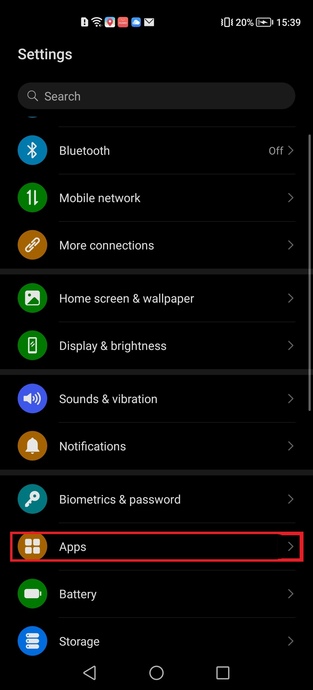
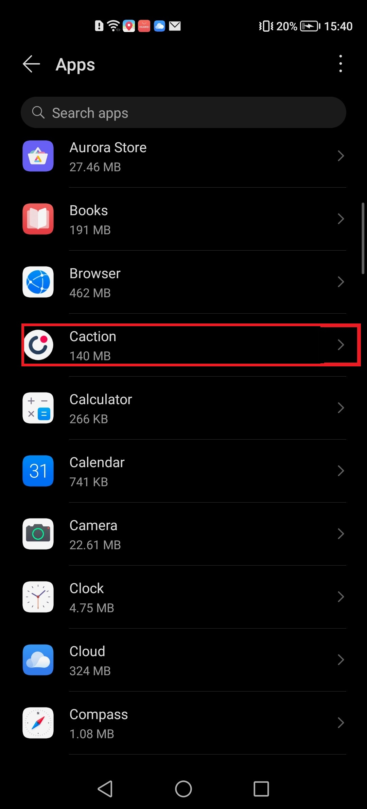
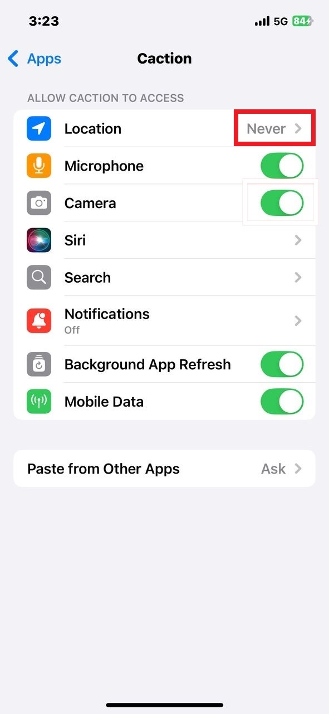

## How to Access Notifications, Camera, and GPS Settings in Mobile?

If you're not receiving notifications or experiencing issues with camera and GPS access on your device, please follow the steps below to verify your settings:

- [Android Version](#section1) 
- [IOS Version](#section2)
     

- **Android Version**:

1. In Settings page of your phone, Select "Apps".

   

     
   

   \*Note: Phone settings may vary depending on the phone model. 

2. Click "Apps".

   

     
   
 

3. Click "Caction".

   

     
   
 

4. Click "Notifications".

   

     
   
 

5. Make sure the "Allow notifications" has been toggled.

   

     
   
 

6. Click "Permissions".

   

     
   
 

7. Click "Camera".

   

     
   
 

8. Make sure the "Allow" has been toggled.

   

     
   
 

9. Click "Location".

   

     
   
 

10. Make sure the "Allow only while in use" has been toggled.

   

     
   
 
     
     

- **IOS Version**:

1. In Settings page of your phone, go to the search section.

   

     
   
 

2. Search "Caction".

   

     
   
 

3. Click "Notifications".

   

     
   
 

4. Make sure the "Allow Notifications" has been toggled.

   

     
   
 

5. Back to App settings, Make sure the "Camera" has been toggled.

   

     
   
 

6. Click "Location".

   

     
   
 

7. Select "Always" to ensure proper functionality.

   

     
   
 

**Related Article**

- [I Get Spammed By a Lot of Notifications. How Do I Disable It?](Disable_Notification.md)
- [Notification Settings by User Account](Notification_Settings_by_User_Account.md)

<!-- [Link Text](https://support.caction.com/ How_to_Access_Notifications_ Camera_and_GPS.html) -->
