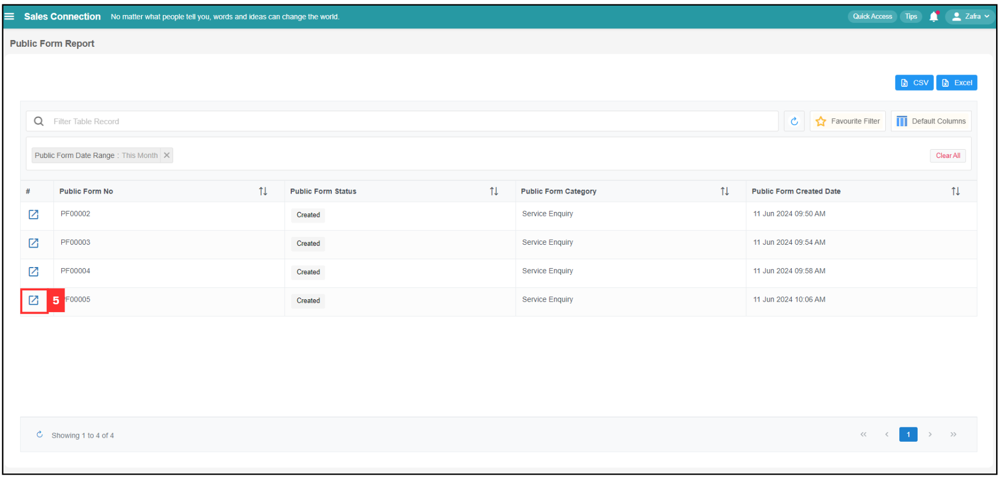

## How to Access Submitted Public Form?

*Note: If you are unable to access the Public Form, please reach out to your admin for assistance.

**Navigate to the section by clicking it.** 

- [Filter](#section1) 
- [Default Columns](#section2) 
- [View Submitted Public Form](#section3) 
   

### Filter

1. At the navigation bar, go to Business Report > Public Form Report.

   

      
   
 

2. Change filter accordingly if unable to find a particular Public Form. For example, filter date range by clicking "Public Form Date Range".

   *Note: If you want to further narrow down the results, you can click on "Filter Table Record".
   

      
   
 

3. Select the filter value you want to view.

   

      
   
 

4. Click "Done" and the filter value for Public Form will be shown.

   

      
   
 

### Default Columns

### View Submitted Public Form

5. Click on the expand button to view for the public form.

   

      
   
 

6. Picture below is a sample of a public form submitted by a customer.

   

      
   
 

   

**Related Articles**
- [How to Configure Public Form Access in UAC (Done by Admin)?](Configure_Public_Form_Access_in_UAC.md)
- [How to Generate Public Form?](Creation_of_Public_Form.md)
- [How to Setup Public Form Template?](Setup_Public_Form_Template_Page.md)
- [How to Pull Out Job/Project/Form Report?](Export_Report.md)
- [How to Filter Job by Date Range?](Job_Filter_by_Date_Range.md)
- [How to Set Customized Favourite Filter as Default - Desktop ](Default_Favourite_Filter.md)
- [How to Set Customized Favourite Filter as Default - App ](Default_Favourite_Filter_App.md)
- [How to Set Up the Column View in the Report Page?](How_to_Set_Up_the_Column_View_in_the_Report_Page.md)
- [How to Use Update Report Filter?](Job_Update_Report_Filter.md)
