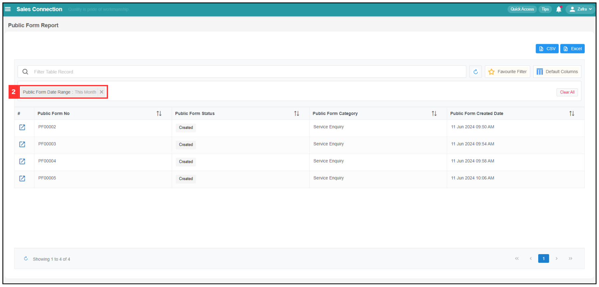
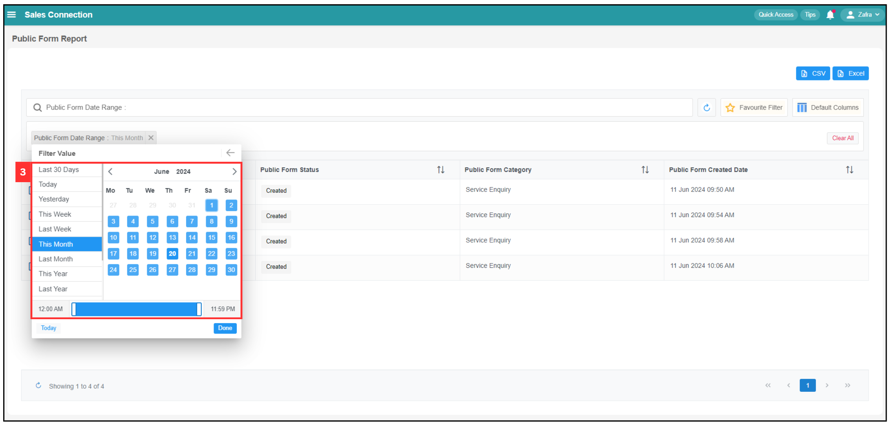

Version 1.0 
Created: 16 July 2024 
Updated: 16 July 2024 
## How to Access Submitted Public Form?

*Note: If you are unable to access the Public Form, please reach out to your admin for assistance.

**Navigate to the section by clicking it.** 

- [Filter](#section1) 
- [Default Columns](#section2) 
- [Favourite Filter](#section3) 
- [View Submitted Public Form](#section4) 
   

### Filter

*Note: The filter teaching here use Public Form Date Range as example. If you want to use filter table record, you can refer to the page attached below.
[https://github.com/SalesConnection/Sales-Connection-Support/blob/main/docs/Report_Page.md#section3](https://github.com/SalesConnection/Sales-Connection-Support/blob/main/docs/Report_Page.md#section3)

1. At the navigation bar, go to Business Report > Public Form Report.

   

      
   
 

2. Change filter accordingly if unable to find a particular Public Form. For example, filter date range by clicking "Public Form Date Range".

   *Note: If you want to further narrow down the results, you can click on "Filter Table Record".
   

      
   
 

3. Select the filter value you want to view.

   

      
   
 

4. Click "Done" and the filter value for Public Form will be shown.

   

      
   
 

### Default Columns

1. If you want to display different columns for the Update Report, click on "Default Columns".

   

     
   
 

2. Click on the "+ Create" button.

   

     
   
 
 
3. Select the columns you wish to have from here.

   

     
   
 

4. After selecting the columns you want to display, click "Save".

   

     
   
    

5. The new Public Form Report with different columns will be shown as below. 

   

     
   
   

6. If you wish to name the default columns, click "Column Group 2".

   

     
   
   

7. Click the "pencil" icon.

   

     
   
   

8. Enter the name of the "Default Columns".

   

     
   
   

9. Click on the "tick" icon.

   

     
   
   

10. The "Default Columns" has been renamed successfully.

    

      
    
   

11. On the next time you enter this page, click on the "Default Columns".

    

      
    
   

12. Click on the "default Columns" that you want.

    

      
    
  

13. The Report with chosen “Default Columns” will be shown as below.

    

      
    
 

### Favourite Filter

1. Ensure that the “Filter” and “Default Columns” you want is applied.

   

     
   
 

2. Click on the “Favourite Filter”.

   

     
   
 

3. Click on “+ Add”.

   

     
   
 

4. Enter the name of the “Favourite Filter”.

   

     
   
 

5. Click on the “Save” button.

   

     
   
 

6. The “Favourite Filter” has been saved successfully.

   

     
   
 

7. On the next time you enter the page, click on “Favourite Filter”.

   

     
   
 

8. Click the “Favourite Filter” you want to apply.

   

     
   
 

9. The “Favourite Filter” is applied successfully.

   

     
   
 

10. If you wish to set the “Favourite Filter” as “Default Favourite Filter”, click “Favourite Filter”.

    

      
    
 

11. Click “Default Filter” to expand it.

    

      
    
 

12. Click the “Favourite Filter” you want to set as default.

    

      
    
 

13. The “Default Favourite Filter” has been set successfully. Everytime when you enter this page, it will automatically show the “Default Favourite Filter”.

    

      
    
 

### View Submitted Public Form

1. Click on the expand button to view for the public form.

   

      
   
 

2. Picture below is a sample of a public form submitted by a customer.

   

      
   
 

   

**Related Articles**
- [How to Generate Public Form?](Creation_of_Public_Form.md)
- [How to Pull Out Job/Project/Form Report?](Export_Report.md)
- [How to Filter Job by Date Range?](Job_Filter_by_Date_Range.md)
- [How to Set Customized Favourite Filter as Default - Desktop ](Default_Favourite_Filter.md)
- [How to Set Customized Favourite Filter as Default - App ](Default_Favourite_Filter_App.md)
- [How to Set Up the Column View in the Report Page?](How_to_Set_Up_the_Column_View_in_the_Report_Page.md)
- [How to Use Update Report Filter?](Job_Update_Report_Filter.md)

<!-- [Link Text](https://salesconnection.github.io/Sales-Connection-Support/Access_Submitted_Public_Form.html) -->
