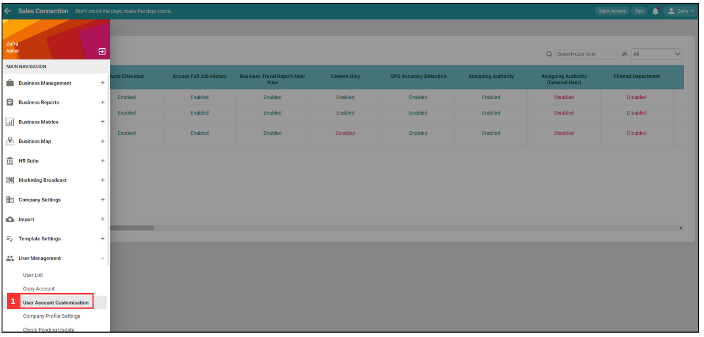
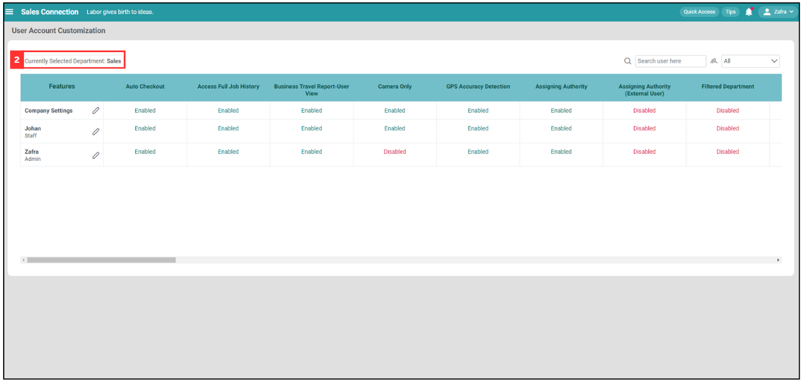

## How to Access Submitted Public Form?

*Note: If you are unable to access the Public Form, please reach out to your admin for assistance.

1. At the desktop site's navigation bar, go to User Management > User Account Customization. 
     **Open User Account Customization:** [https://salesconnection.my/uac](https://salesconnection.my/uac) 
     
   

      
   

2. If you wish to change the public form access for the staff of another department, click "Currently Selected Department".

   

     
   

3. For example, if you want to edit the access permission of submitted public form for yourself. Click "Select Department" beside "Admin".

   

     
   

4. Click on the 

   

     
   

5. Press Ctrl + F and enter "Enable Public Form Access".

   

     
   

6. Toggle "IMEI Login Check" to turn on/off the IMEI check.

   

     
   

7. Now, the user is able to access the Digital Form.

   

     
   

   

**Related Articles**
- [How to Add Dropdown Options in Digital Form?](Add_Dropdown_Options_in_Digital_Form.md)
- [How to Edit Checklist Dropdown Options?](Edit_Checklist_Dropdown_Options.md)
- [How Do I Add New Status in Digital Form?](Add_New_Status_in_Digital_Form.md)
