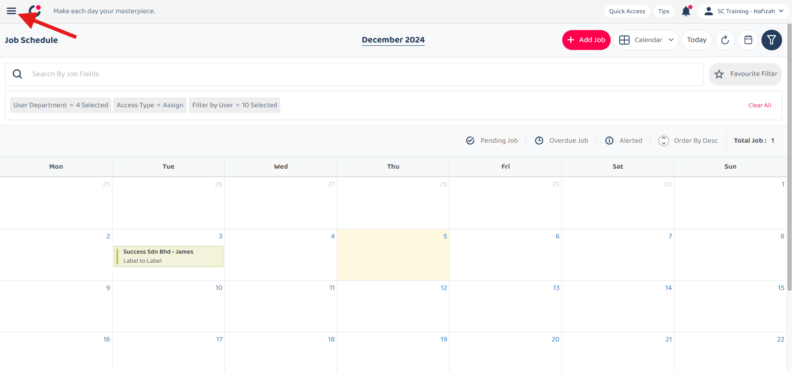
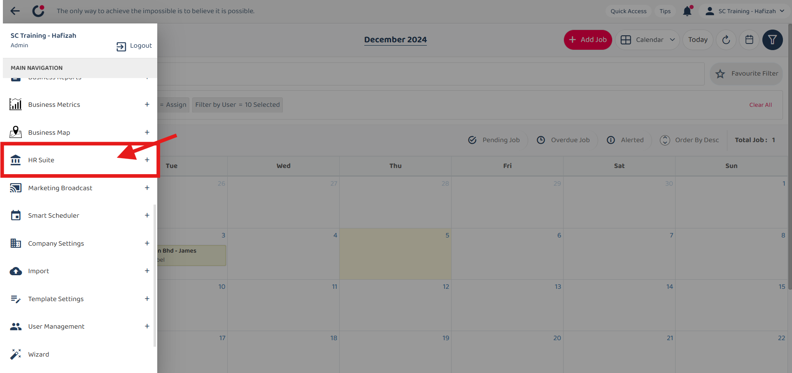
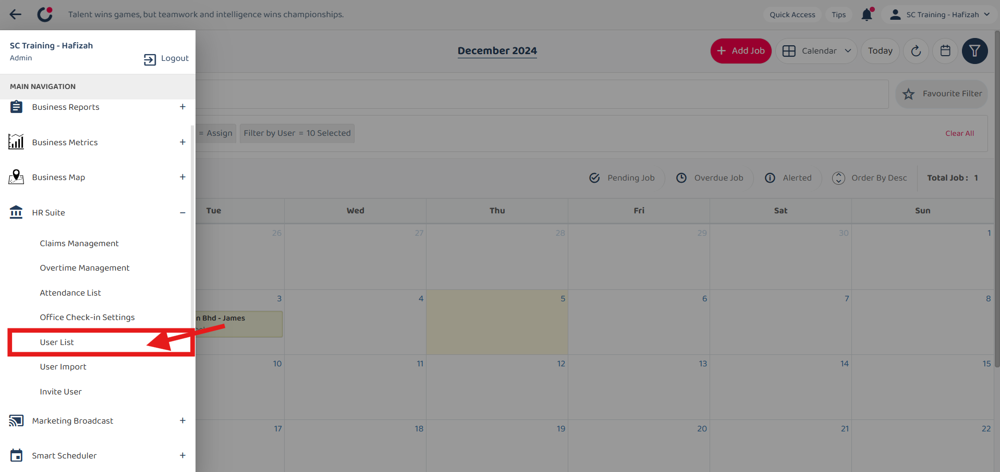
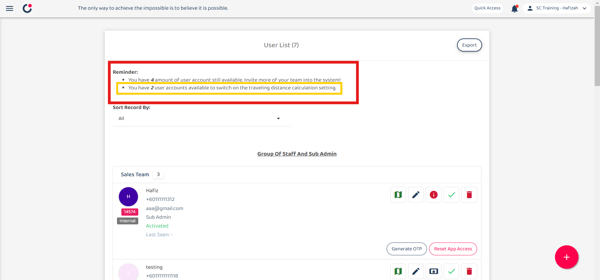
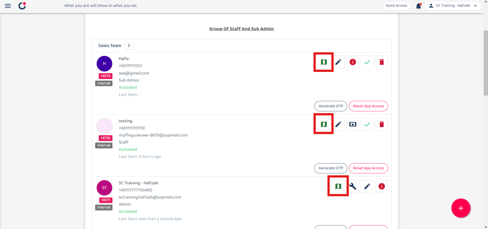
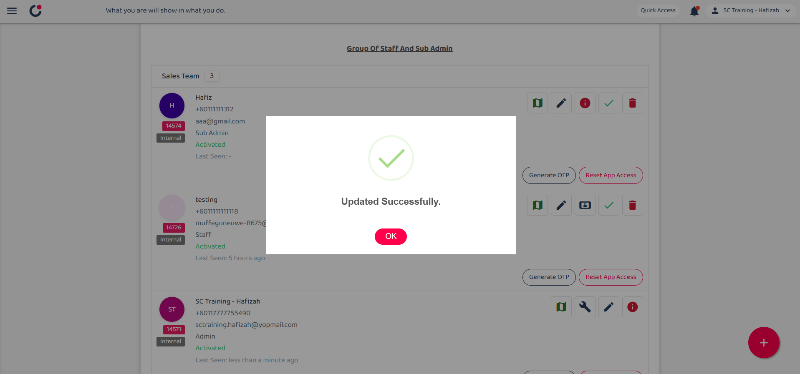
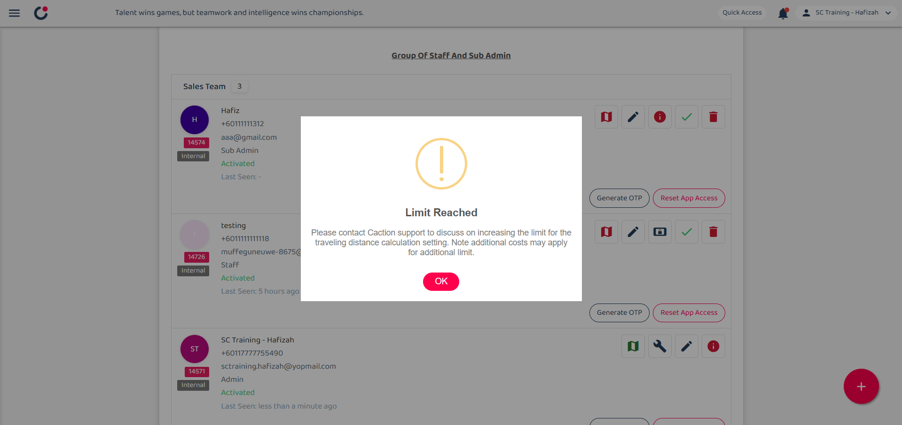

## How to activate traveling mileage calculation ?
### The traveling mileage calculation is an additional feature separate from the normal user account. If the user requires mileage calculation, you can activate it in the User List after inviting them to the system.

1) Select left corner menu icon to open sidebar.  

         

 

2) Select HR Suite.  

         

 

3) Select User List.  

         

 

4) Please note that there's a limit to the number of users who can use this feature.  

         

 

5) Click the icon below shown to activate traveling mileage calculation.  

         

 

6) Updates dialog will pop up once it successful activated.  

         

 

7) The quota for user accounts is run out.   If you wish to add more quota, please contact caction support. 

         

 
