Version 1.0 
Created: 22 July 2024 
Updated: 22 July 2024 
## How to Add Claim?

The claim feature allows company staff to easily submit and track claims for expenses such as fuel, meals, parking fees, tools, and more.  

1. At the mobile navigation bar, go to Dashboard. 

   

     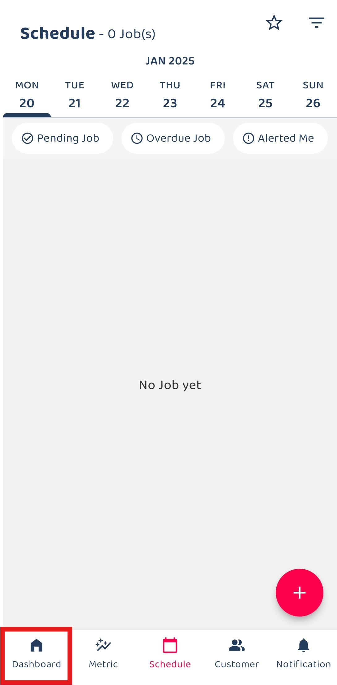
   

2. Click Business Travel.

   

     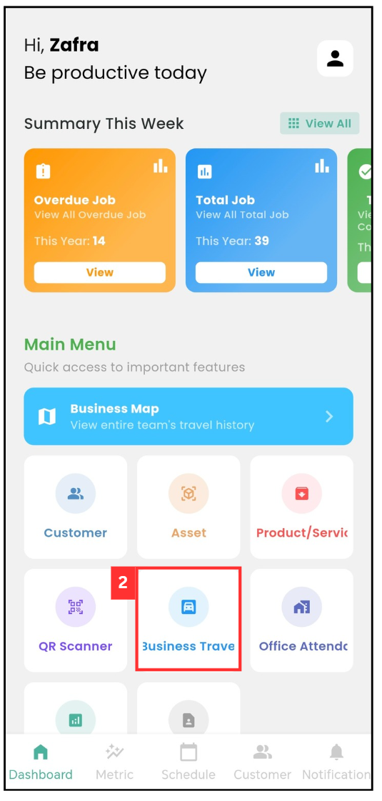
   

3. Select the date of your business travel.

   

     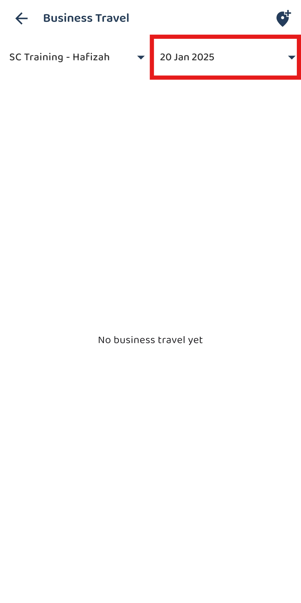
   

4. You can also select a date range of your travels based on the “Start Date” and “End Date”.

   

     
   

5. Click on the "tick" icon.

   

     
   

6. Select the Business Travel that you would like to create a claim for.

   

     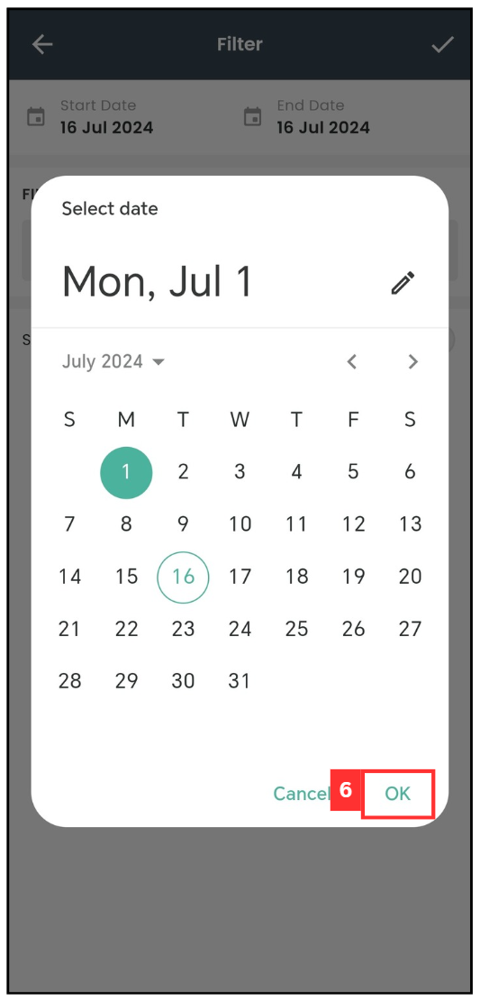
   

  
7. Click on "Add New Claim / Attachment".

   

     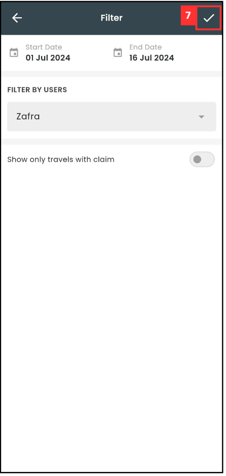
   

8. Click on "Category".

   

     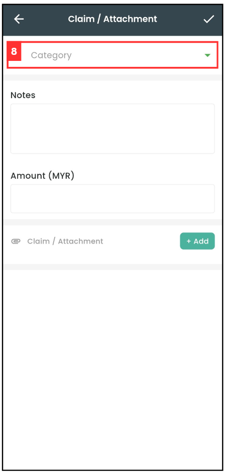
   

9. Select the category that you want to claim for.

   

     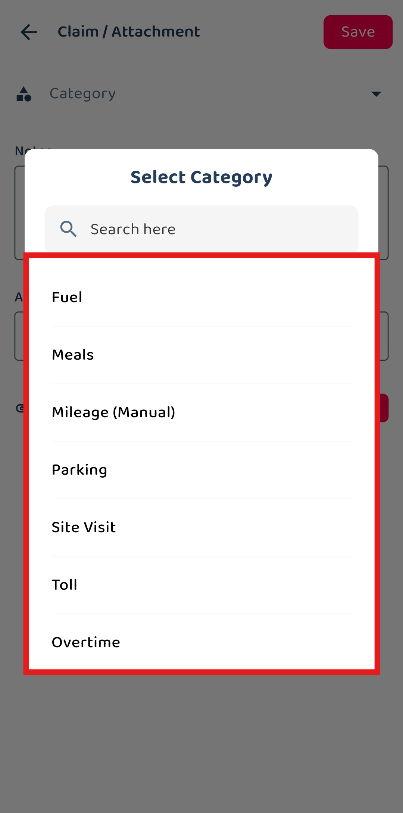
   

10. Enter the details of the claim.

    

      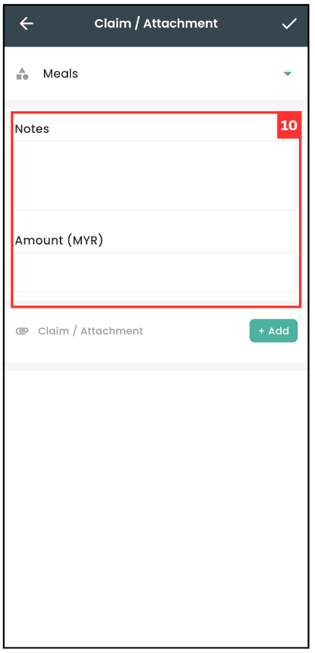
    

11. Click on "+ Add" if you want to attach any document.

    

      
    

    *Note: Only one file (photo/video/document) may be attached to a claim. 

12. Select for the attachement's format.

    

      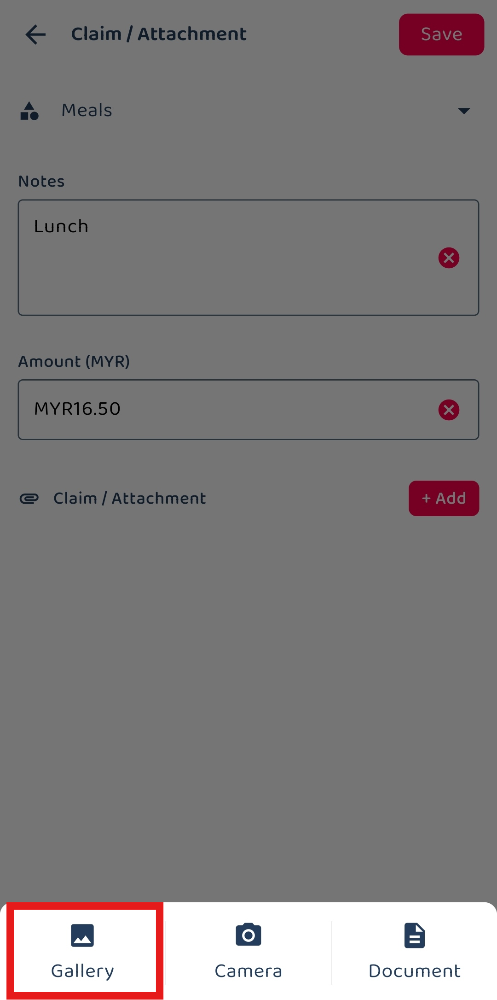
    

    
13. Choose the photo that you want to upload as attachment.

    

      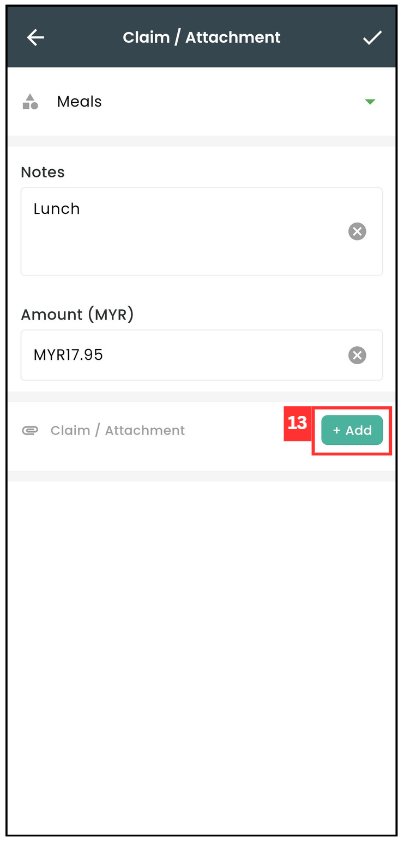
    

14. Click on the "tick" icon.

    

      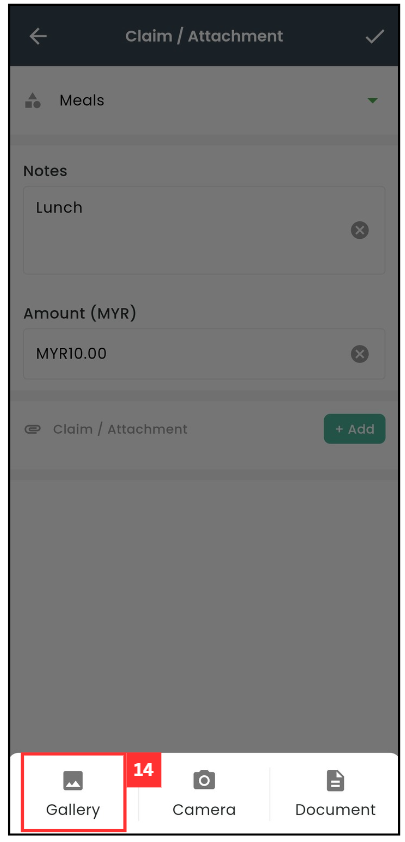
    

15. Click on the "tick" icon to submit ypour claim.

    

      
    

16. Your claim has been saved successfully when this prompt appears.

    

      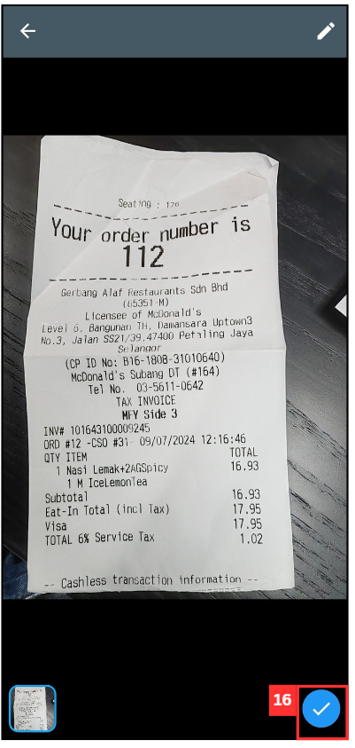
    

       

**Related Articles**
- [How to Add Overtime Claim?](Add_Overtime_Claim.md)
- [Claim Management](Claim_Management.md)
- [Overtime Management](Overtime_Management.md)
- [Office Check-In Settings](Office_Check_In_Settings.md)

<!-- [Link Text](https://salesconnection.github.io/Sales-Connection-Support/Add_Claim.html) -->
