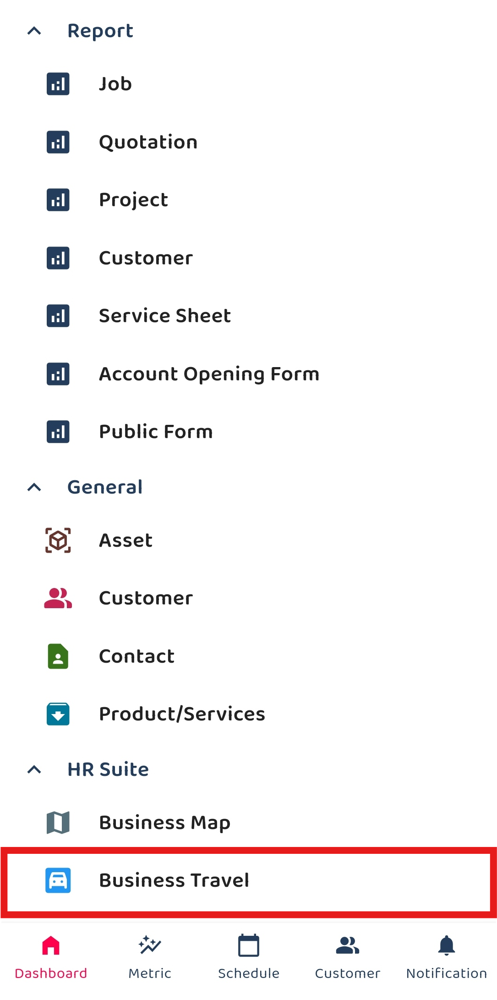
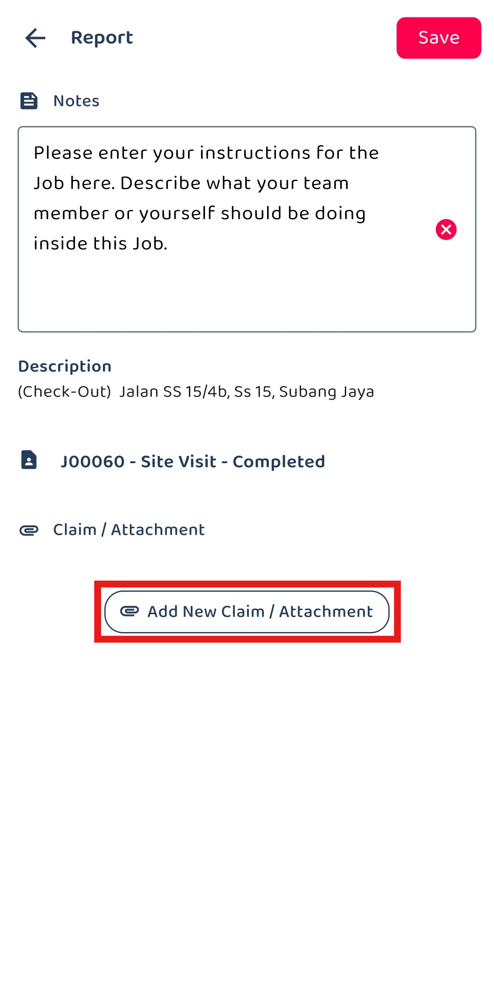
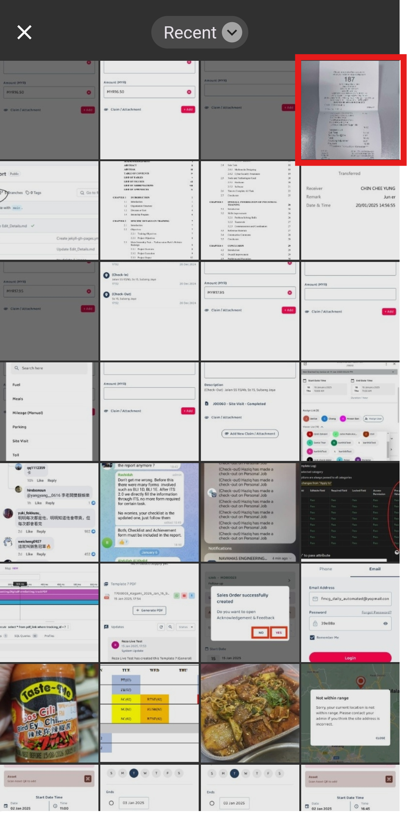

## How to Add Claim?

The claim feature allows company staff to easily submit and track claims for expenses such as fuel, meals, parking fees, tools, and more.  

1. At the mobile navigation bar, go to Dashboard. 

   

     
   

2. Click Business Travel.

   

     
   

3. Select the date of your business travel.

   

     
   

4. You can also select a date range of your travels based on the “Start Date” and “End Date”.

   

     
   

5. Click on the "tick" icon.

   

     
   

6. Select the Business Travel that you would like to create a claim for.

   

     
   

   *Note: Selecting Check-in or Check-out will determine whether you can modify the start time or end time of the overtime claim. 

7. Click on "Add New Claim / Attachment".

   

     
   

8. Click on "Category".

   

     
   

  
9. Select the category.

   

     
   

10. 

    

      
    

11. Click on "+ Add" if you want to attach any document.

    

      
    

12. Click on the "tick" icon.

    

      
    

13. Your claim has been saved successfully when this prompt appears.

    

      
    

       

**Related Articles**
- [Claim Management](Claim_Management.md)
- [Overtime Management](Overtime_Management.md)
- [Office Check-In Settings](Office_Check_In_Settings.md)
