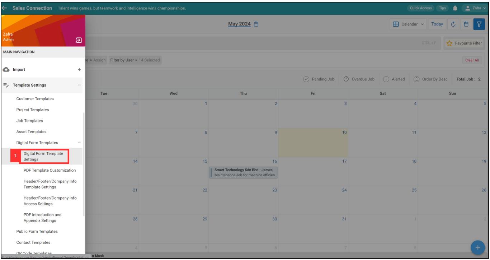
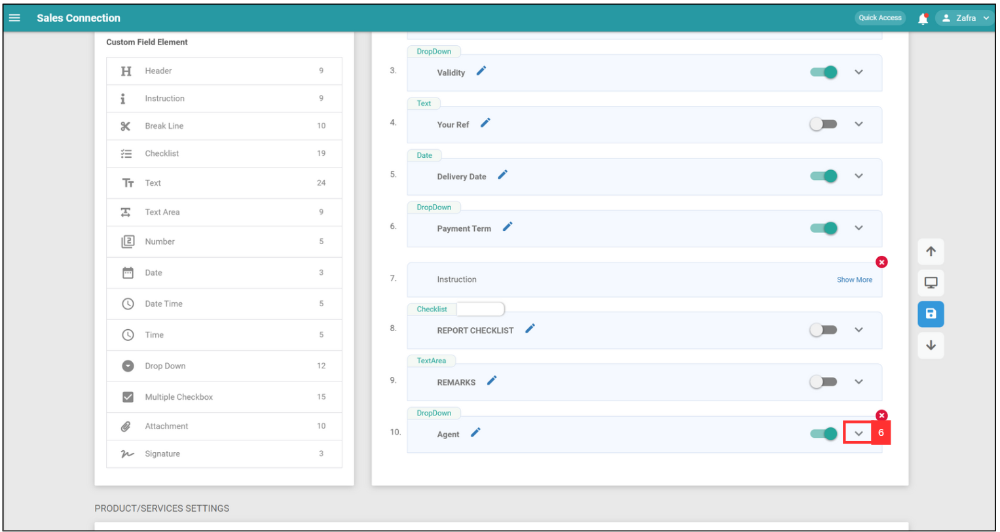
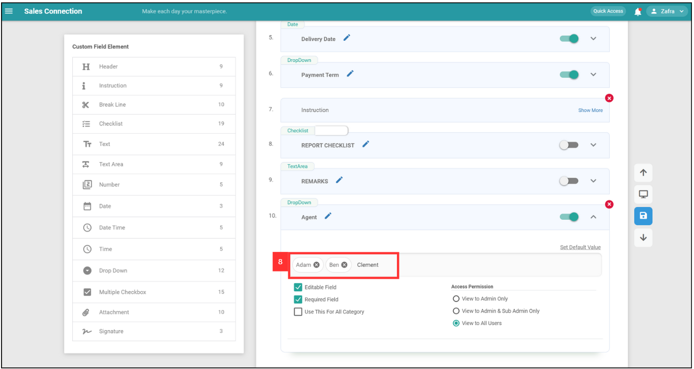
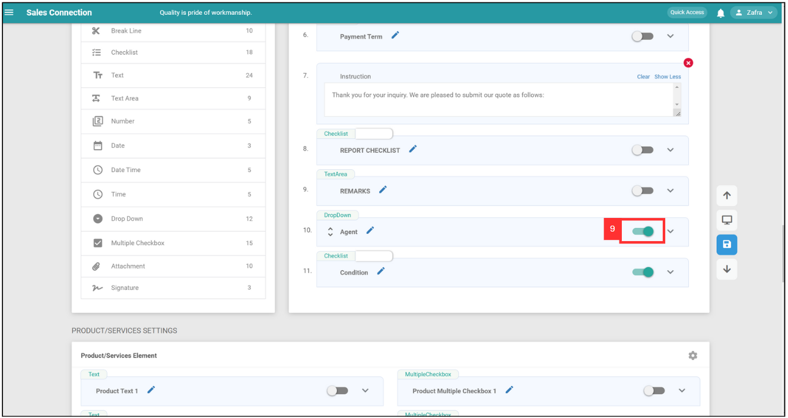
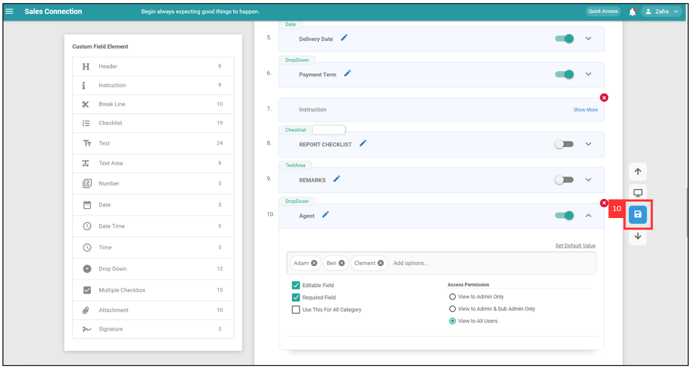

Version 1.0 
Created: 16 May 2024 
Updated: 16 May 2024 
## 🔽 How to Add Dropdown Options in Digital Form?

**Desktop site:** 

1. For example, if you want to add dropdown options for Quotations. Go to desktop site navigation bar > "Template Settings" > "Digital Form Templates" > "Digital Form Template Settings". 
   **Open the page here**: [https://salesconnection.my/ServiceReport/TemplateSetting](https://salesconnection.my/ServiceReport/TemplateSetting) 

   

     
   

2. Select "Quotation"

   

      
   

3. Click "Drop Down" to add new dropdown options. 

   

     
   

   
4. Click the 🖋️ Pencil Icon to rename the new dropdown. 

   

     
   

  
5. After rename for the new dropdown, click the tick icon to save the name. 

   

      
   

  
6. Click the expand button to add options. 

   

      
   

  
7. Click "Add Options" to add options. 

   

     
  
8. Add the next option by clicking the Enter key on your keyboard. 

   

     
   

  
9. Make sure the dropdown has been toggled as in the image shown below. 

   

     
   

10. Click the save button to save this dropdown options. 

    

     
    

11. Click "OK". 

    

     
    

12. Click "OK" and your dropdown options have been added successfully. 

    

     
    

       

**Related Article** 
[How to Edit Checklist Dropdown Options?](Edit_Dropdown_Options.md)
