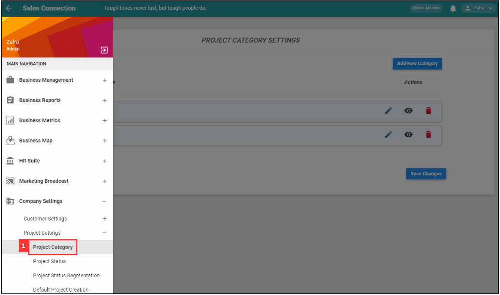

## How Do I Add New Category in Customer/Project/Job?
    
  1. For example, if you wish to add new category in Project. At the desktop site's navigation bar, go to Company Settings > Project Settings > Project Category. 

     

       
     

  2. Click on the "Add New Category" button. 
     **Add New Project Category Here:** [https://salesconnection.my/settings/CategoryList?type=dssecond](https://salesconnection.my/settings/CategoryList?type=dssecond) 

     

       
     

  3. Enter the name of the new category. 

     

       
     

  4. Click the "Submit" button. 

     

       
     

  5. Remember to click the "Save Changes" button to save the new category. 

     

       
     

  6. Click "OK" and the new project category has been saved successfully. 

     

       
     

        

**Related Article** 
