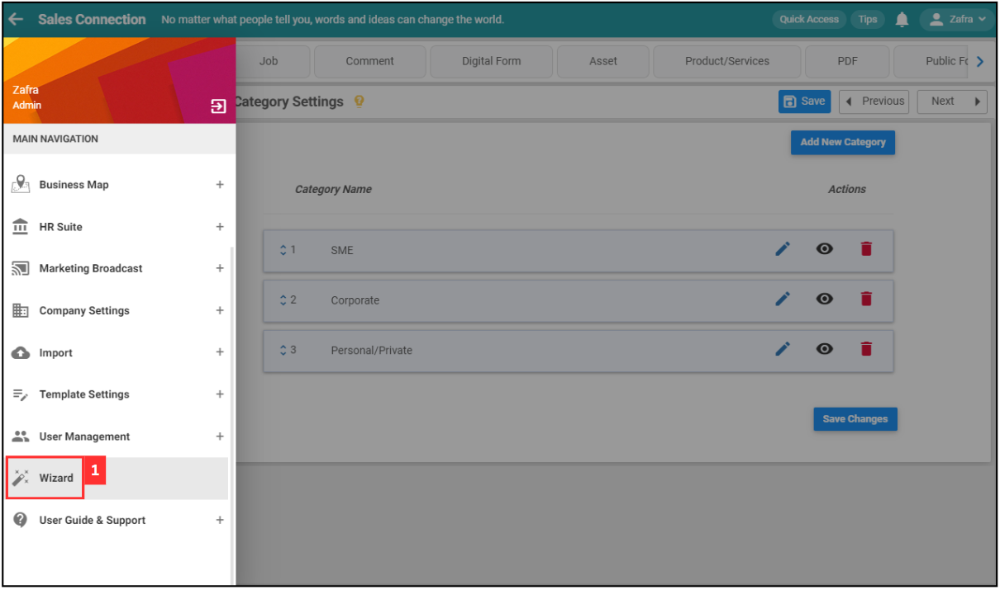
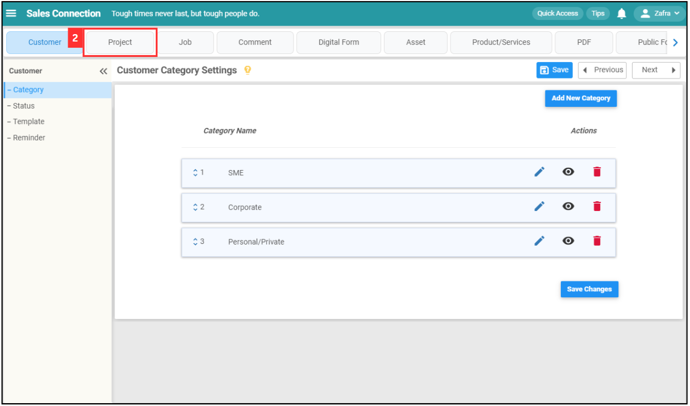
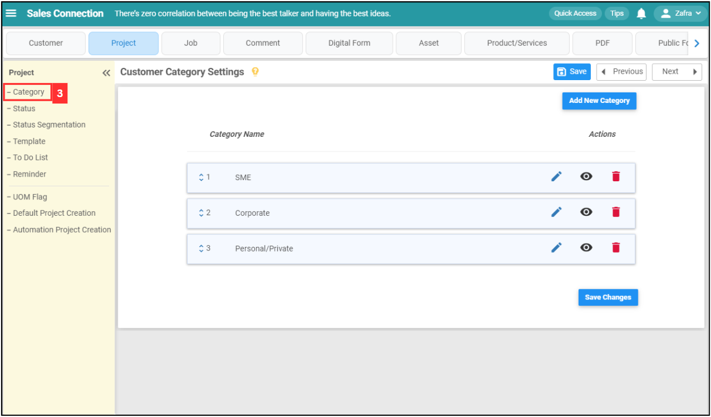
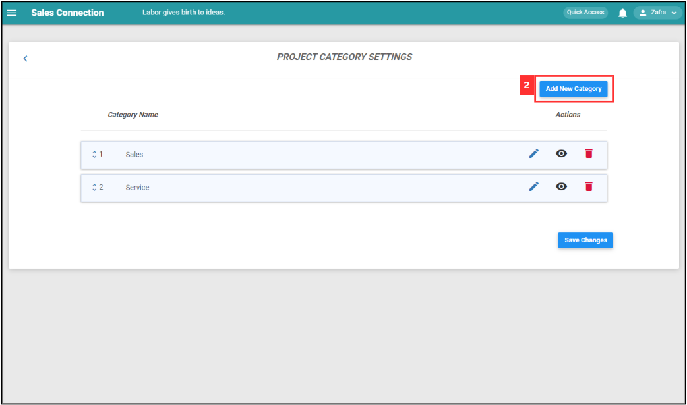
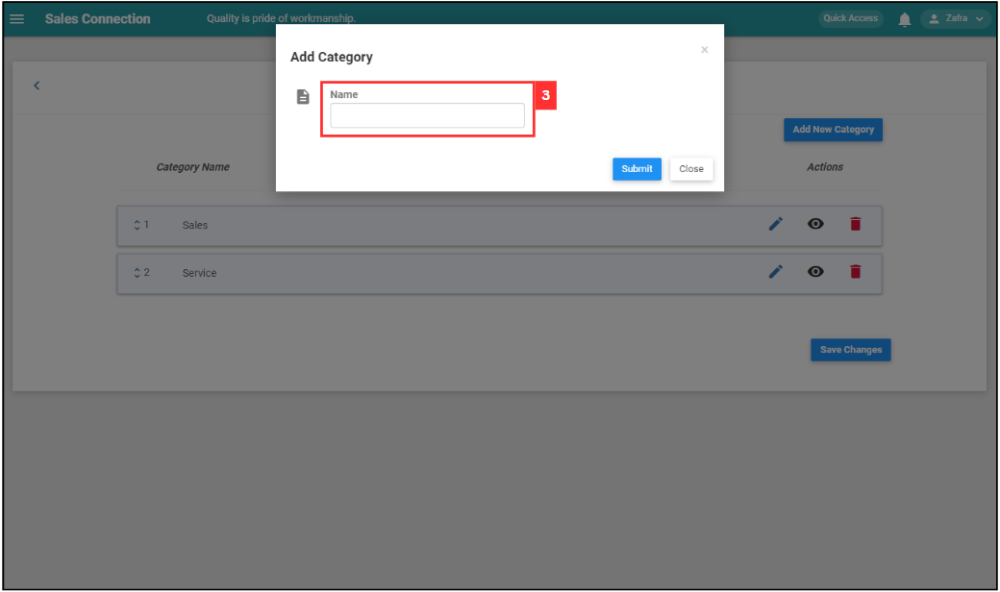
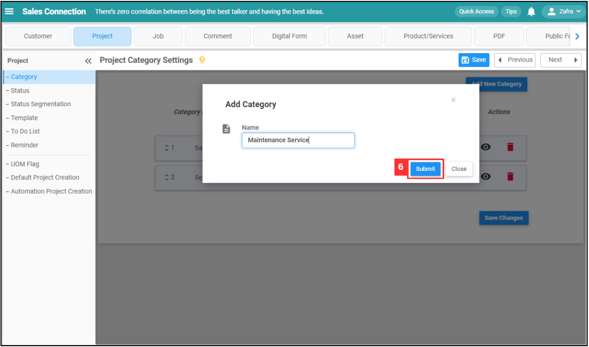
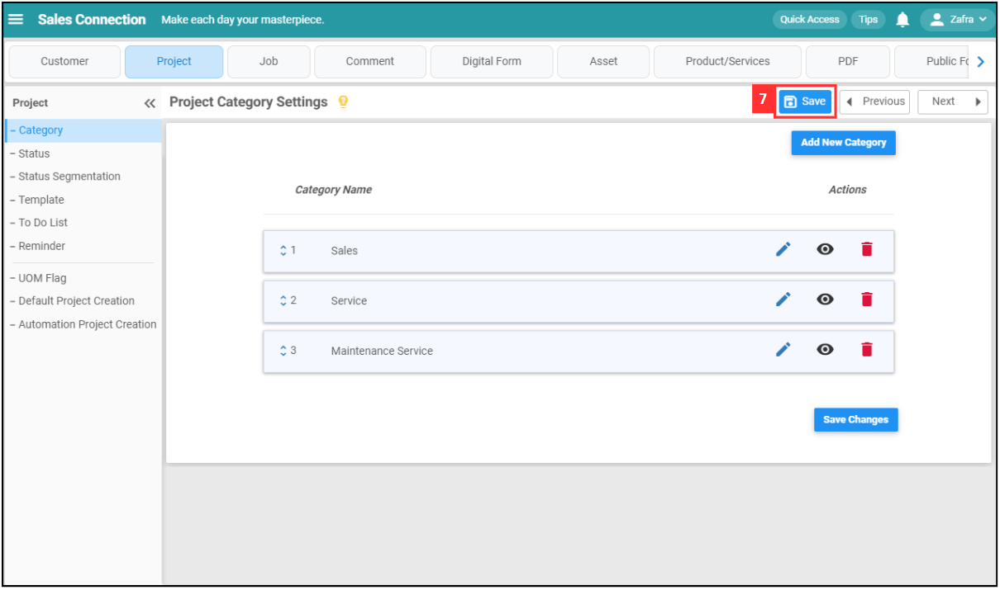
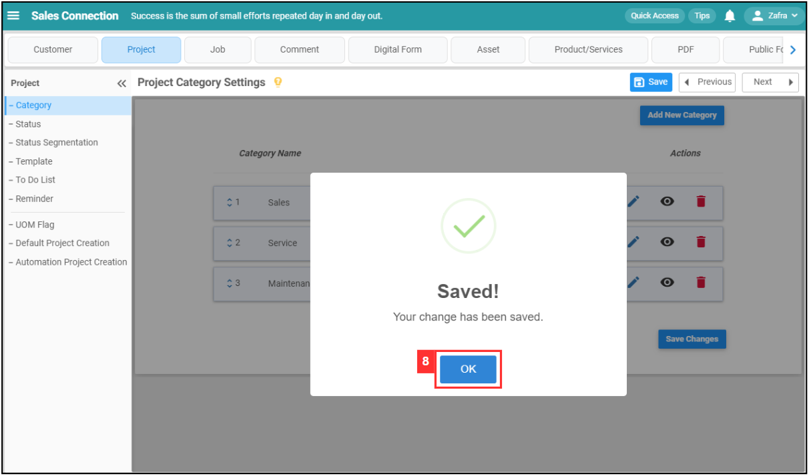

Version 1.0 
Created: 24 May 2024 
Updated: 24 May 2024 
## How Do I Add New Category in Customer/Project/Job?
    
  1. For example, if you wish to add new category in Project. At the desktop site's navigation bar, go to Wizard. 
     **Open Wizard Page Here:** [https://salesconnection.my/wizard](https://salesconnection.my/wizard) 
     
     

       
     

  2. Click "Project". 

     

       
     

     
  3. Click "Category". 

     

       
     

  
  4. Click on the "Add New Category" button. 
     **Add New Project Category Here:** [https://salesconnection.my/settings/CategoryList?type=dssecond](https://salesconnection.my/settings/CategoryList?type=dssecond) 

     

       
     

  5. Enter the name of the new category. 

     

       
     

  6. Click the "Submit" button. 

     

       
     

  7. Remember to click the "Save" button to save the new category. 

     

       
     

  8. Click "OK" and the new project category has been saved successfully. 

     

       
     

   

**Related Articles**
- [How Do I Add New Status in Digital Form?](Add_New_Status_in_Digital_Form.md)
- [How Do I Add New Status in Customer/Project/Job?](Add_New_Status_in_Customer_Project_Job.md)

<!-- [Link Text](https://salesconnection.github.io/Sales-Connection-Support/Add_New_Category_in_Customer_Project_Job.html) -->
