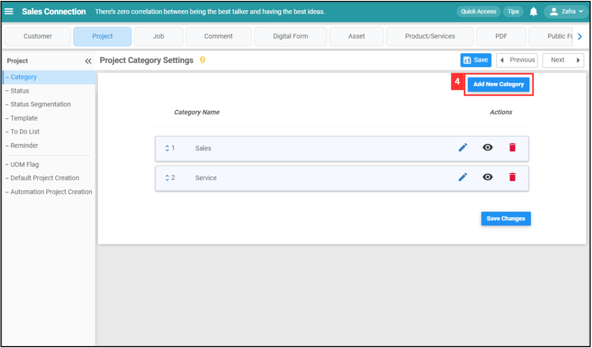
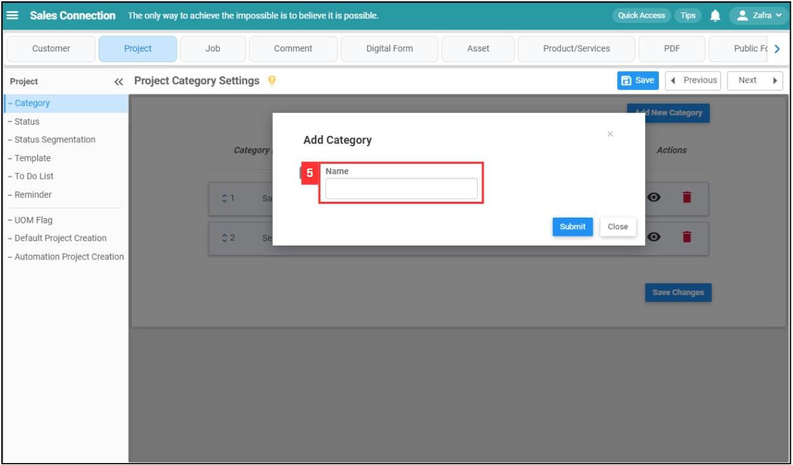
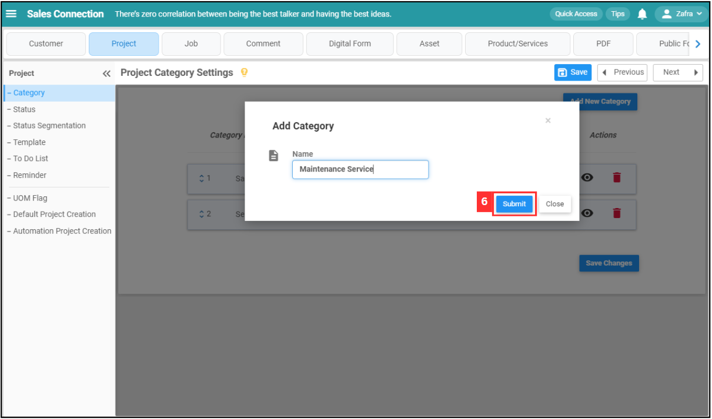
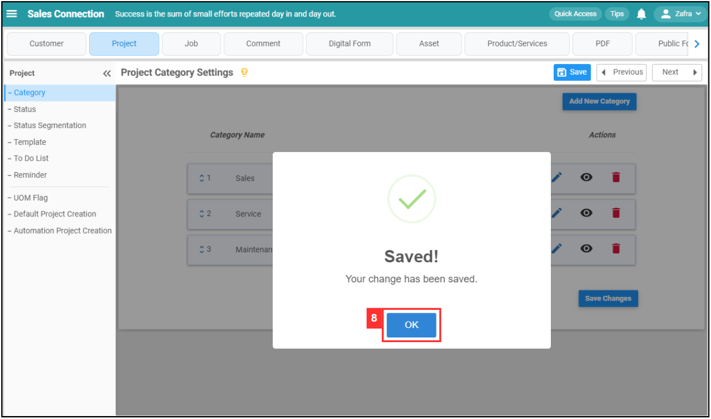
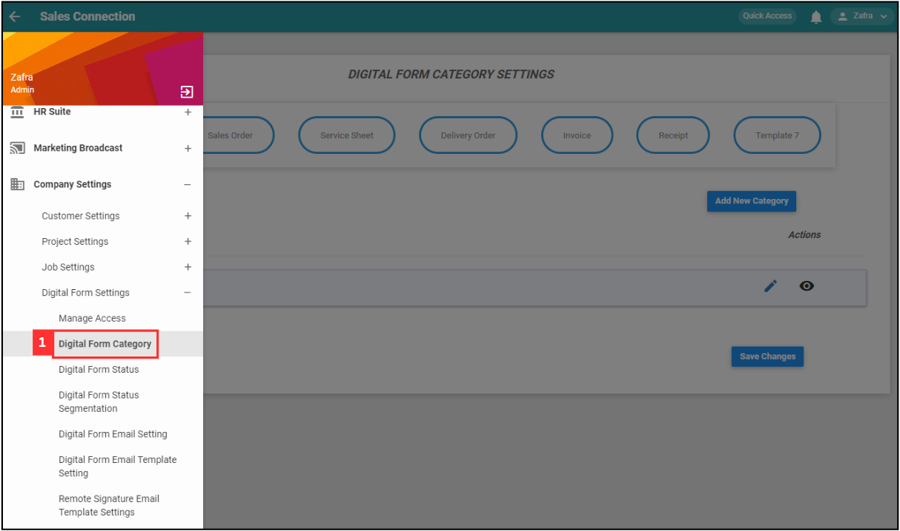
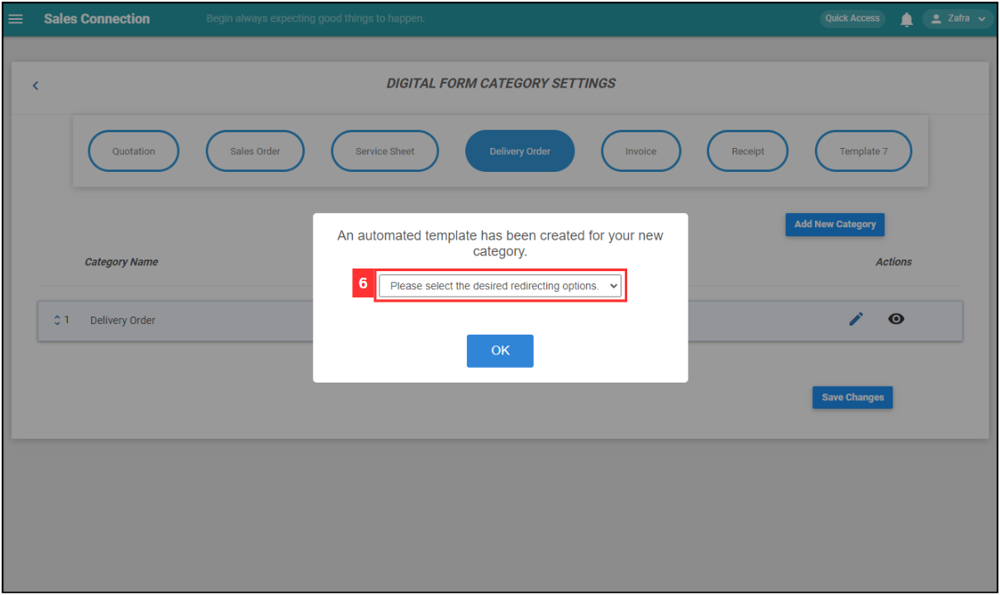
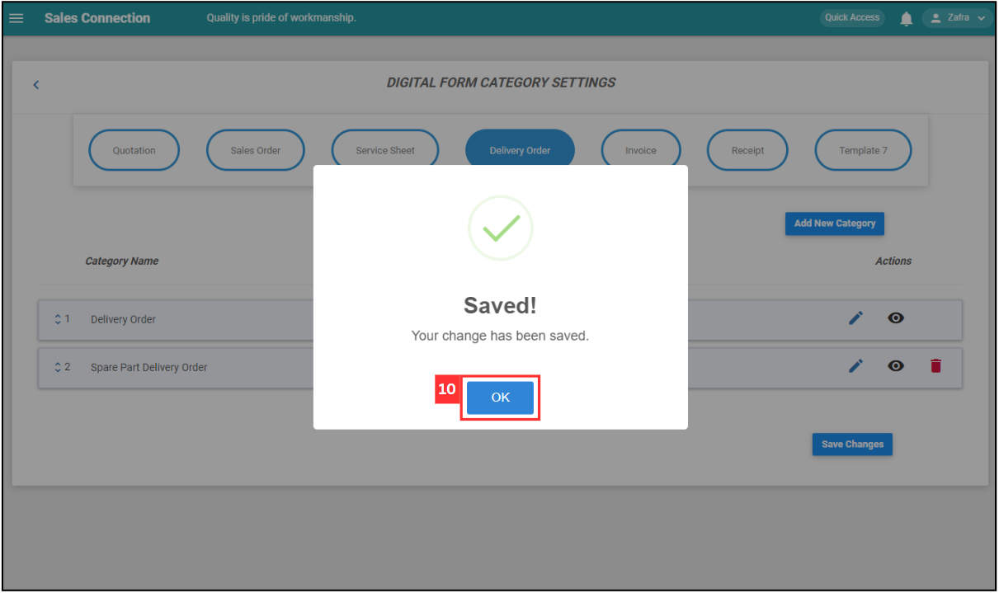

Version 1.0 
Created: 24 May 2024 
Updated: 24 May 2024 
## How to Add a New Category for Customers, Projects, Jobs or Digital forms?
    
  1. For example, if you wish to add new category in Project. At the desktop site's navigation bar, go to Wizard. 
     **Open Wizard Page Here:** [https://system.caction.com/wizard](https://system.caction.com/wizard) 
     
     

       
     

  2. Click "Project". 

     

       
     

     
  3. Click "Category". 

     

       
     

  
  4. Click on the "Add New Category" button. 
     **Add New Project Category Here:** [https://system.caction.com/settings/CategoryList?type=dssecond](https://system.caction.com/settings/CategoryList?type=dssecond) 

     

       
     

  5. Enter the name of the new category. 

     

       
     

  6. Click the "Submit" button. 

     

       
     

  7. Remember to click the "Save" button to save the new category. 

     

       
     

  8. Click "OK" and the new project category has been saved successfully. 

     

       
     

  

### Example of Add New Category in Digital Form
    
  1. For example, if you wish to add new category in Delivery Order. At the desktop site's navigation bar, go to Company Settings > Digital Form Settings > Digital Form Category. 

     

       
     

  2. Click on "Delivery Order". 
     **Add New Digital Form Category Here:** [https://system.caction.com/ServiceReport/DigitalFormCategory](https://system.caction.com/ServiceReport/DigitalFormCategory) 

     

       
     

  
  3. Click on the "Add New Category" button. 

     

       
     

  4. Enter the name of the new "Delivery Order" category. 

     

       
     

  5. Click the "Submit" button. 

     

       
     

  6. Click on the column. 

     

       
     

  
  7. Choose "Stay in Current Page". 

     

       
     

  
  8. Click "OK". 

     

       
     

  
  9. Remember to click the "Save Changes" button to save the new category. 

     

       
     

  10. Click "OK" and the new "Delivery Order" category has been saved successfully. 

      

        
      

   

**Related Articles**
- [How Do I Add New Status in Digital Form?](Add_New_Status_in_Digital_Form.md)
- [How Do I Add New Status in Customer/Project/Job?](Add_New_Status_in_Customer_Project_Job.md)

<!-- [Link Text](https://support.caction.com/Add_New_Category_in_Customer_Project_Job.html) -->
