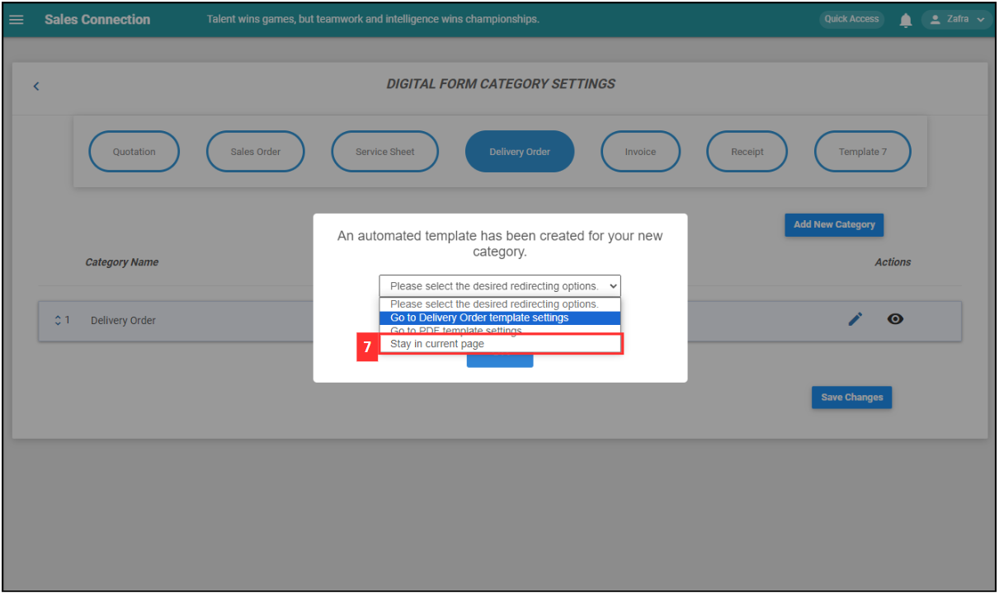

## How do I Add New Category in Digital Form?
    
  1. For example, if you wish to add new category in Delivery Order. At the desktop site's navigation bar, go to Company Settings > Digital Form Settings > Digital Form Category. 

     

       
     

  2. Click on "Delivery Order". 
     **Add New Digital Form Category Here:** [https://salesconnection.my/ServiceReport/DigitalFormCategory](https://salesconnection.my/ServiceReport/DigitalFormCategory) 

     

       
     

  
  3. Click on the "Add New Category" button. 

     

       
     

  4. Enter the name of the new "Delivery Order" category. 

     

       
     

  5. Click the "Submit" button. 

     

       
     

  6. Click on the column. 

     

       
     

  
  7. Choose "Stay in Current Page". 

     

       
     

  
  8. Click "OK". 

     

       
     

  
  9. Remember to click the "Save Changes" button to save the new category. 

     

       
     

  10. Click "OK" and the new "Delivery Order" category has been saved successfully. 

      

        
      

     
   

**Related Articles** 
- [How Do I Add New Category in Customer/Project/Job?](Add_New_Category_in_Customer_Project_Job.md)
- [How Do I Add New Status in Customer/Project/Job?](Add_New_Status_in_Customer_Project_Job.md)
- [How Do I Add New Status in Digital Form?](Add_New_Status_in_Digital_Form.md)  

<!-- [Link Text](https://salesconnection.github.io/Sales-Connection-Support/Add_New_Category_in_Digital_Form.html) -->
