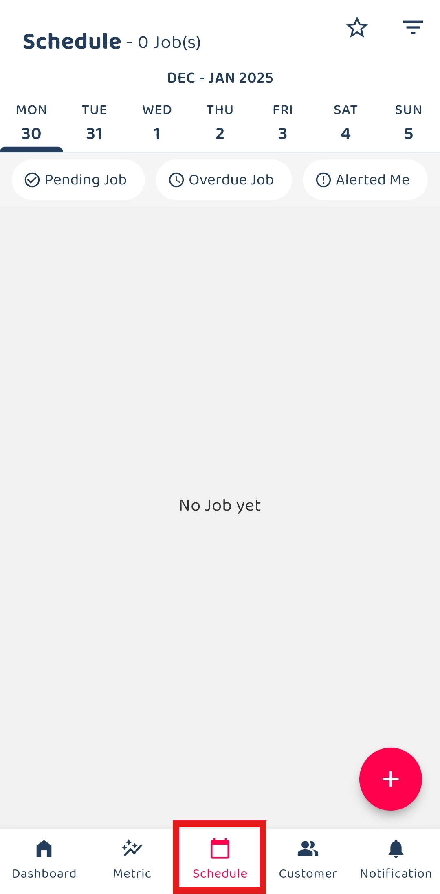
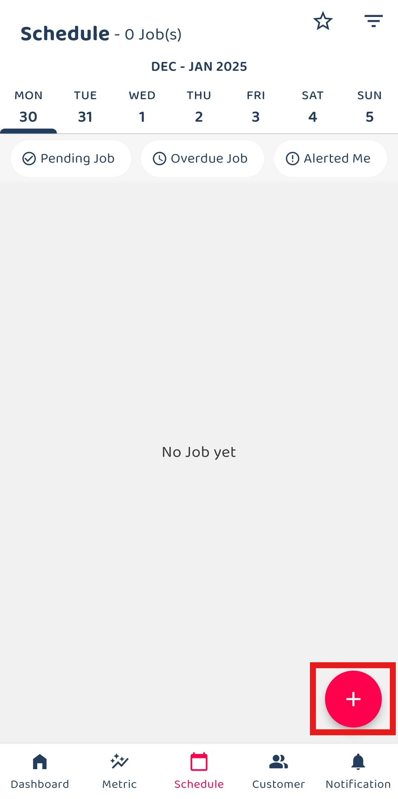
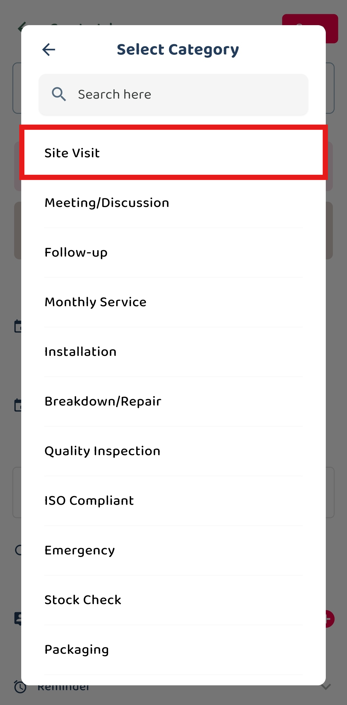
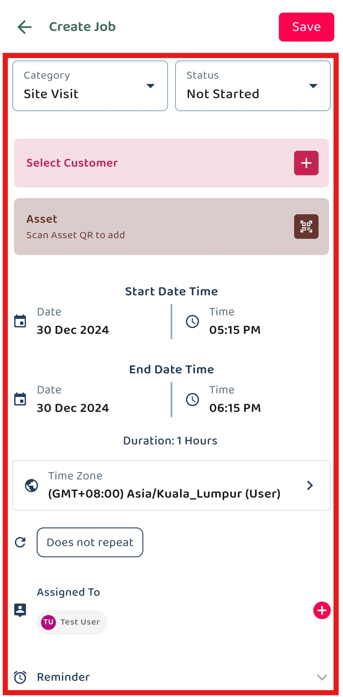
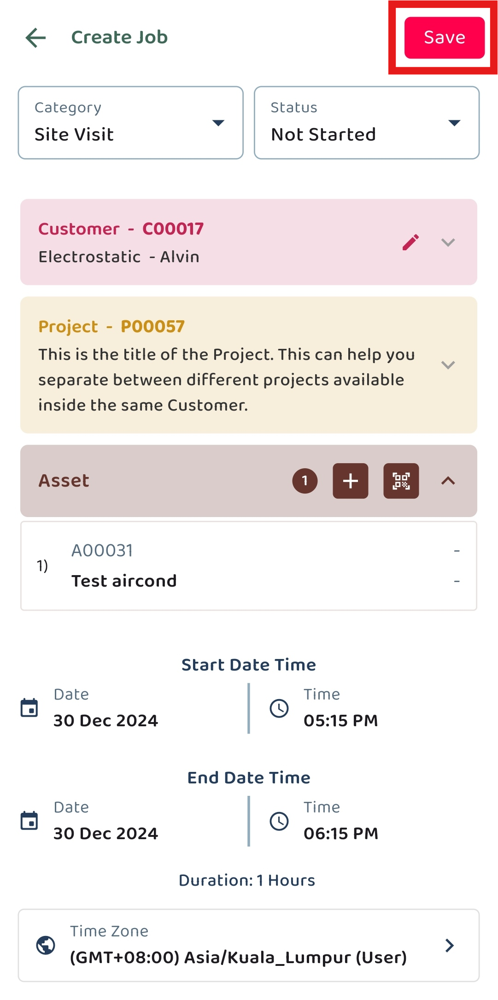
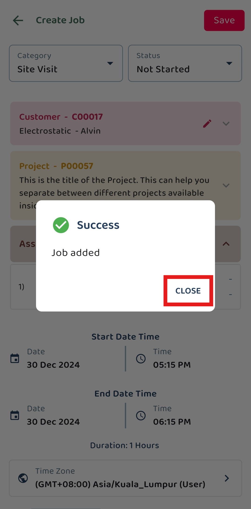
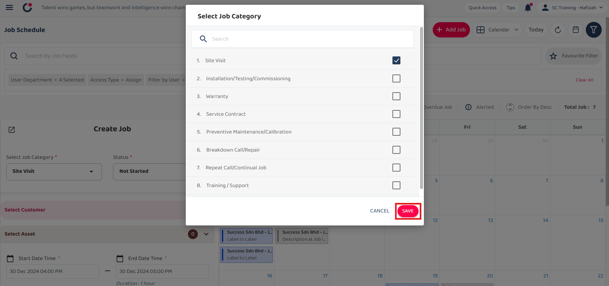
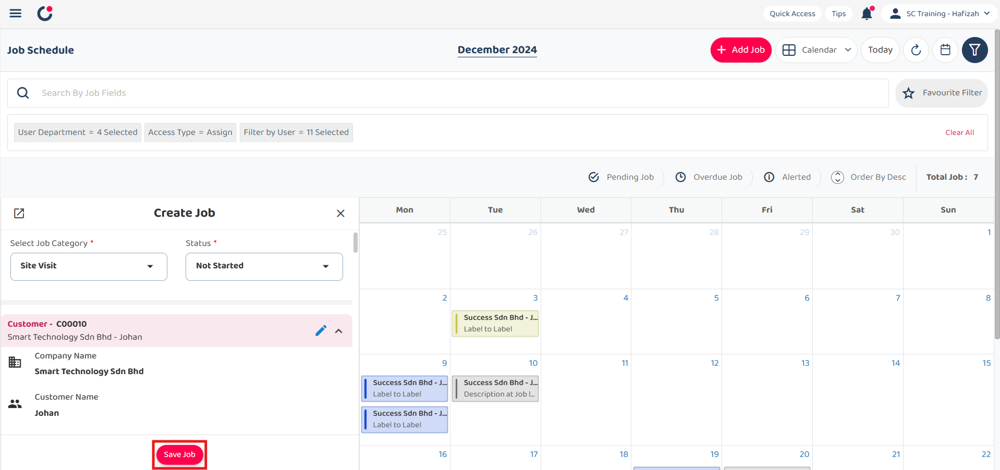

Version 1.0 
Created: 10 June 2024 
Updated: 18 June 2024 
## How to Add New Job?

*Note: In your system, Job may have been renamed to other (i.e Task, Ticket, Deal, etc.)  

**Navigate to the section by clicking it.** 

- [Mobile Version](#section1) 
- [Desktop Version](#section2)
   

**Mobile Version**

1. At the mobile app's navigation bar, go to Schedule. 
     
   

     
   

2. Click on the "+" button to add new job. 

   

     
   

   *Note: If you do not see a “+” button, you may need to request permission or help from your Admin to register new job.

3. Select the job category. 

   

     
   

   *Note: Please select the correct job category before proceeding. Different categories may have different requirements for different purposes. 
     
4. Fill out the details of the new job. Available fields may differ depending on your company’s system setup. 

   | Field Name| Description |
   |-------|---------|
   | Category* | Classifies the type of job. |
   | Status* | Indicates the current status of the job. |
   | Select Customer | Choose a customer from those registered in the system. After selecting Customer, you will be asked to select Project under that Customer. |
   | Select Asset | Choose an asset from those registered in the system. |
   | Start End Date* | The date range when the job is planned to start and end. |
   | Recurrent Job | Indicates if the job recurs. |
   | Assigned To | The user responsible for the job. |
   | Reminder | Set a reminder for the job. |
   | Description | Detailed description of the job. |
   | Attachment (Document or Receipt) | Upload any relevant documents or receipts. |
     
   *Note: Fields marked with an asterisk ( * ) are required. 

   

     
   

     
5. Click on the "Save Job" button. 
     
   

     
   

6. The new job has been saved successfully when this prompt appears. 

   

     
   

     
   

**Desktop Version**

1. At the desktop site's navigation bar, go to Business Management > Schedule > Job Schedule. 
   **Add New Job Here:** [https://salesconnection.my/activity/scheduler](https://salesconnection.my/activity/scheduler) 
     
   

     
   

2. Click on the "+" button to add new job. 

   

     
   

   *Note: If you do not see a “+” button, you may need to request permission or help from your Admin to register new job.

3. Select the job category. 

   

     
   

   *Note: Please select the correct job category before proceeding. Different categories may have different requirements for different purposes. 
     
4. Click on the "SAVE" button. 

   

     
   

     
5. Fill out the details of the new job. Available fields may differ depending on your company’s system setup.. 

   | Field Name| Description |
   |-------|---------|
   | Select Job Category* | Classifies the type of job. |
   | Status* | Indicates the current status of the job. |
   | Select Customer | Choose a customer from those registered in the system. After selecting Customer, you will be asked to select Project under that Customer. |
   | Select Asset | Choose an asset from those registered in the system. |
   | Job Start End Date* | The date range when the job is planned to start and end. |
   | Recurrent Job | Indicates if the job recurs. |
   | Assigned User | The user responsible for the job. |
   | Reminder | Set a reminder for the job. |
   | Description | Detailed description of the job. |
   | Attachment (Document or Receipt) | Upload any relevant documents or receipts. |
     
   *Note: Fields marked with an asterisk ( * ) are required. 
     
   

     
   

6. Click on the "Save Job" button. 

   

     
   

7. Click "OK" and the new job has been saved successfully. 

   

     
   

      

**Related Articles** 
- [How to Add New User?](Add_New_User.md)
- [How to Add New User Category?](Add_New_User_Category.md)
- [How to Add New Customer?](Add_New_Customer.md)
- [How to Add New Project?](Add_New_Project.md)
- [How to Add New Asset?](How_to_Add_New_Asset.md)
- [How to Create Digital Form?](Create_Digital_Form.md)
- [How to Generate and Share QR Code for Public Form?](Creation_of_Public_Form.md)
- [How to Setup Job Template Page?](Setup_Job_Template.md)

<!-- [Link Text](https://salesconnection.github.io/Sales-Connection-Support/Add_New_Job.html) -->
