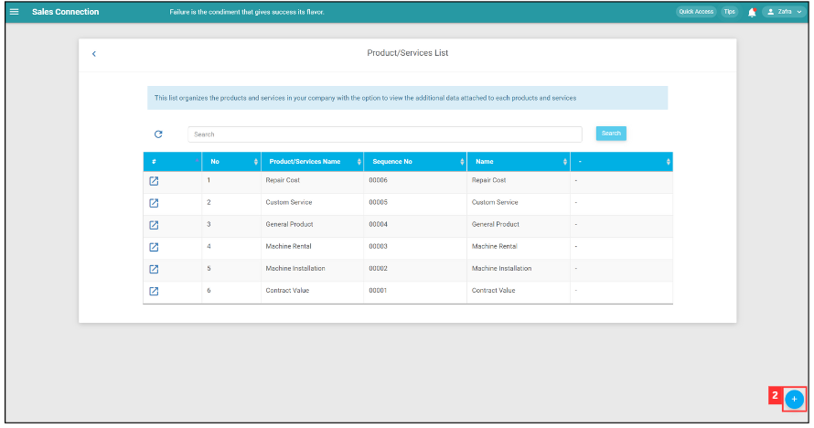
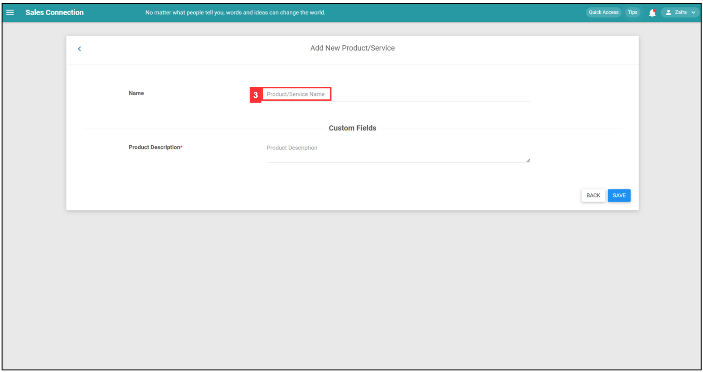
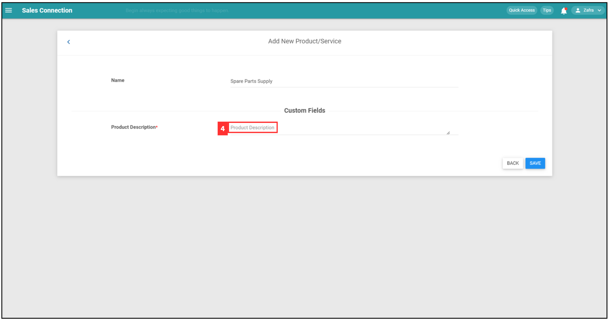
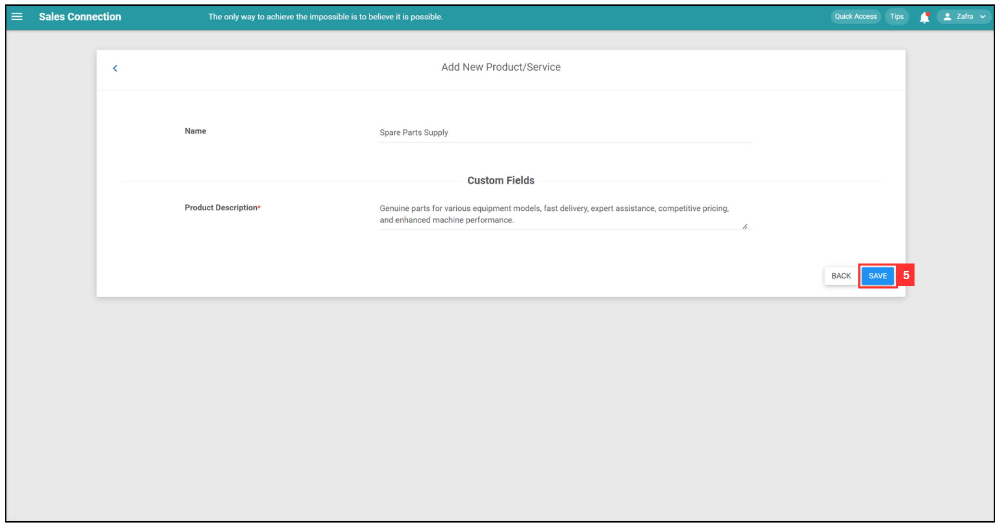
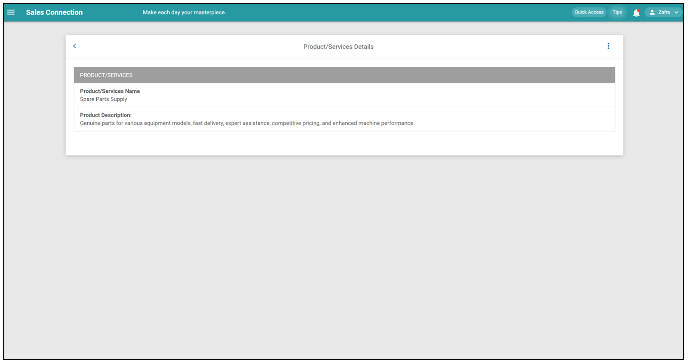
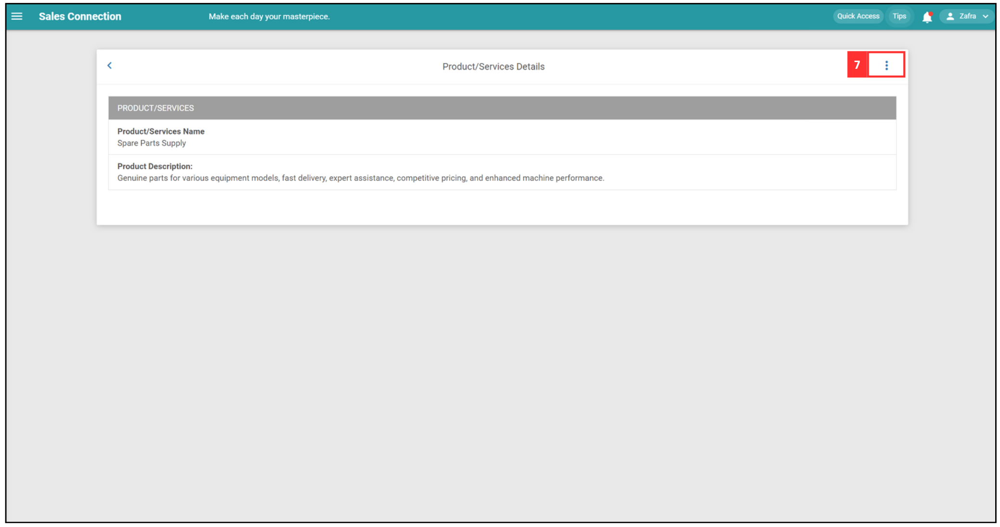
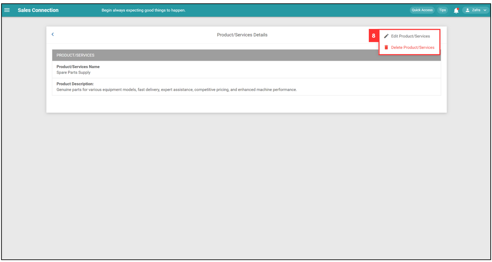

## How to Add New Product/Services?

**Navigate to the section by clicking it.** 

- [Add New Product/Services](#section1) 
- [Edit the Newly Added Product/Services](#section2) 
   
 

### Add New Product/Services

1. At the desktop's navigation bar, go to Business Management > Product/Services List. 
   **Open Product/Services List Here:** [https://salesconnection.my/templateSettings/ViewProductList](https://salesconnection.my/templateSettings/ViewProductList) 

   

     
   

    

2. Click the "+" button to add new product/services.

   

     
   

    

3. Click on the text box to add new product/service name.

   

     
   

    

4. Click on the text tox below Custom Fields to add product description.

   

     
   

    

5. Click save button to save the new product/service details.

   

     
   

    

6. The new product/service details have been saved successfully.

   

     
   

    

   

   ### Edit the Newly Added Product/Services

7. Click on the three dots icon if you want to edit the details of this product/service.

   

     
   

    

8. You can either edit or delete the newly added product/services.

   

     
   

    

**Related Articles**
- [How to Import New Product/Services(s)?](Import_Product_Services.md)
- [Product/Services List](Product_Services_List.md)

<!-- [Link Text](https://salesconnection.github.io/Sales-Connection-Support/Add_New_Product&Service_List.html) -->
