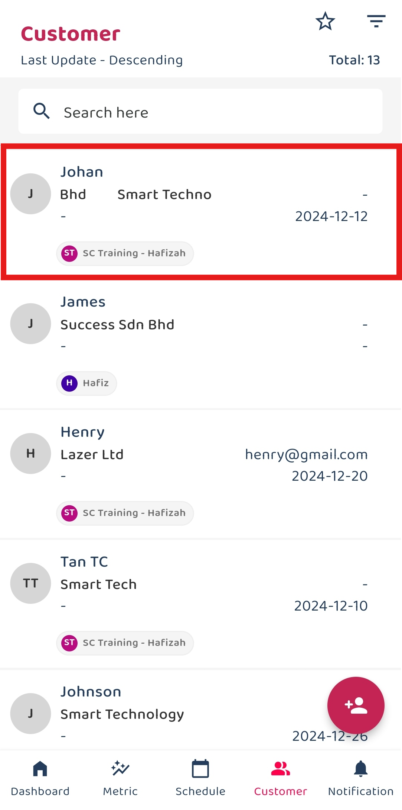
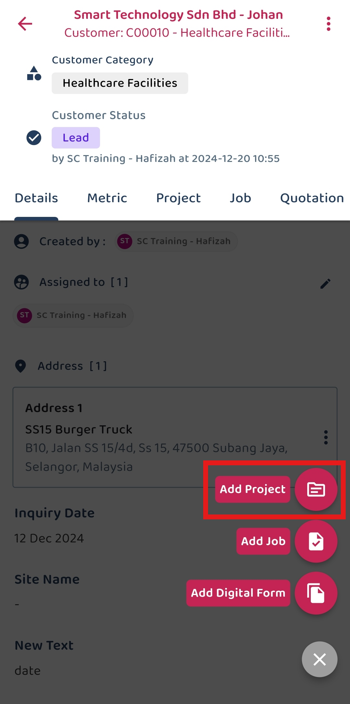
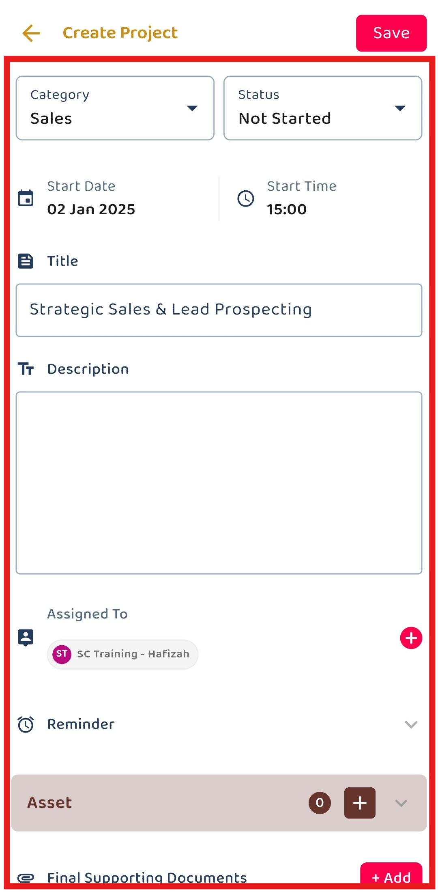
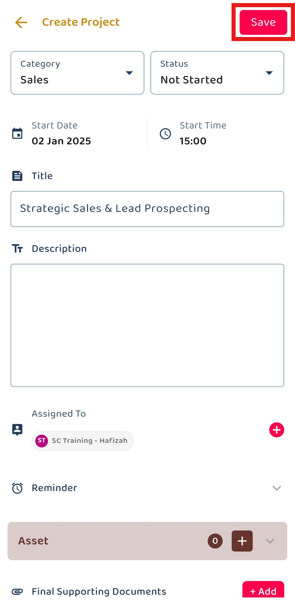
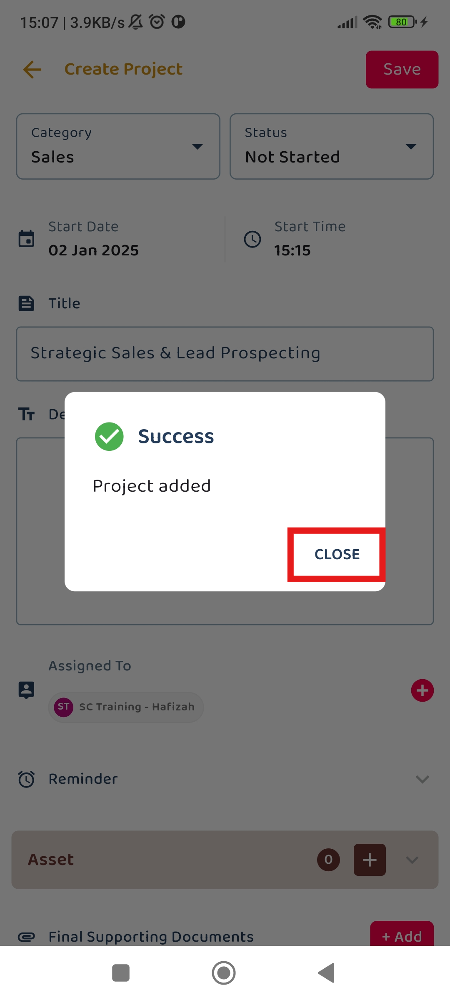

Version 1.0 
Created: 20 June 2024 
Updated: 20 June 2024 
## How to Add New Project?

**Navigate to the section by clicking it.** 

- [Mobile Version](#section1) 
- [Desktop Version](#section2)
   

**Mobile Version**

1. At the mobile app's navigation bar, go to Customer. 
     
   

     
   

2. Click on the Customer that needs to create a new project. 

   

     
   

3. Click on the "+" button. 
     
   

     
   

   *Note: If you do not see a “+” button, you may need to request permission or help from your Admin to register new Project. 

4. Click the "Add Project" icon to add a new project for the customer. 

   

     
   

     
5. Fill out the details of the new project. 

   | Field | Description |
   |-------|---------|
   | Category | Classifies the project type. |
   | Status | Indicates the current status of the project. |
   | Start Date | The date when the project is planned to start. |
   | End Date | The date when the project is planned to end. |
   | Title | A short title for the project. |
   | Description | Detailed description of the project. |
   | Assigned To | The user responsible for managing this project. |
   | Reminder | Set a reminder for the project. |
   | Asset | Any asset registered in the system associated with the project. |
   | Final Supporting Documents | Upload final supporting documents for the project. |
   | Product/Services | Select the products or services involved in the project. |
          
   

     
   

6. Click the "tick" icon to save the project. 

     

       
     

7. The new project has been saved successfully when this prompt appears. 

     

       
     

       
     

**Desktop Version**

1. At the desktop site's navigation bar, go to Business Management > Customer List. 
   **Add New Project Here:** [https://salesconnection.my/customers](https://salesconnection.my/customers) 
     
   

     
   

2. Remember to use the filter bar to search for the desired customer before clicking the expand button. 

   

     
   

3. Click on the "+" button. 
     
   

     
   

   *Note: If you do not see a “+” button, you may need to request permission or help from your Admin to register new Project. 

4. Click on the "New Project" button to add a new project for the customer. 

   

     
   

     
5. Fill out the details of the new project. 

   | Field | Description |
   |-------|---------|
   | Category | Classifies the project type. |
   | Status | Indicates the current status of the project. |
   | Start Date | The date when the project is planned to start. |
   | End Date | The date when the project is planned to end. |
   | Title | A short title for the project. |
   | Description | Detailed description of the project. |
   | Reminder | Set a reminder for the project. |
   | Asset ID | Any asset registered in the system associated with the project. |
   | Assigned To | The user responsible for managing this project. |
   | Final Supporting Documents | Upload final supporting documents for the project. |
   | Product/Services | Select the products or services involved in the project. |
          
   

     
   

6. Click on the "Save Project" button. 

     

       
     

7. Click "OK" and the new project has been saved successfully. 

     

       
     

        

**Related Articles** 
- [How do I Import New Project(s)?](Import_Project.md)
- [How to Add New Customer?](Add_New_Customer.md)
- [How to Add New Job?](Add_New_Job.md)
- [How to Add New Asset?](How_to_Add_New_Asset.md)
- [How to Create Digital Form?](Create_Digital_Form.md)
- [How to Generate and Share QR Code for Public Form?](Creation_of_Public_Form.md)

<!-- [Link Text](https://salesconnection.github.io/Sales-Connection-Support/Add_New_Project.html) -->
