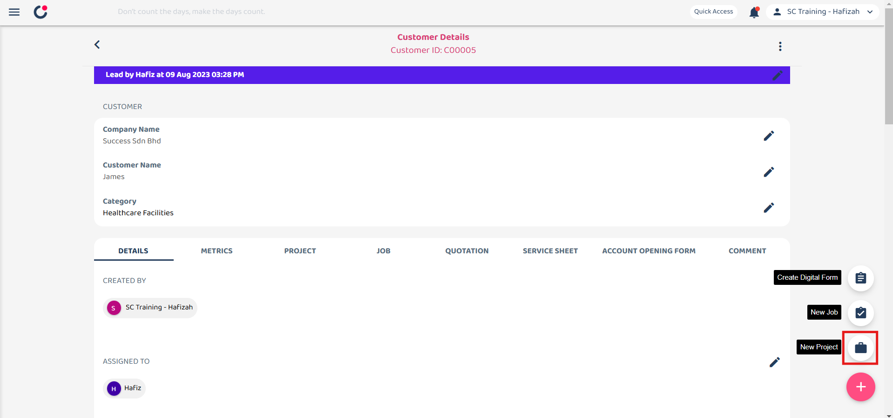
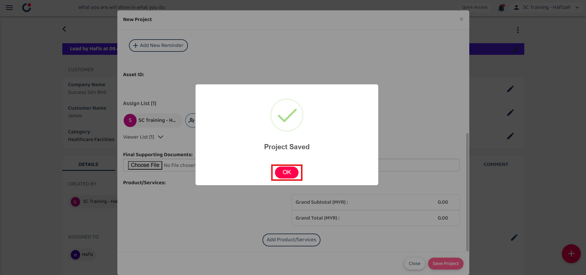

## How to Add New Project?
    
  1. At the desktop site's navigation bar, go to Business Management > Customer List. 
     **Add New Project Here:** [https://salesconnection.my/customers](https://salesconnection.my/customers) 
     
     

       
     

  2. Click on the expand button of the customer that you want to add a new project for. 

     

       
     

  3. Click on the "+" button. 
     
     

       
     

  4. Click on the "New Project" button to add a new project for the customer. 

     

       
     

     
  5. Fill out the details of the new project. 

     | Field Name| Description |
     |-------|---------|
     | Category | Classifies the project type. |
     | Status | Indicates the current status of the project. |
     | Start Date | The date when the project is planned to start. |
     | End Date | The date when the project is planned to end. |
     | Title | A short title for the project. |
     | Description | Detailed description of the project. |
     | Reminder | Set a reminder for the project. |
     | Asset ID | Any asset registered in the system associated with the project. |
     | Assigned To | The user responsible for managing this project. |
     | Final Supporting Documents | Upload final supporting documents for the project. |
     | Product/Services | Select the products or services involved in the project. |
          
     

       
     

6. Click on the "Save Project" button. 

     

       
     

7. Click "OK" and the new project has been saved successfully. 

     

       
     

        

**Related Articles** 
