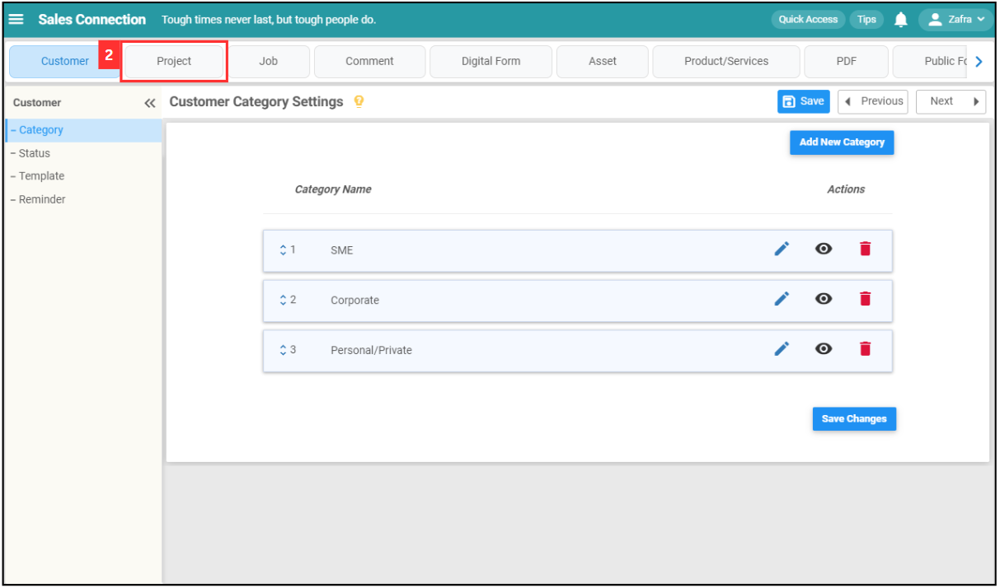
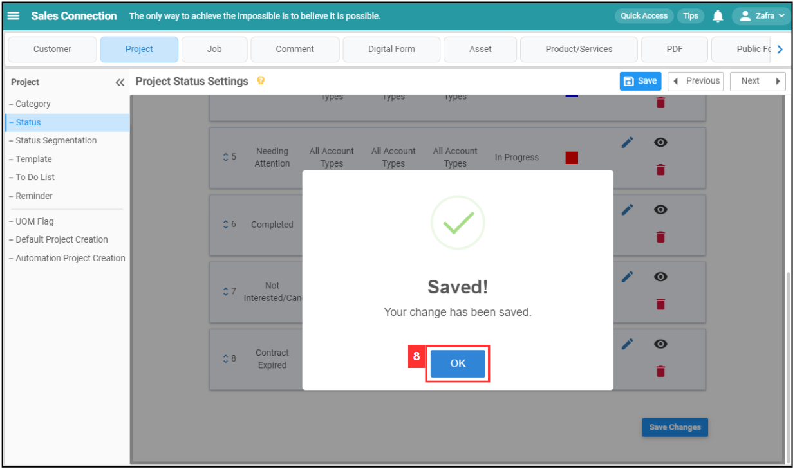
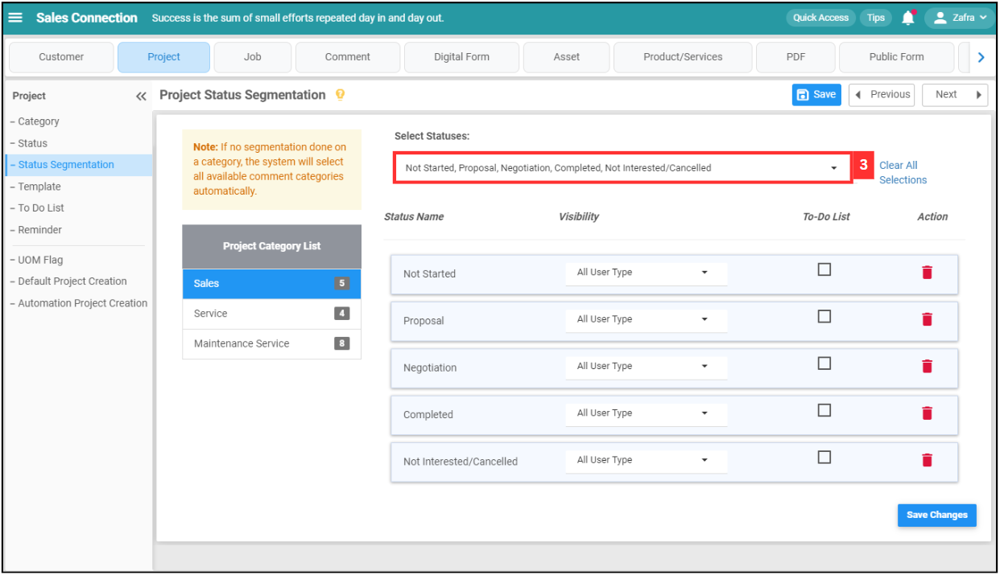
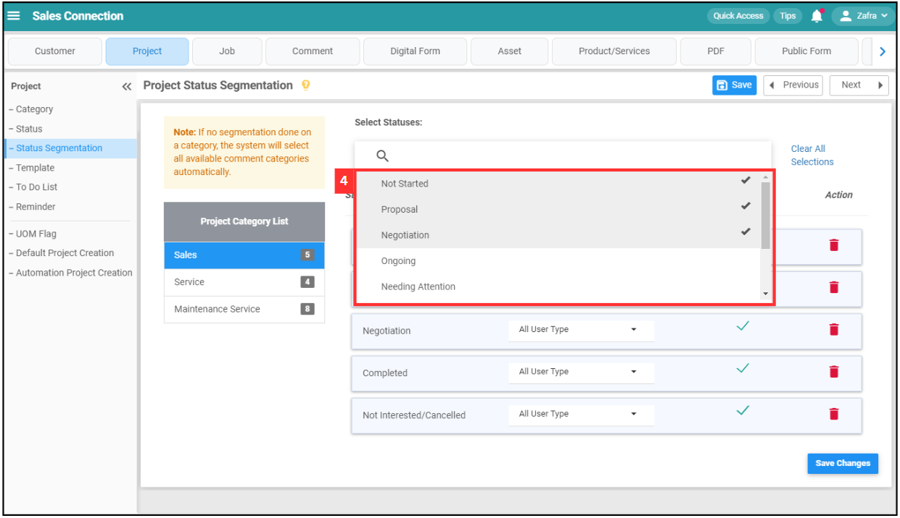
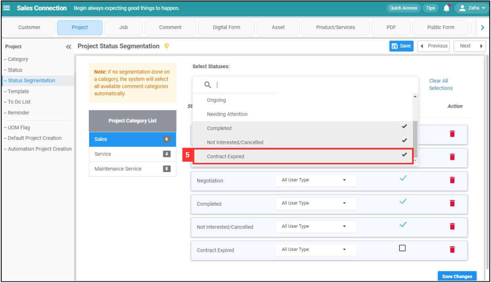
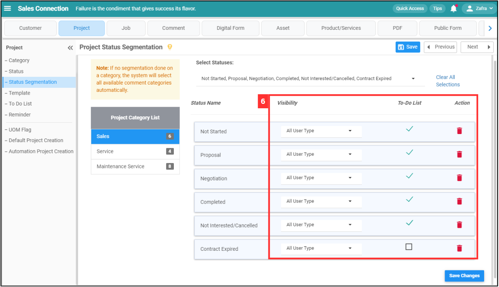

Version 1.0 
Created: 27 May 2024 
Updated: 27 May 2024 
## How Do I Add New Status in Customer/Project/Job?

Keep track of all your Job, Project, Customer, Asset, Digital Form(s), and other statuses with the right status set up.  

**Navigate to the section by clicking it.** 

- [Add New Status](#section1) 
- [Status Segmentation](#section2)
   

1. In adding statuses for all the different data levels in your system, we will be utilising the Wizard page that has access to all status relevant pages. In this guide, we will focus on the Project status as an example. At the desktop main navigation bar, click on Wizard. 
   **Open Wizard Page Here:** [https://salesconnection.my/wizard](https://salesconnection.my/wizard) 
 
   

     
   

   *Note: You must have access to Company Settings menu to perform this action. Please request permission or help from your admin if you do not have access to the menu.  

## Add New Status

2. Click "Project". 

   

     
   

 
3. Click "Status". 

   

     
   

4. Click on the "Add New Status" button. 

   

     
   

5. To add a new status for the Contract Expired Project, please follow these steps: 

   | Terms | Meaning |
   |-------|---------|
   | Name | Assign a name to the status (E.g. Contract Expired). |
   | Edit Access | Define who can edit the Contract Expired Project when it's in this status (E.g. If the status is "Contract Expired", only specific users can make edits). |
   | Status Modification | Specify who can change the project's status (E.g. Only certain users can modify the project's status when it's "Contract Expired"). |
   | Digital Form Creation | Specify who can create digital form for the project when it's in this status (E.g. If the status is "Contract Expired", only specific users can create digital form). |
   | Status Type | Categorize the status for more manageable system administration, For this example, you can select "Cancelled". |
   | Color | Pick a color to represent the status in the system for easy reference. |

   

     
   

7. Click the "Submit" button. 

   

     
   

8. Remember to click the "Save" button to save the new status. 

   

     
   

9. Click "OK" and the new project status has been saved successfully. 

   

     
   

     

## Status Segmentation

1. On the same page, click "Status Segmentation".
     
   

     
   

2. Click on the project category you want to add the status. 

   

     
   

3. Click on the expand button to select status.

   

     
   

   *Note: Visibility determines who can see the to-do list and who must complete the to-do list before changing the status. 
  
4. Scroll to find the status you want to add.

   

     
   

  
5. Click on the status you want to add.

   

     
   

6. Edit the field of the status you added.

   | Terms | Description |
   |-------|-------------|
   | Visibility | Decide who can see this status. |
   | To-do List | Decide who can see the to-do list of the status. |
   | Delete | Click to delete the status. |

   

     
   

7. Click on the "Save Changes" button.

   

     
   

   
8. The status has been added to the category successfully when this prompt appears.

   

     
   

      

**Related Articles** 
- [How Do I Add New Category in Customer/Project/Job?](Add_New_Category_in_Customer_Project_Job.md)
- [How Do I Add New Status in Digital Form?](Add_New_Status_in_Digital_Form.md)

<!-- [Link Text](https://salesconnection.github.io/Sales-Connection-Support/Add_New_Status_in_Customer_Project_Job.html) -->
