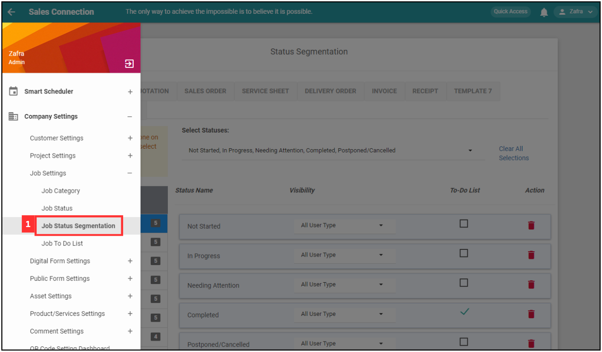
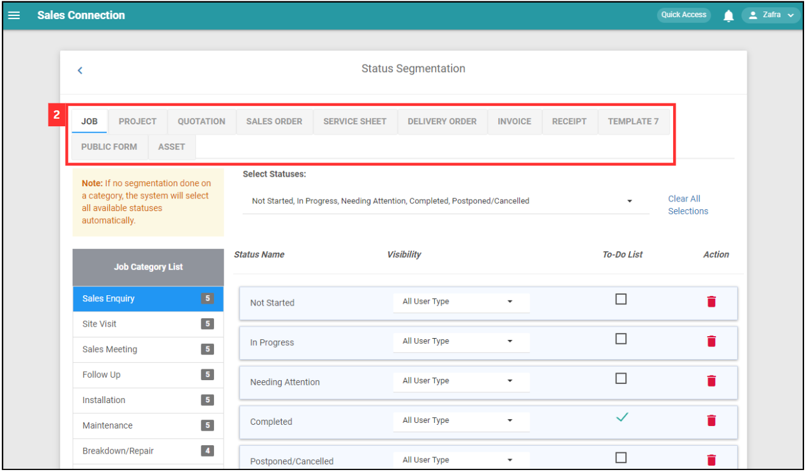
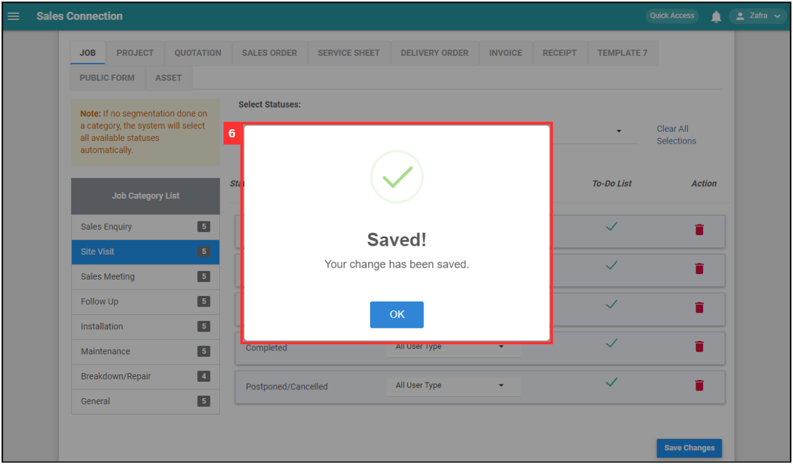
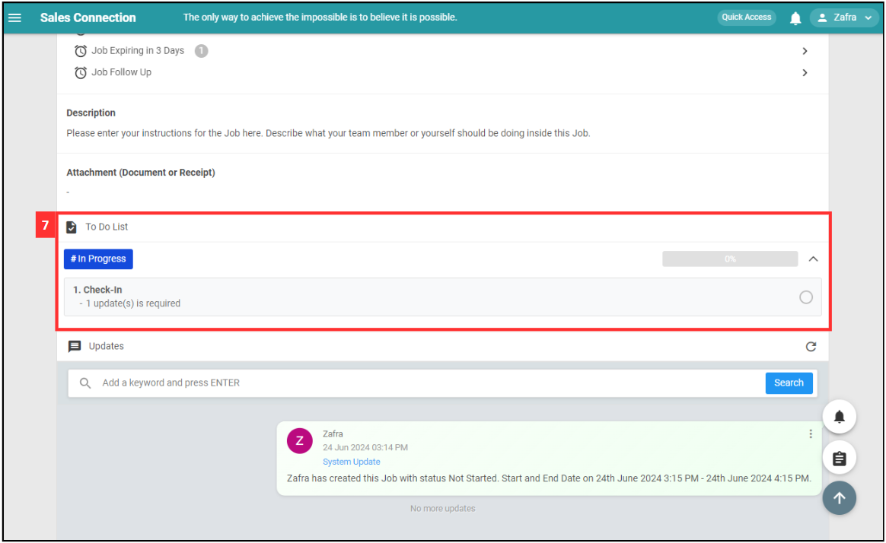

Version 1.0 
Created: 27 May 2024 
Updated: 27 May 2024 
## How Do I Add New Status in Customer/Project/Job?

**Navigate to the section by clicking it.** 

- [Deactivate a Resigned User?](#section1) 
- [Delete a Resigned User?](#section2) 
- [Change to a New User?](#section3)
   

## Add New Status

1. For example, if you wish to add new status in Project. At the desktop site's navigation bar, go to Wizard. 
   **Open Wizard Page Here:** [https://salesconnection.my/wizard](https://salesconnection.my/wizard) 
 
   

     
   

2. Click "Project". 

   

     
   

 
3. Click "Status". 

   

     
   

4. Click on the "Add New Status" button. 

   

     
   

5. To add a new status for the Contract Expired Project, please follow these steps: 

   | Terms | Meaning |
   |-------|---------|
   | Name | Assign a name to the status (E.g. Contract Expired). |
   | Edit Access | Define who can edit the Contract Expired Project when it's in this status (E.g. If the status is "Contract Expired", only specific users can make edits). |
   | Status Modification | Specify who can change the project's status (E.g. Only certain users can modify the project's status when it's "Contract Expired"). |
   | Digital Form Creation | Specify who can create digital form for the project when it's in this status (E.g. If the status is "Contract Expired", only specific users can create digital form). |
   | Status Type | Categorize the status for more manageable system administration, For this example, you can select "Cancelled". |
   | Color | Pick a color to represent the status in the system for easy reference. |

   

     
   

7. Click the "Submit" button. 

   

     
   

8. Remember to click the "Save" button to save the new status. 

   

     
   

9. Click "OK" and the new project status has been saved successfully. 

   

     
   

## Status Segmentation

  1. At the desktop site's navigation bar, go to Company Settings > Job Settings > Job Status Segmentation. 
     **Open Job Status Segmentation Here:** [https://salesconnection.my/settings/statusTransaction?page=act](https://salesconnection.my/settings/statusTransaction?page=act) 
     
     

       
     

  2. Select the data level you want. For example, click "JOB". 

     

       
     

  3. Click on the job category you want to add the to-do list. 

     

       
     

  
  4. Tick on the box of the to-do list and select the visibility of the to-do list. 

     

       
     

  
  5. Click on the "Save Changes" button. 

     

       
     

  6. Your to-do list segmentation is successfully saved when the “Saved” prompt appears. 

     

       
     

  7. For example, when the to-do list is ticked for "Site Visit" Job with the status "In Progress", the to-do list box will be displayed in the job as below. 

     

       
     

        

**Related Articles** 
- [How Do I Add New Category in Customer/Project/Job?](Add_New_Category_in_Customer_Project_Job.md)
- [How Do I Add New Status in Digital Form?](Add_New_Status_in_Digital_Form.md)
