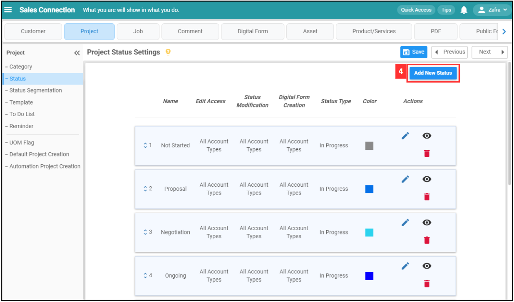

## How Do I Add New Status in Customer/Project/Job?
    
  1. For example, if you wish to add new status in Project. At the desktop site's navigation bar, go to Company Settings > Project Settings > Project Status. 

     

       
     

  2. Click on the "Add New Status" button. 
     **Add New Project Status Here:** [https://salesconnection.my/settings/StatusList?type=dssecond](https://salesconnection.my/settings/StatusList?type=dssecond) 

     

       
     

  3. Fill in the details of the new project status. 
     a. The details include: 
        - Name 
        - Edit Access 
        - Status Modification 
        - Digital Form Creation 
        - Status Type 
        - Color (Choose one to represent the status in the system) 

     

       
     

  4. Click the "Submit" button. 

     

       
     

  5. Remember to click the "Save Changes" button to save the new status. 

     

       
     

  6. Click "OK" and the new project status has been saved successfully. 

     

       
     

        

**Related Article** 
