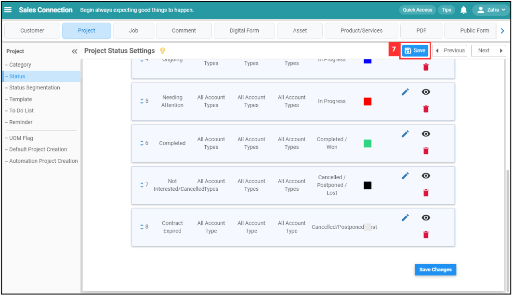

## How Do I Add New Status in Customer/Project/Job?
    
  1. For example, if you wish to add new status in Project. At the desktop site's navigation bar, go to Wizard. 
     **Open Wizard Page Here:** [https://salesconnection.my/wizard](https://salesconnection.my/wizard) 
     
     

       
     

  
  2. Click "Project". 

     

       
     

     
  3. Click "Status". 

     

       
     

  4. Click on the "Add New Status" button. 

     

       
     

  5. Fill in the details of the new project status. 
     a. The details include: 
        - Name (E.g. Contract Expired) 
        - Edit Access (E.g. Once the status is "Contract Expired", only the user who has the access can edit the project.) 
        - Status Modification (E.g. Once the status is "Contract Expired", only the user who has the access can modify the status.) 
        - Digital Form Creation (E.g. Once the status is "Contract Expired", only the user who has the access can create digital form.) 
        - Status Type (E.g. In progress) 
        - Color (Choose one to represent the status in the system) 

     

       
     

  6. Click the "Submit" button. 

     

       
     

  7. Remember to click the "Save" button to save the new status. 

     

       
     

  8. Click "OK" and the new project status has been saved successfully. 

     

       
     

        

**Related Articles** 
- [How Do I Add New Category in Customer/Project/Job?](Add_New_Category_in_Customer_Project_Job.md)
- [How Do I Add New Status in Digital Form?](Add_New_Status_in_Digital_Form.md)
- [How Do I Add New Category in Digital Form?](Add_New_Category_in_Digital_Form.md)
