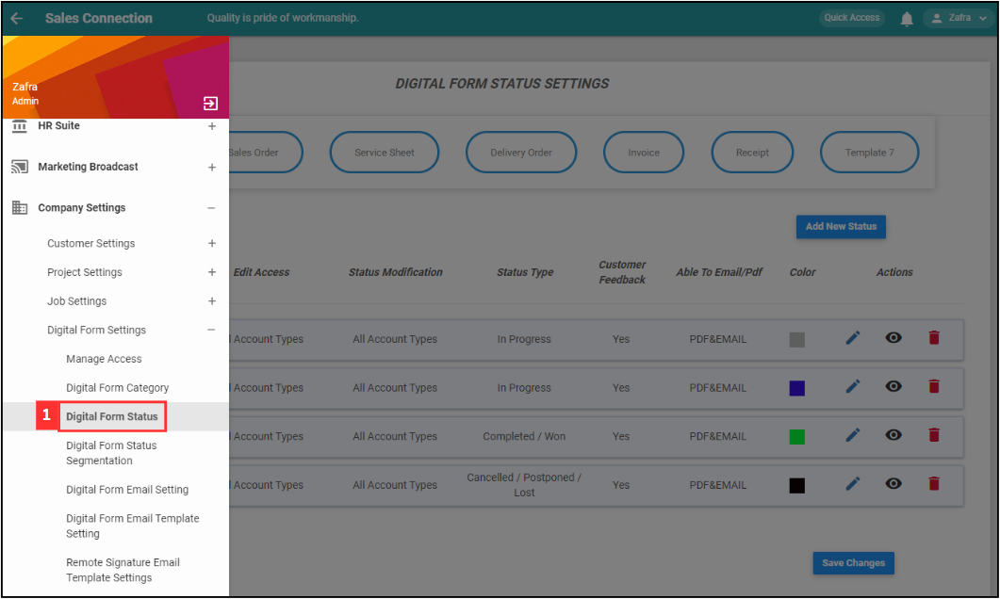
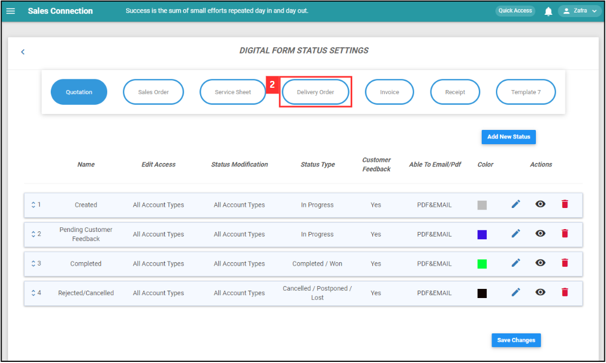
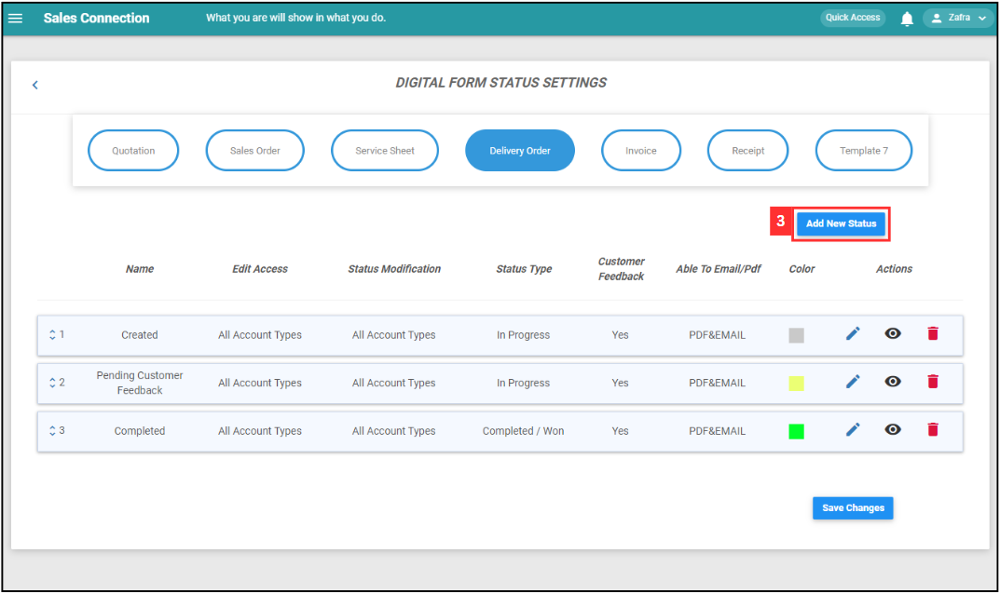
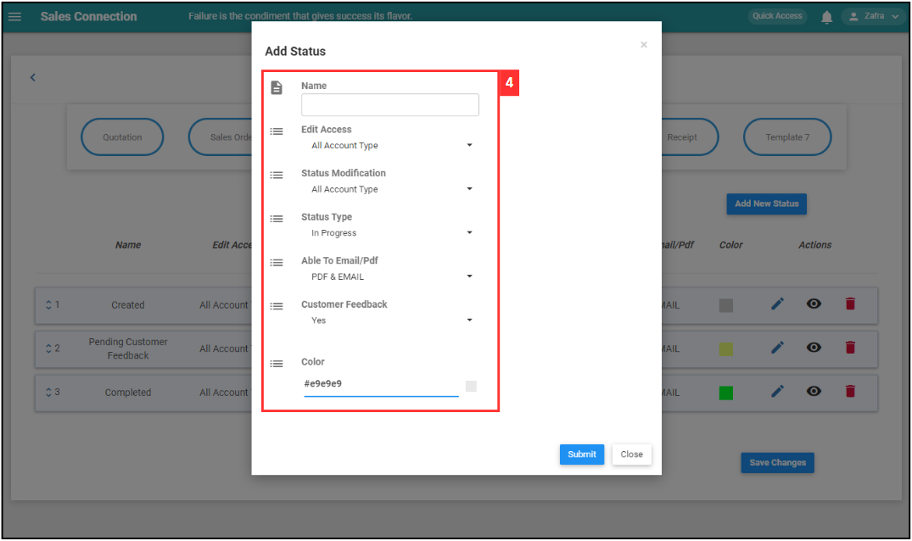
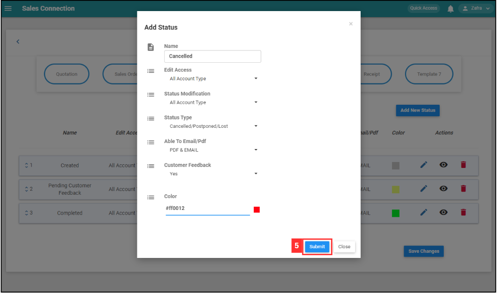
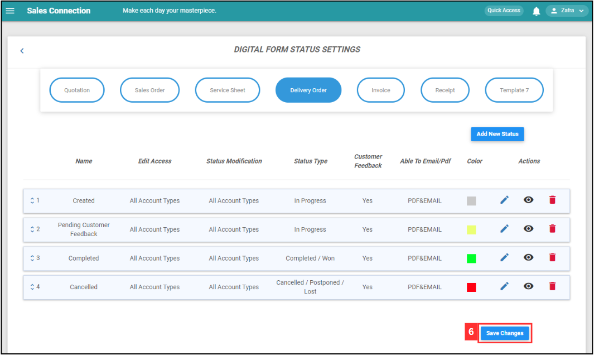
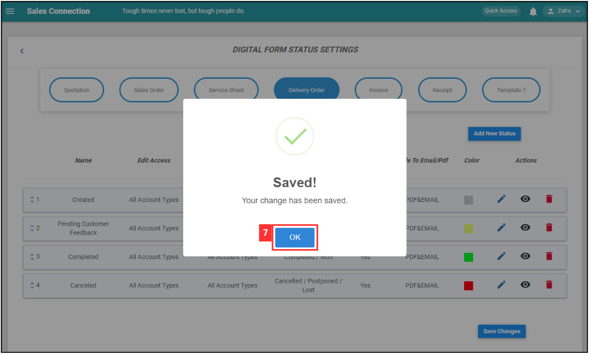

Version 1.0 
Created: 27 May 2024 
Updated: 27 May 2024 
## How Do I Add New Status in Digital Form?
    
  1. For example, if you wish to add new status in Delivery Order. At the desktop site's navigation bar, go to Company Settings > Digital Form Settings > Digital Form Status. 

     

       
     

  2. Click on "Delivery Order". 
     **Add New Digital Form Status Here:** [https://salesconnection.my/ServiceReport/DigitalFormStatus](https://salesconnection.my/ServiceReport/DigitalFormStatus) 

     

       
     

  
  3. Click on the "Add New Status" button. 

     

       
     

  4. To add a new status for the Delivery Order Form, please follow these steps: 

     | Terms | Meaning |
     |-------|---------|
     | Name | Assign a name to the status (E.g. "Cancelled"). |
     | Edit Access | Define who can edit the Delivery Order Form when it's in this status (E.g. If the status is "Cancelled", only specific users can make edits). |
     | Status Modification | Specify who can change the form's status (E.g. Only certain users can modify the form's status when it's "Cancelled"). |
     | Status Type | Categorize the status for more manageable system administration. For this example, you can select "Cancelled". |
     | Email/PDF Options | Choose if the form can be emailed or converted to PDF (E.g. Select "PDF Only" if the form should only be sent as a PDF). |
     | Customer Feedback | Choose if you want a section for customer comments in this status (E.g. Pick "No" if you don't want a feedback section while in this status). |
     | Color | Pick a color to represent the status in the system for easy reference. |

     

       
     

  6. Click the "Submit" button. 

     

       
     

  7. Remember to click the "Save Changes" button to save the new status. 

     

       
     

  8. Click "OK" and the new "Delivery Order" status has been saved successfully. 

     

       
     

        

**Related Articles** 
- [How Do I Add New Category in Customer/Project/Job?](Add_New_Category_in_Customer_Project_Job.md)
- [How Do I Add New Status in Customer/Project/Job?](Add_New_Status_in_Customer_Project_Job.md)

<!-- [Link Text](https://salesconnection.github.io/Sales-Connection-Support/Add_New_Status_in_Digital_Form.html) -->
