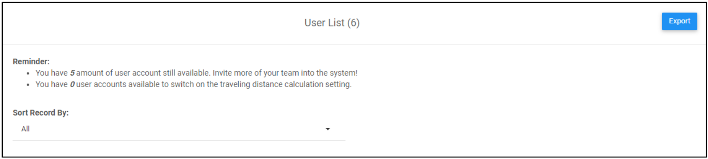

Version 1.0 
Created: 24 May 2024 
Updated: 24 May 2024 
## 👩‍💼 How to Add New User?
    
  1. At the desktop site's navigation bar, go to User Management > User List. 

     

       
     

  2. Click on the "+" button to access the "Add New User" page. 
     **Add User Here:** [https://salesconnection.my/usermanage/adduser](https://salesconnection.my/usermanage/adduser) 

     

       
     

  3. Fill out the details of your new team member. 
     a. The details include: 
        - Name 
        - Telephone 
        - Email (optional if the user only uses a mobile device) 
        - Staff Category 
        - Account Type 
        - Color (Choose one to represent the user in the system) 
        
      b. Click “Submit Form” to finish the process. 

     

       
     

      

### What is the limit for me to add users?

  The total number of user accounts available depends on your **subscription plan**. 
  To check the remaining number of user accounts and desktop access available, go to the desktop site’s navigation bar > User Management > User List. It is stated at the top of this page under “Reminder.” 

  

    
  

  
  **Check Your User Limit Here:** [https://salesconnection.my/usermanage/userlist](https://salesconnection.my/usermanage/userlist)  

### Why I cannot add a user?

  You might have reached the **maximum limit** of user accounts that can be created. 
  To check the remaining number of user accounts available, go to the desktop site’s navigation bar > User Management > User List. It is stated at the top of this page under “Reminder.” 

  **Check Your User Limit Here:** [https://salesconnection.my/usermanage/userlist](https://salesconnection.my/usermanage/userlist) 
  
  If you want to add more users, **contact us** through 012-2780122 to upgrade your subscription plan.
     

**Related Articles** 
- [How to Add New User Category?](Add_New_User_Category.md)
- [How to Assist My New User to Login?](New_User_Login.md)
- [How to Login Into Sales Connection Using Mobile and Desktop?](Login.md)

<!-- [Link Text](https://salesconnection.github.io/Sales-Connection-Support/Add_New_User.html) -->
