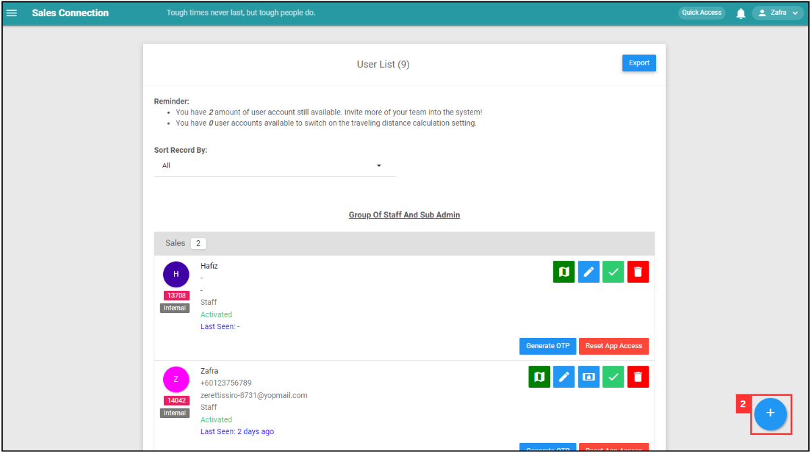

## 👩‍💼 How to Add New User?
    
  1. At the desktop site's navigation bar, go to User Management > Invite User. 

     

       
     

  2. Click on the "+" button to access the "Add New User" page. 
     **Add User Here:** [https://salesconnection.my/usermanage/adduser](https://salesconnection.my/usermanage/adduser) 

     

       
     

  3. Fill out the details of your new team member and click "Submit Form". 
     Details such as name, telephone, email, staff category, account type and color (pick one to represent the user in the system). 
     *Note: Email is optional if the user only uses mobile device. 

     

       
     

      

### What is the limit for me to add users?

  The total number of user accounts available depends on your **subscription plan**. 
  To check the remaining number of user accounts and desktop access available, go to the desktop site’s navigation bar > User Management > User List. It is stated at the top of this page under “Reminder.†

  

    
  

  
  **Check Your User Limit Here:** [https://salesconnection.my/usermanage/userlist](https://salesconnection.my/usermanage/userlist)  

### Why I cannot add a user?

  You might have reached the **maximum limit** of user accounts that can be created. 
  To check the remaining number of user accounts available, go to the desktop site’s navigation bar > User Management > User List. It is stated at the top of this page under “Reminder.†

  **Check Your User Limit Here:** [https://salesconnection.my/usermanage/userlist](https://salesconnection.my/usermanage/userlist) 
  
  If you want to add more users, contact us to upgrade your subscription plan!  

**Looking for More?**
- [How to Assist My New User to Login?](New_User_Login.md)
- 
