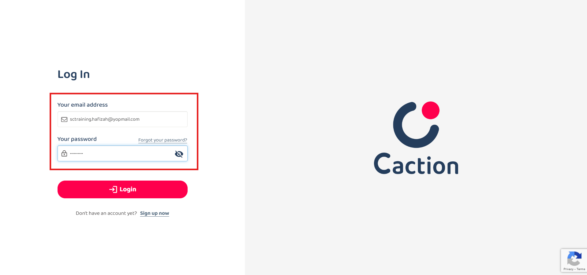

## 👩‍💼 Add New User
    
### How do I add users?

  1. At the desktop site's navigation bar, go to User Management > Invite User. 
     **Add User Here:** [https://salesconnection.my/usermanage/adduser](https://salesconnection.my/usermanage/adduser) 
  2. Fill out the details of your new team member and click "Submit Form". 
     Details such as name, telephone, email, staff category, account type and color (pick one to represent the user in the system). 
     *Note: Email is optional if the user only uses mobile device. 

     

       
     

      

### How to login as a new user?
  **Desktop Version** 
  1. Click "Verify Email" through a **verification email** sent from admin@salesconnection.my to verify it. 

     

       
     

  2. Another email with a **password** will be sent after the verification. 

     

       
     

     *Note: User can change password after login to the system. 
  
  3. Login using the **registered** email address. 
     **Login Here:** [https://salesconnection.my/login](https://salesconnection.my/login) 

     

       
     

     *Note: Only email addresses that are verified will be sent.  

  **Mobile Version** 
  1. Download the Sales Connection app from Google Playstore or App Store. 
     **Download Here for Android User:** [https://play.google.com/store/apps/details?id=com.connection.crm](https://play.google.com/store/apps/details?id=com.connection.crm) 
     **Download Here for IOS User:** [https://apps.apple.com/us/app/sales-connection/id1327210298](https://apps.apple.com/us/app/sales-connection/id1327210298) 

     

       
     

  
  2. Open the Sales Connection's App, click the "Login" button then enter the **registered** phone number and click "Login". 

     

       
     

  3. Check your "Messages" app and look for the "Code" sent by 62002. 

     

       
     

  4. Enter the "Code" you received and click the "SUBMIT" button to login to the app. 

     

       
     

  
&emsp;&emsp; *Note: Only email addresses that are verified will be sent.  

### What is the limit for me to add users?

  The total number of user accounts available depends on your **subscription plan**. 
  To check the remaining number of user accounts and desktop access available, go to the desktop site’s navigation bar > User Management > User List. It is stated at the top of this page under “Reminder.” 

  

    
  

  
  **Check Your User Limit Here:** [https://salesconnection.my/usermanage/userlist](https://salesconnection.my/usermanage/userlist)  

### Why I cannot add a user?

  You might have reached the **maximum limit** of user accounts that can be created. 
  To check the remaining number of user accounts available, go to the desktop site’s navigation bar > User Management > User List. It is stated at the top of this page under “Reminder.” 

  **Check Your User Limit Here:** [https://salesconnection.my/usermanage/userlist](https://salesconnection.my/usermanage/userlist) 
  
  If you want to add more users, contact us to upgrade your subscription plan!  

