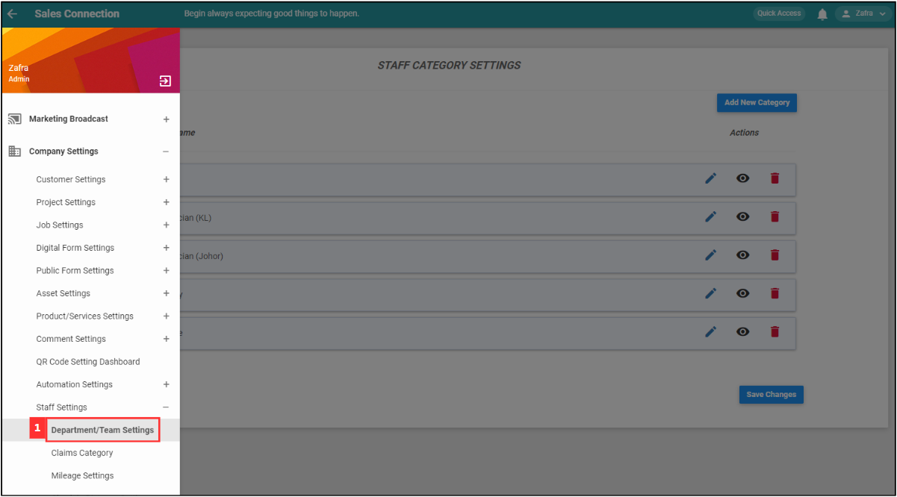
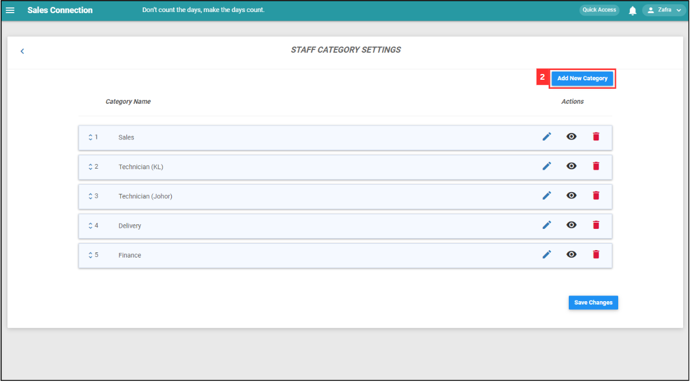
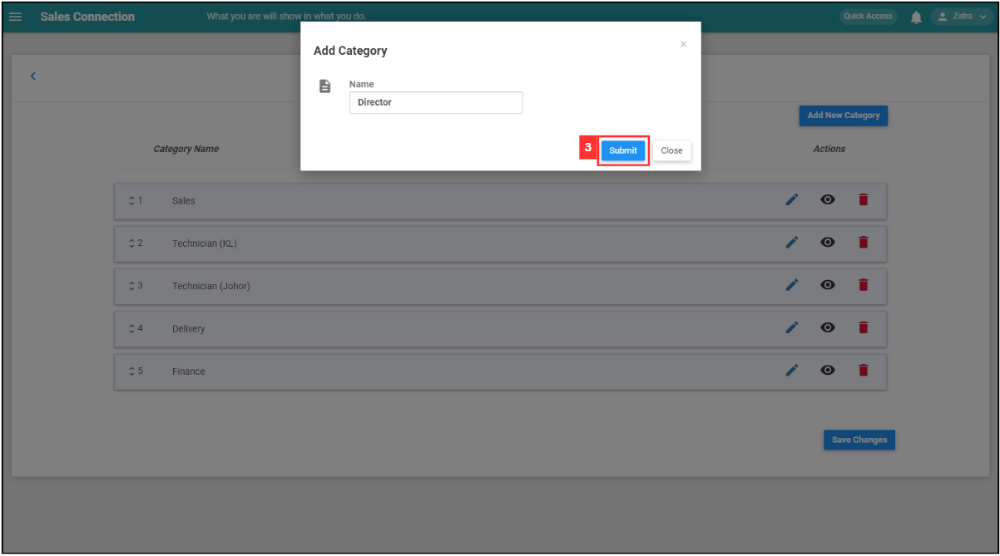
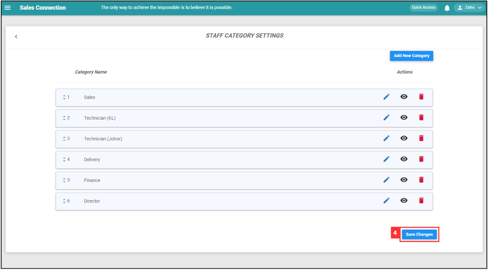
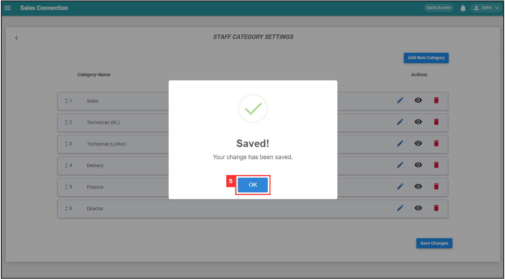
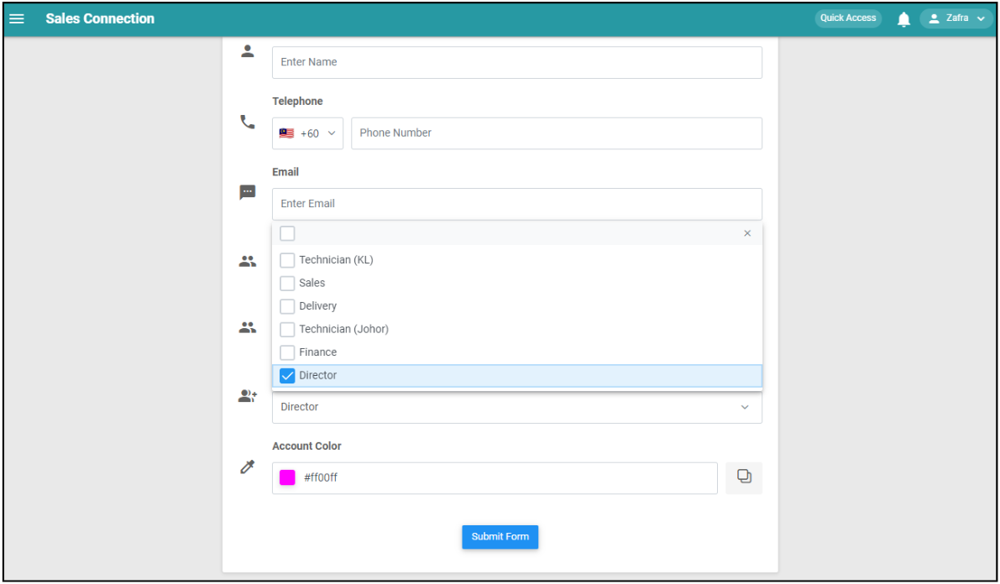

Version 1.0 
Created: 24 May 2024 
Updated: 24 May 2024 
## 👩‍💼 How to Add New User Category?
    
  1. At the desktop site's navigation bar, go to Company Settings > Staff Settings > Department/Team Settings. 
     **Add New User Category Here:** [https://salesconnection.my/settings/CategoryList?type=usother](https://salesconnection.my/settings/CategoryList?type=usother) 

     

       
     

  2. Click on the "Add New Category" button. 

     

       
     

  3. Enter the name of the new user category and click “Submit”. 

     

       
     

  4. Click "Save Changes" to confirm your action. 

     

       
     

  5. The category of user has been added. Now, click "OK". 

     

       
     

  6. The result will be shown below. 
     **Add New User Here:** [https://salesconnection.my/usermanage/adduser](https://salesconnection.my/usermanage/adduser) 

     

       
     

        

**Related Articles** 
- [How to Add New User?](Add_New_User.md)
- [How Do I Add New Category in Customer/Project/Job?](Add_New_Category_in_Customer_Project_Job.md)

<!-- [Link Text](https://salesconnection.github.io/Sales-Connection-Support/Add_New_User_Category.html) -->
