Version 1.0 
Created: 16 July 2024 
Updated: 16 July 2024 
## How to Add Overtime Claim?

Utilize the overtime claim function to capture the extra hours your team has put in to complete the job.  

1. At the mobile navigation bar, go to Dashboard. 

   

      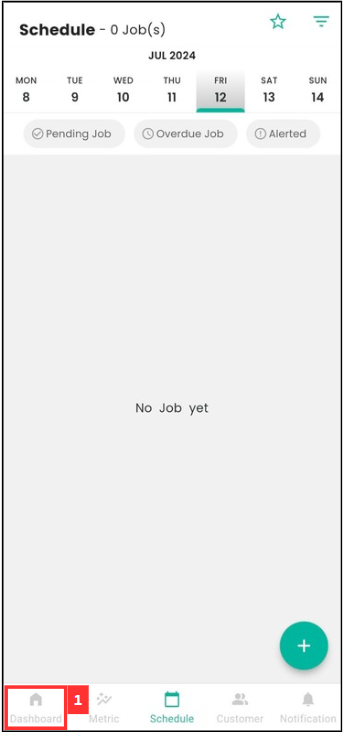
   

2. Click Business Travel.

   

      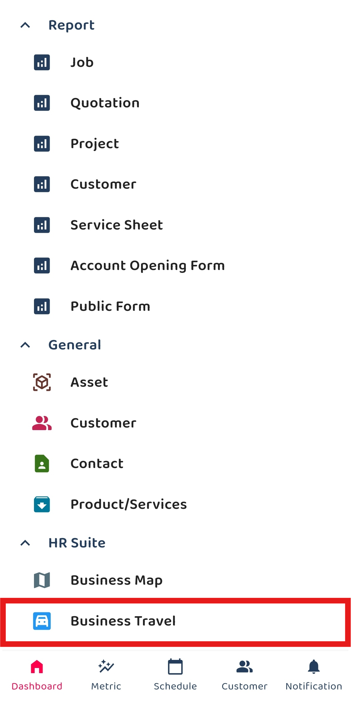
   

3. Select the date of your business travel.

   

      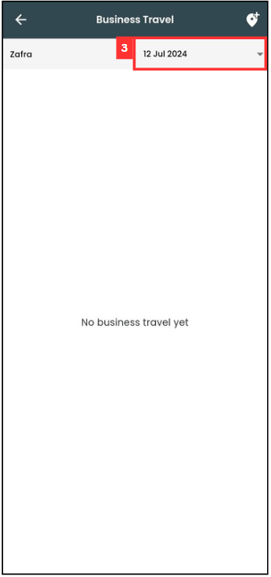
   

4. You can also select a date range of your travels based on the “Start Date” and “End Date”.

   

      
   

5. Click on the "tick" icon.

   

      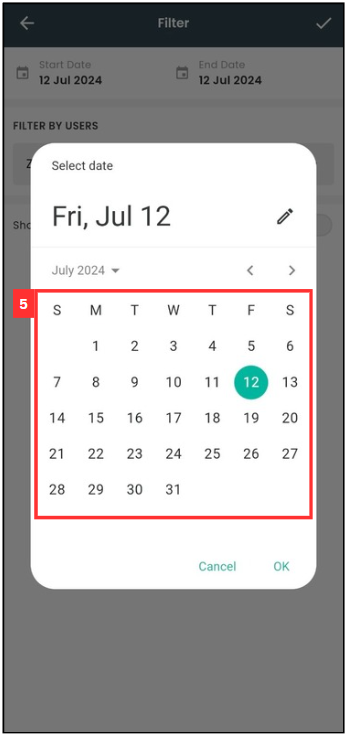
   

6. Select the Business Travel that you would like to create an overtime claim for.

   

      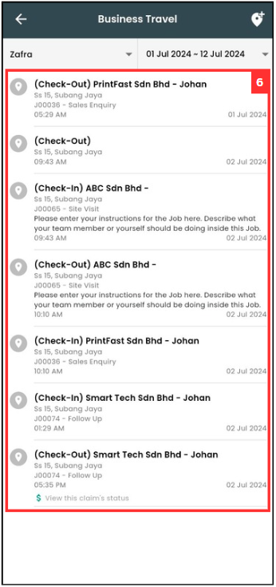
   

   *Note: Selecting Check-in or Check-out will determine whether you can modify the start time or end time of the overtime claim. 

7. Click on "Add New Claim / Attachment".

   

      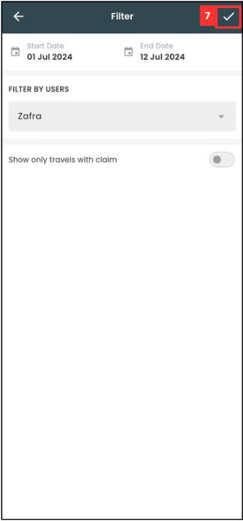
   

8. Click on "Category".

   

      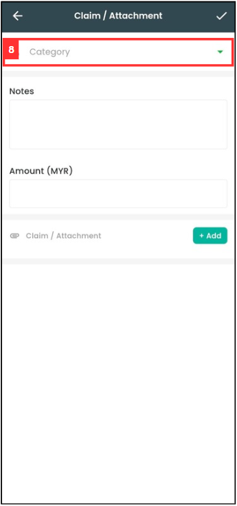
   

  
9. Select the “Overtime” category.

   

      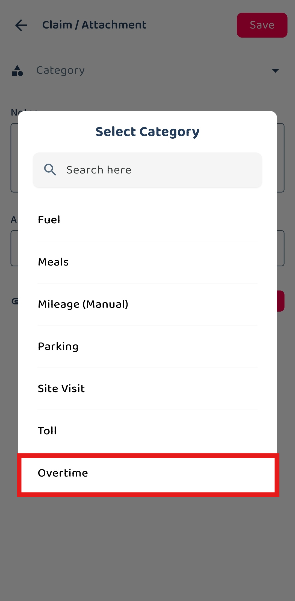
   

10. Enter the notes and the start time of the overtime.

    

      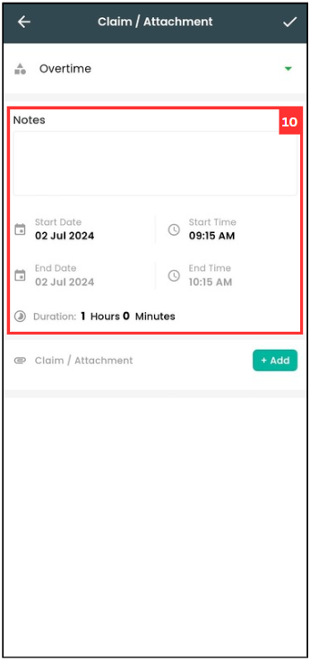
    

    *Note: End time cannot be edited as it follows your check-out time. 

11. Click on "+ Add" if you want to attach any document.

    

      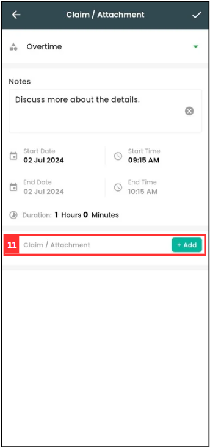
    

12. Click on the "tick" icon.

    

      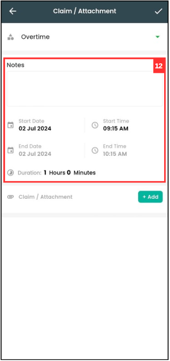
    

13. Your claim has been saved successfully when this prompt appears.

    

      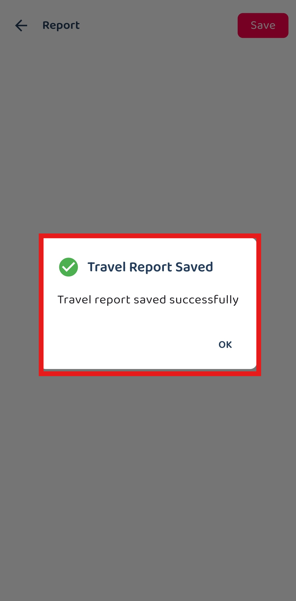
    

       

**Related Articles**
- [Claim Management](Claim_Management.md)
- [Overtime Management](Overtime_Management.md)
- [Office Check-In Settings](Office_Check_In_Settings.md)

<!-- [Link Text](https://salesconnection.github.io/Sales-Connection-Support/Add_Overtime_Claim.html) -->
