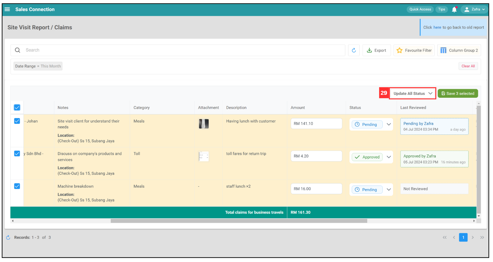

## How to Add Overtime Claim?

**Claim Management** allows users to efficiently manage and review claims related to business expenses, such as meals and travel costs, submitted by employees. It provides a comprehensive overview of claims, including details, attachments, statuses, and amounts, facilitating streamlined processing and approvals.

**Navigate to the section by clicking it.** 

- [Default Columns](#section1) 
- [Filter](#section2) 
- [Favourite Filter](#section3) 
- [Default Filter](#section4) 
- [Clear All Filter](#section5) 
- [Change Claim Status](#section6) 
- [Refresh](#section7) 
- [Export](#section8)
   

1. At the desktop site navigation bar, go to HR Suite > Claims Management. 
   **Open Claims Management Here:** [https://salesconnection.my/claim/list](https://salesconnection.my/claim/list) 

   

      
   

     

   **Default Columns**

2. Click "Default Columns".

   

      
   

3. Click "+ Create".

   

      
   

4. Select the columns you want to display.

   

      
   

5. Tick the box if you want to show assets and product/services separately.

   

      
   

6. Click on the "Save" button.

   

      
   

7. The customize columns will be displayed as below and you can apply it next time.

   

      
   

     

   

   **Filter**  

8. Click "Search" to filter the list.

   

      
   

  
9. Click on the filter group you want.

   

      
   

10. Click on the "Filter Value" you want.

    

      
    

11. Click "Done".

    

      
    

12. The list with filter will be shown as below.

    

      
    

      

    
 
    **Favourite Filter**  

13. Click on "Favourite Filter".

    

      
    

14. Click "+ Add".

    

      
    

15. Enter the name of the favourite filter.

    

      
    

16. Click on the "Save" button.

    

      
    

17. The favourite filter has been saved successfully.

    

      
    

      

    
 
    **Default Filter**

18. Click on "Favourite Filter".

    

      
    

19. Click "Default Filter".

    

      
    

20. Select the favourite filter you want to set as default filter.

    

      
    

21. The default filter has been saved successfully.

    

      
    

    

    **Clear All Filter**

22. Click "Clear All" to remove the filter applied.

    

      
    

    
 
    **Change Claim Status**

23. Scroll the list to "Status" and click on the status of the overtime claim you want to take action.

    

      
    

24. Click on the status you want for the claim.

    

      
    

25. Click "Save 1 selected".

    

      
    

26. Click on the "Submit" button to update the claims.

    

      
    

27. Your changes have been saved successfully when this prompt appears.

    

      
    

28. If you want to select more and change to one status, tick the boxes of the claims you want.

    

      
    

29. Click "Update All Status".

    

      
    

30. Click on the "Status" you want to update to.

    

      
    

31. Click "Save 3 selected".

    

      
    

32. Click on the "Submit" button.

    

      
    

33. Your changes have been saved successfully when this prompt appears.

    

      
    

      

    
 
    **Refresh**  

34. Click "Refresh" icon to get the latest information on claims.

    

      
    

      

    
 
    **Export** 

35. Click "Export" icon to download the claims list.

    

      
    

       

**Related Articles**
- [Overtime Management](Overtime_Management.md)
- [Attendance List](Attendance_List.md)
- [Office Check-In Settings](Office_Check_In_Settings.md)
