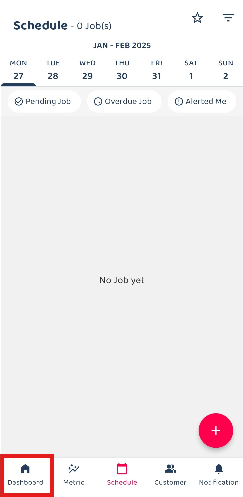
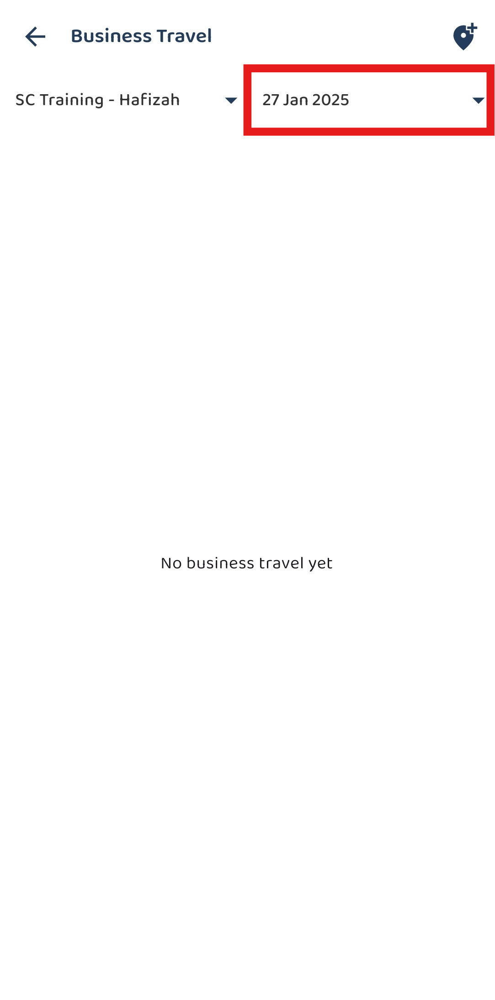
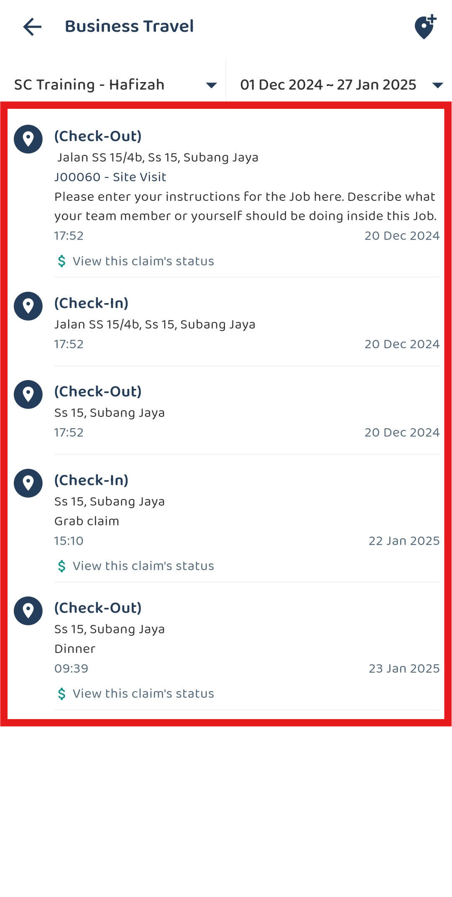
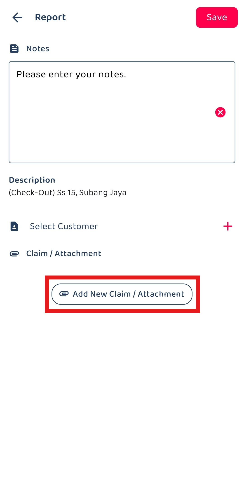
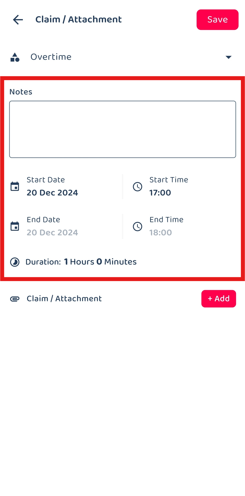

## How to Add Overtime Claim?

1. At the mobile navigation bar, go to Dashboard. 

   

      
   

2. Click Business Travel.

   

      
   

3. Click on the date.

   

      
   

4. Click on "Start Date".

   

      
   

5. Select the date you want.

   

      
   

6. Click "OK".

   

      
   

7. Click on the "tick" icon.

   

      
   

8. Click on the Business Travel that you want to add overtime claim.

   

      
   

  
9. Click on "Add New Claim / Attachment".

   

      
   

10. Click on "Category".

    

      
    

11. Click "Overtime".

    

      
    

12. Enter the notes and the start time of the overtime.

    

      
    

    *Note: End time cannot be edited as it follows your check-out time.

13. Click on "+ Add" if you want to attach any document.

    

      
    

14. Click on the "tick" icon.

    

      
    

15. Your claim has been saved successfully when this prompt appears.

    

      
    

       

**Related Articles**
- [Overtime Management](Overtime_Management.md)
- [Attendance List](Attendance_List.md)
- [Office Check-In Settings](Office_Check_In_Settings.md)
