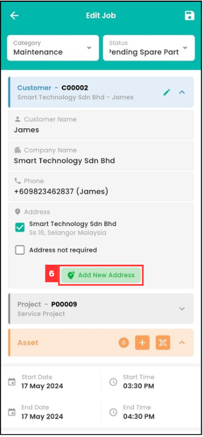

## How to Adjust Geofencing Radius?

1. To adjust the staff check in distance, go to the desktop site navigation bar > Company Settings > Staff Settings > Check-in Distance Settings. 

   

      
   

2. Enter the number of the maximum allowed check in distance. 
   *Note: The suggested check in distance is 1000 meters. 

   

      
   

3. Click on the "SUBMIT" button. 

   

      
   

4. Click "OK" and the new check in distance has been saved successfully. 

   

      
   

   
   

**Related Articles** 
- [I Forgot to Check Out, How?](Assist_Check_Out.md)
- [How to Enable Assist Check Out?](Enable_Assist_Check_Out.md)
