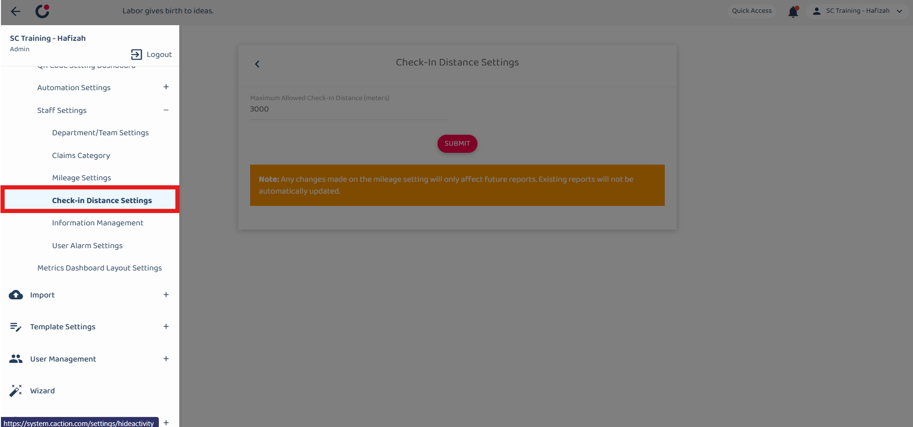

Version 1.0 
Created: 24 May 2024 
Updated: 24 May 2024 
## How to Adjust Geofencing Radius?

1. To adjust the staff check in distance, go to the desktop site navigation bar > Company Settings > Staff Settings > Check-in Distance Settings. 
   **Open the Check-in Distance Settings Page Here:** [https://salesconnection.my/settings/mileage2](https://salesconnection.my/settings/mileage2) 
   

      
   

2. Enter the number of the maximum allowed check in distance. 
   *Note: The suggested check in distance is 1000 meters. 

   

      
   

3. Click on the "SUBMIT" button. 

   

      
   

4. Click "OK" and the new check in distance has been saved successfully. 

   

      
   

   

**Related Articles**
- [I Forgot to Check Out, How?](Assist_Check_Out.md)
- [How to Enable Assist Check Out?](Enable_Assist_Check_Out.md)
- [I am at the location, but the system says I am too far from the location.](Check_In_Address.md)

<!-- [Link Text](https://salesconnection.github.io/Sales-Connection-Support/Adjust_Geofencing_Radius.html) -->
