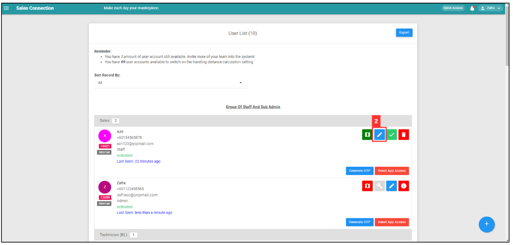

## How do Admin Assist Reset App?

*Note: This feature allows admin to kick out users and perform resetting actions in situations where users have resigned, uninstalled the app, or are consistenly offline.

**Navigate to the section by clicking it.** 

- [User don't have pending data](#section1) 
- [User has pending data](#section2) 
  

 

### User don't have pending data

- [User online](#section3) 
- [User offline](#section4) 

 

**User Online**

1. To reset user's app, go to the desktop site navigation bar > User Management > User List. 
   **Open the User List:** [https://salesconnection.my/usermanage/userlist](https://salesconnection.my/usermanage/userlist) 

   

      
   
 

3. Before reset the selected user's app access, click on the pencil icon to edit the user's details including email and phone number to avoid login by the old user.

   

      
   
 

3. Edit the user details.

   

      
   
 

4. After you have edited the user's details, click on the "Submit Form" button to save the changes.

   

      
   
 
   
5. Click "Reset App Access" to reset the selected user's app access.

   

      
   
 

6. Click "Reset" button to reset app access for the user.

   

      
   
 

7. The system will automatically check for whether the user's account has pending data or not.

   

      
   

   *Note: The pre-condition of the system automatically check pending data is the user's phone must be online.  
   
8. Click "OK" and the account has been reset successfully.

   

      
   

   *Note: If the selected user's account is no pending data, then the account will be successfully reset.  

    

**User Offline**

1. To reset user's app, go to the desktop site navigation bar > User Management > User List. 
   **Open the User List:** [https://salesconnection.my/usermanage/userlist](https://salesconnection.my/usermanage/userlist) 
   

      
   
 

2. Click "Reset App Access" to reset the selected user's app access.

   

      
   
 

3. Click "Reset" button to reset app access for the user.

   

      
   
 

4. The system will automatically check for whether the user's account has pending data or not.

   

      
   

   *Note: The pre-condition of the system automatically check pending data is the user's phone must be online.  
   
5. Click "Skip Pending Data" to continue with resetting app. This action may causes data lost if there is any pending data. 

   *Note: If the prompt "Unable to Retrieve Results" appear, it means that either the user's phone is currently offline or the user has deleted Sales Connection mobile app.

   

      
   
 

6. Click "Reset" to confirm skip pending data.

   

      
   
 

7. Click "OK" and the account has been reset successfully.

   

      
   
   

 

### User has pending data

8. 
   
