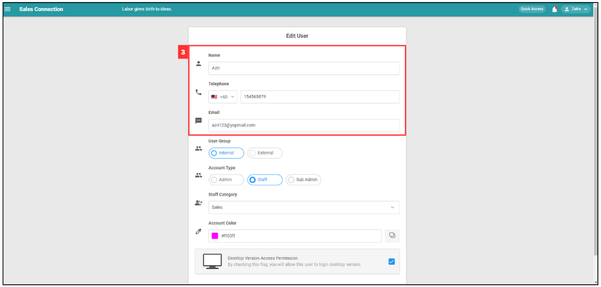
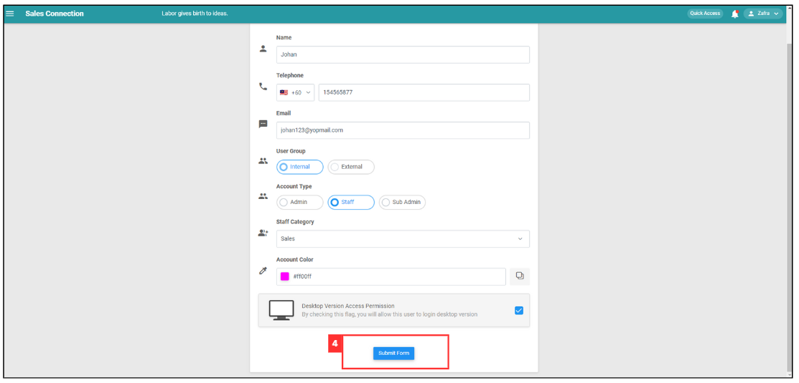
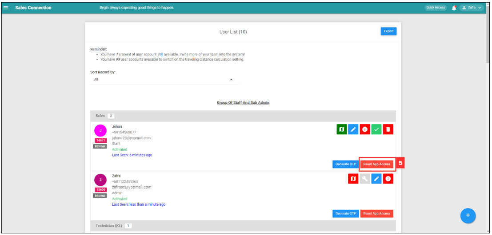

## How do Admin Assit Reset App?

*Note: This feature allows admin to kick out users and perform resetting actions in situations where users have resigned, uninstalled the app, or are consistenly offline.

**Navigate to the section by clicking it.** 

- [User don't have pending data](#section1) 
- [User has pending data](#section2) 
   

 

### User don't have pending data

- [User online](#section3) 
- [User offline](#section4) 

 

**User Online**

1. To reset user's app, go to the desktop site navigation bar > User Management > User List. 
   **Open the User List:** [https://salesconnection.my/usermanage/userlist](https://salesconnection.my/usermanage/userlist) 
   

      
   

2. Click "Reset App Access" to reset the selected user's app access.

   

      
   

3. Click "Reset" button to reset app access for the user.

   

      
   

4. The system will automatically check for whether the user's account has pending data or not.

   

      
   

   *Note: The pre-condition of the system automatically check pending data is the user's phone must be online.
   
5. Click "OK" and the app access has been successfully reset.

   

      
   

   *Note: If the selected user's account is no pending data, then the account will be successfully reset.
