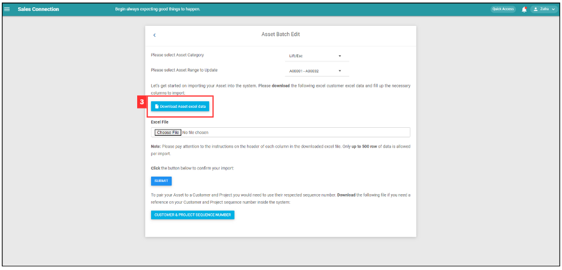

Version 1.0 
Created: 26 June 2024 
Updated: 26 June 2024 
## How to do Asset Bulk Update?

  1. At the desktop site's navigation bar, go to Import > Asset Bulk Update. 
     **Do Asset Bulk Update here:** [https://salesconnection.my/assetbulkimport](https://salesconnection.my/assetbulkimport) 

     

       
     
 

  2. Select for the Asset Category and Asset Range to Update that you want to update. 

     

       
     
 

  3. Click "Download Asset excel data". 

     

       
     

     *Note: This file cannot be reused after doing Update previously. Always download a new “Download Asset Excel data” when doing Asset Bulk Update. 

   
  4. Fill out the details of asset updated. 
     a. Examples of details include: 
     - Serial No
     - Status
     - Warranty Start Date
     - Warranty End Date
     - Attachment Field
     - Model
     - Remarks
     - Customer Seq No
     - Project Seq No

     *Note: Asset No, Category, Customer Name, Project Name can't be edited in this excel file. Column headers in Excel file may vary depending on your system set up. 
Data in Column C must be Unique and is compulsory to fill in. 

     

       
     
 

  5. Make sure all the information of the asset updated is correct and save the file.

     

       
     
 

  6. Go back to the asset bulk import page and choose the correct file by clicking "Choose File" to import.

     

       
     
 

     *Note: Make sure select for the correct asset category and asset range to update.

  7. Make sure the file uploaded is correct.

     

       
     
 

  8. Click on the "Submit" button.

     

       
     
 

  9. Click "Yes" to confirm the action.

     

       
     
 
  
  10. Click "Ok" and the asset updates have been uploaded successfully.

      

        
      
  
     

**Related Articles** 
- [How to Add New Asset?](How_to_Add_New_Asset.md)
- [How to do Customer/Project/Product/Services/UOM Bulk Update?](Customer_Bulk_Update.md)

<!-- [Link Text](https://salesconnection.github.io/Sales-Connection-Support/Asset_Bulk_Update.html) -->
