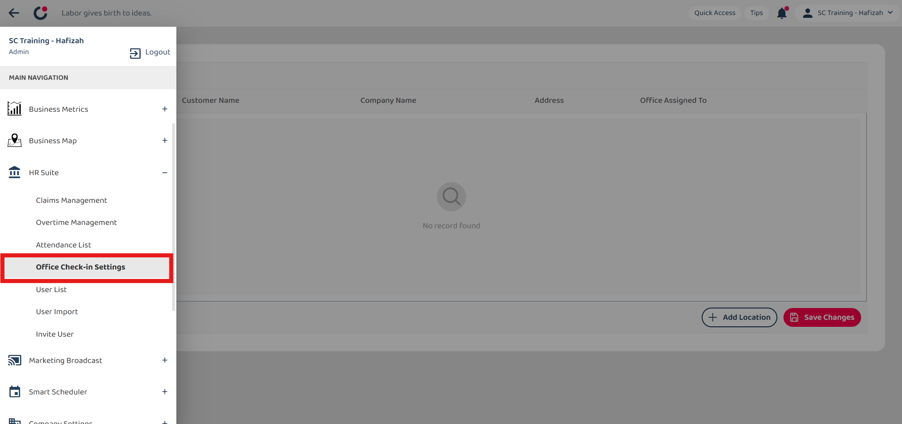
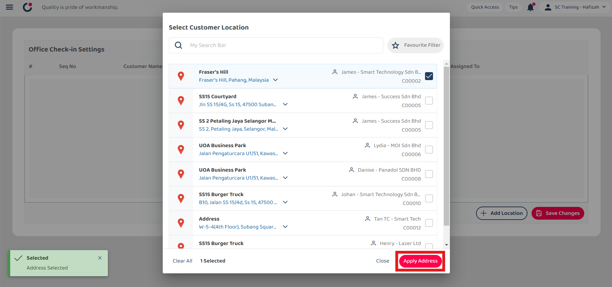
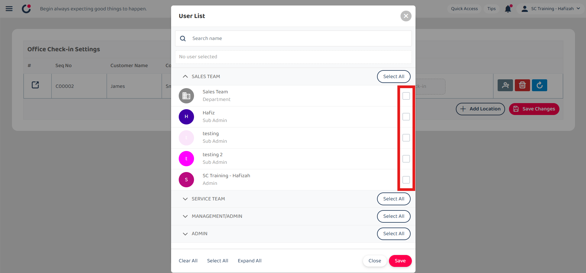
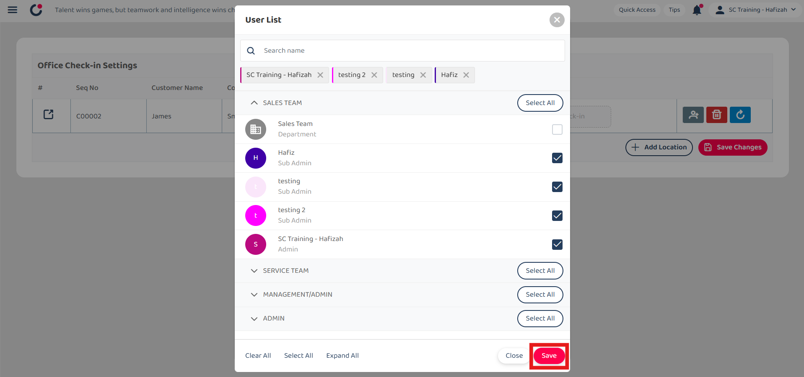

## Asset Dashboard

**Navigate to the section by clicking it.** 

- [Add Office Check-In](#section1) 
- [Clear Assigned User](#section2) 
- [Delete Office Check-In](#section3)
   

1. At the desktop site navigation bar, go to Business Management > Dashboard > Asset. 
   **Open Asset Dashboard Here:** [https://salesconnection.my/dashboard/asset](https://salesconnection.my/dashboard/asset) 

   

      
   

    

   

   **Dashboard Selection**

2. Click "Asset Dashboard" to access another dashboard.

   

      
   

  
3. Click on the dashboard that you want to access.

   

      
   

    

   

   **Add New Asset**

4. Click "New Asset" to add a new asset.

   

      
   

    

   

   **Refresh** 

5. Click on the "Refresh" icon to get the latest information on assets.

   

      
   

    

   

   **Customise Asset Card**  

6. Enter the user name that you want to assign to the office check-in.

   

      
   

  
7. Tick the box of the user accordingly.

   

      
   

  
8. Click on the "Save" button.

   

      
   

  
9. Click "Save Changes".

   

      
   

  
10. The office check-in has been saved successfully when this prompt appears.

    

       
    

    *Note: If no location is set, the user will be able to perform office check-in/out anywhere. 
      

### Clear Assigned User

1. Click on the "Clear" icon to clear the assigned user.

   

      
   

  
2. Click "Save Changes".

   

      
   

  
3. All the users assigned have been cleared when this prompt appears.

   

      
   

     

### Delete Office Check-In

1. Click on the "Delete" icon beside the office check-in you want to delete.

   

      
   

  
2. Click "Save Changes".

   

      
   

  
3. The office check-in has been deleted when this prompt appears.

   

      
   
  
      

**Related Articles**
- [I Forgot to Check Out, How?](Assist_Check_Out.md)
- [How to Enable Assist Check Out?](Enable_Assist_Check_Out.md)
- [I am at the location, but the system says I am too far from the location.](Check_In_Address.md)
- [How to Adjust Geofencing Radius?](Adjust_Geofencing_Radius.md)
