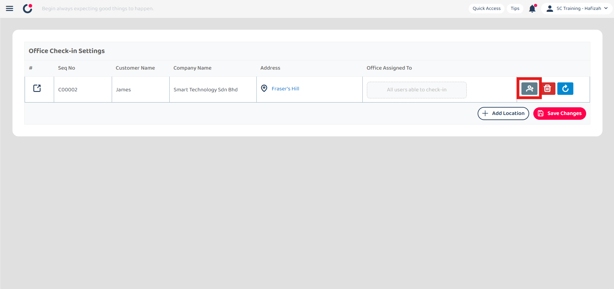
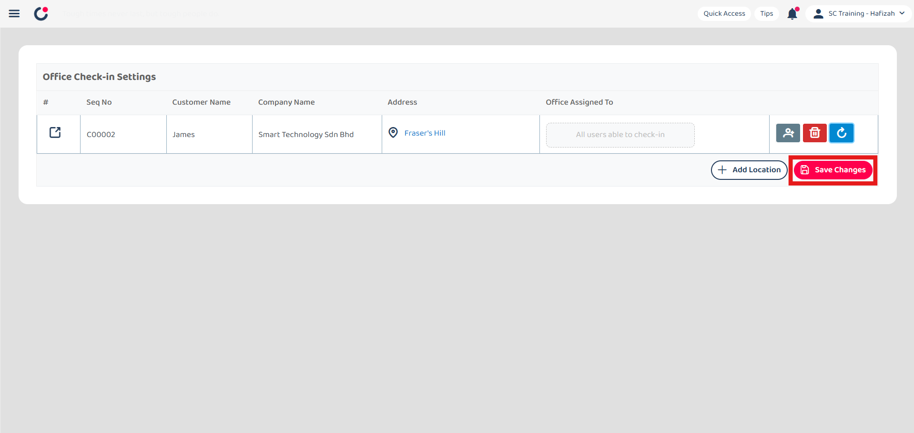
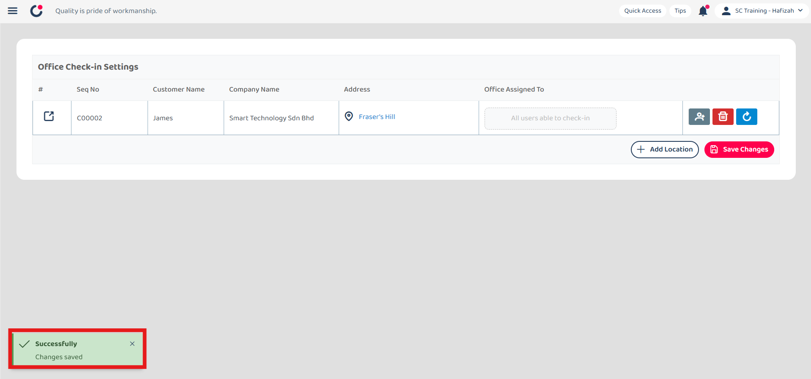
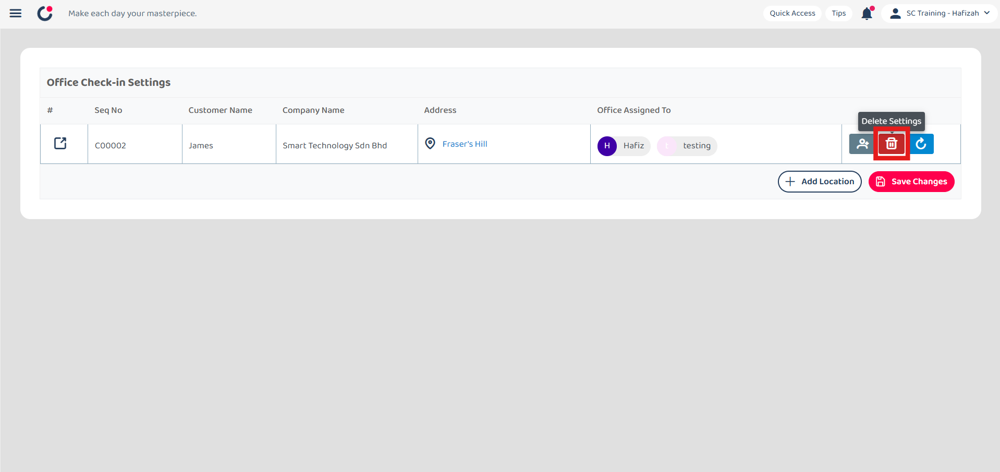
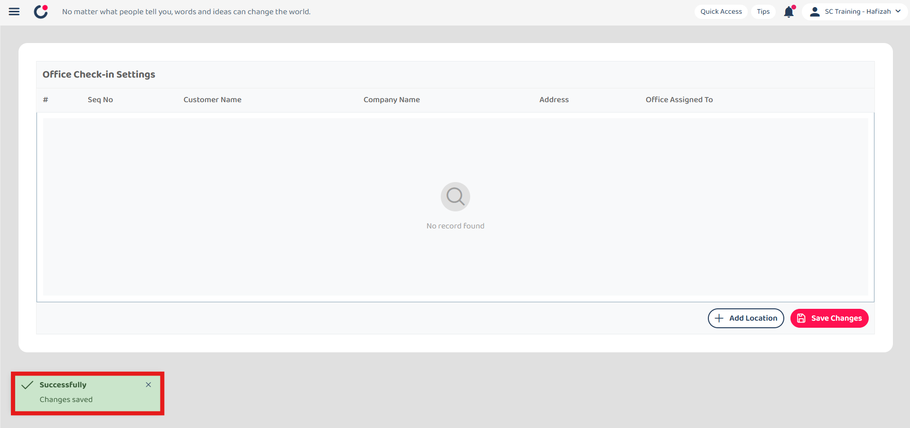

## Asset Dashboard

**Asset Dashboard** allows users to  

**Navigate to the section by clicking it.** 

- [Dashboard Selection](#section1) 
- [Add New Asset](#section2) 
- [Refresh](#section3) 
- [Asset Card Customization](#section4) 
- [Sort By](#section5) 
- [Filter](#section6) 
- [Favourite Filter](#section7) 
- [Default Filter](#section8) 
- [Clear Filter](#section9)
   

1. At the desktop site navigation bar, go to Business Management > Dashboard > Asset. 
   **Open Asset Dashboard Here:** [https://salesconnection.my/dashboard/asset](https://salesconnection.my/dashboard/asset) 

   

      
   

    

   

   **Dashboard Selection**

2. Click "Asset Dashboard" to access another dashboard.

   

      
   

  
3. Click on the dashboard that you want to access.

   

      
   

    

   

   **Add New Asset**

4. Click "New Asset" to add a new asset.

   

      
   

    

   

   **Refresh** 

5. Click on the "Refresh" icon to get the latest information on assets.

   

      
   

    

   

   **Customise Asset Card**  

6. Click on the "Settings" icon to customise the asset card.

   

      
   

  
7. Click "+ Add Field".

   

      
   

  
8. Select the field you want to display in the dashboard.

   

      
   

  
9. Click on the "Done" button.

   

      
   

  
10. Click on the asset category that you want to show custom fields in the dashboard.

    

       
    

11. Click "+ Add Field".

    

       
    

  
12. Select the custom field you want to display in the dashboard.

    

       
    

  
13. Click on the "Done" button.

    

       
    

14. Click on the "three dots" icon.

    

       
    

  
15. Select the width size for the dashboard column and the field name's display type.

    

       
    

  
16. Click on the "Save" button.

    

       
    
  

17. The asset dashboard with the asset card customization will be shown as below.
    
    

       
    
  
     

    

    **Sort By**  

18. Click on the "Last Update D..." to change the sort by.
    
    

       
    

19. Click on the expand button beside "Last Update Date".
    
    

       
    

20. Choose the condition to sort the asset.
    
    

       
    

21. Click on the expand button beside "Direction".
    
    

       
    

22. Choose ascending or descending to sort.
    
    

       
    

23. The result will be shown as below.
    
    

       
    

     

    

    **Filter**  

24. Click "+ Add Filter" to filter the asset.
    
    

       
    

25. Click on the filter variable you want. For example, click "Asset Serial No"
    
    

       
    

26. Click on the operator you want to apply. For example, click "Contains".
    
    

       
    

27. Enter the filter value you want to apply.
    
    

       
    

28. Press "Enter" to apply the filter.
    
    

       
    

29. The filter applied will be shown in the filter bubble and the result will be shown as below.
    
    

       
    

     

    

    **Favourite Filter**  

30. Click "Favourite Filter" if you want to save the filter.
    
    

       
    

31. Click "+ Add" to add a favourite filter.
    
    

       
    

32. Enter the name of the favourite filter.
    
    

       
    

33. Click "Save" to save the favourite filter.
    
    

       
    

34. You can now apply the filter everytime when you enter this page.
    
    

       
    

     

    

    **Default Filter**  

35. Click "Favourite Filter" if you want to set default filter.
    
    

       
    

36. Click "Default Filter".
    
    

       
    

37. Select the filter you want to set as default filter.
    
    

       
    

38. The default filter has been saved successfully and the filter will be applied automatically when you enter this page.
    
    

       
    

     

    

    **Clear Filter**  

39. Click "Clear All" if you want to clear all the filter applied.
    
    

       
    

40. The filter applied has been cleared successfully.
    
    

       
    

       

**Related Articles**
- [I Forgot to Check Out, How?](Assist_Check_Out.md)
- [How to Enable Assist Check Out?](Enable_Assist_Check_Out.md)
- [I am at the location, but the system says I am too far from the location.](Check_In_Address.md)
- [How to Adjust Geofencing Radius?](Adjust_Geofencing_Radius.md)
