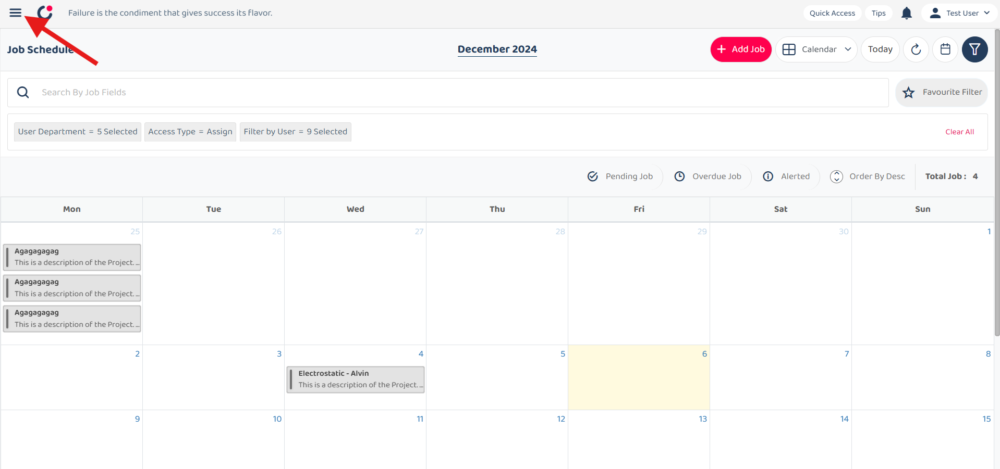
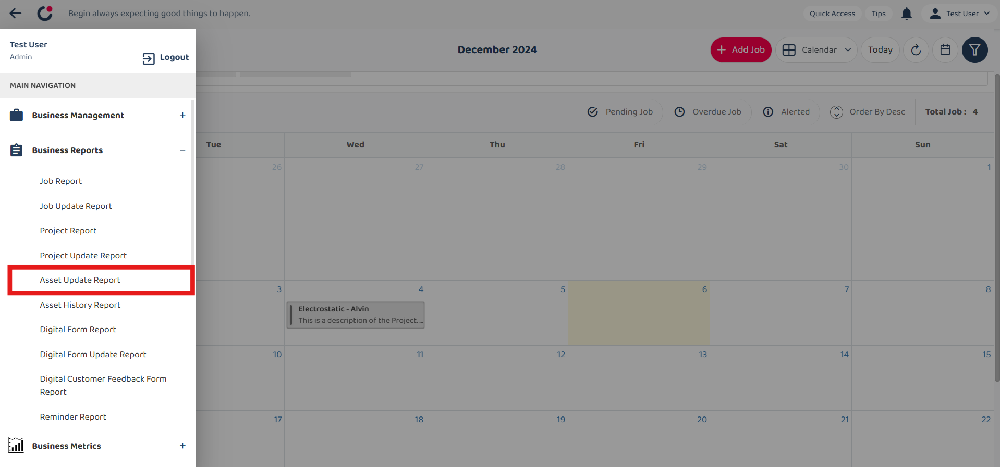
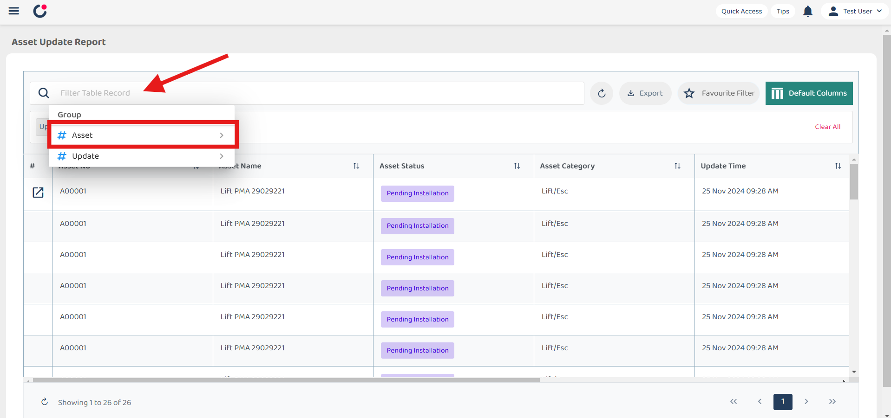
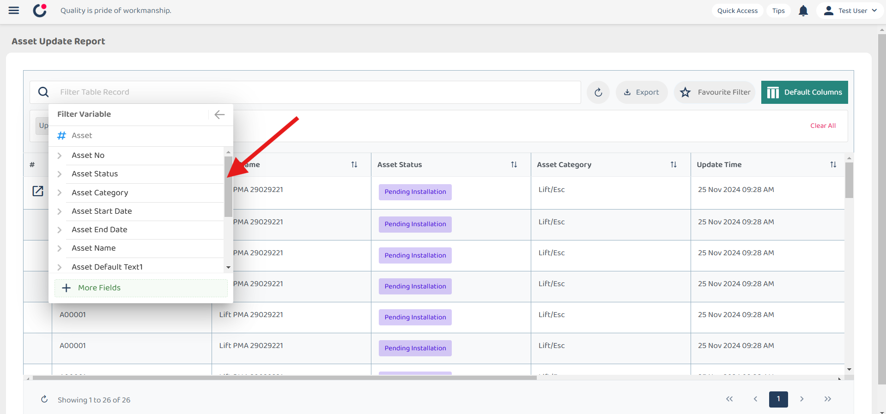
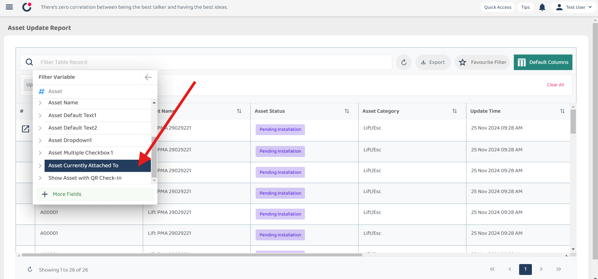
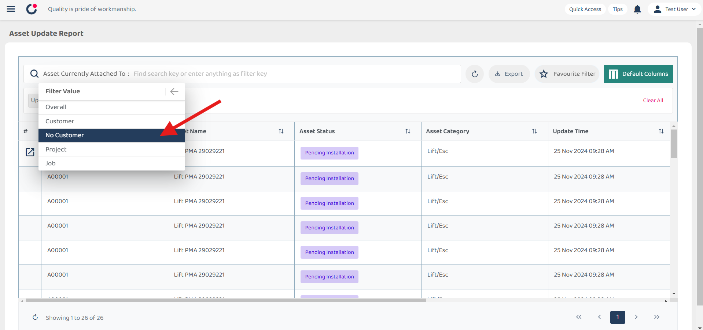
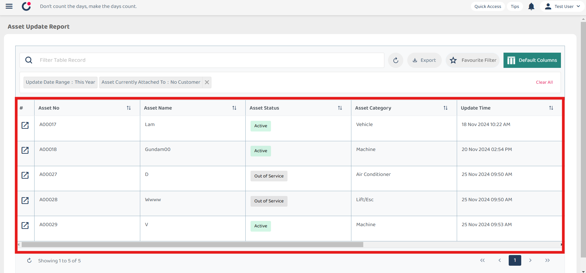

## How to filter asset : No Customer Attached

1) Select left corner menu icon to open sidebar.  

         

 

2) Select Business Reports.  

         

 

3) Select Asset Update Report.  

         

 

4) Click the filter search bar, and then select asset from the list.  

         

 

5) Under Asset, scroll down and select Asset Currently Attached To.  

         
         

 

6) Select 'No Customer' for the filter value.  

         

 

7) Result are displayed.  

         

 
