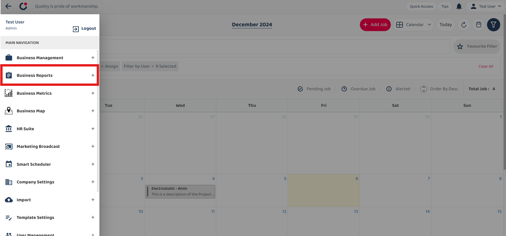

## How to filter asset : No Customer Attached

1) 1. Click the menu icon (three horizontal lines) in the top left corner to go to the Main Navigation.  

         

 

2) Select 'Business Reports'.  

         

 

3) Select 'Asset Update Report'.  
*Note : You may also perform this filtering in Asset List under Business Management. 

         

 

4) Click the filter search bar, and then select 'Asset' from the list.  

         

 

5) Under Asset, scroll down and select 'Asset Currently Attached To'.  

         
         

 

6) Select 'No Customer' for the filter value.  

         

 

7) Results are displayed.  

         

 
