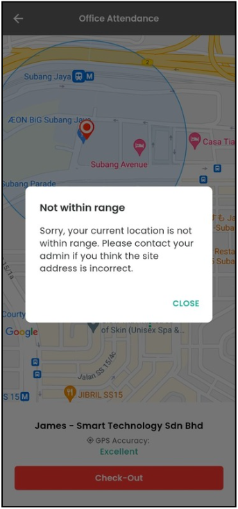
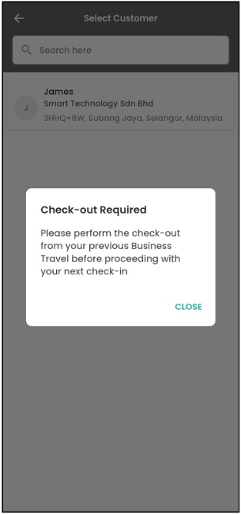
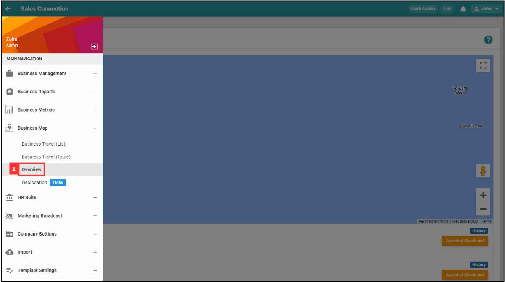
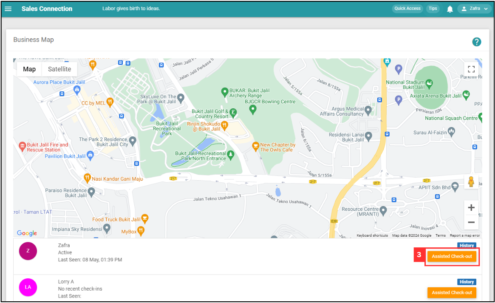
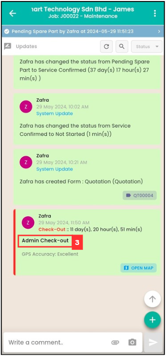
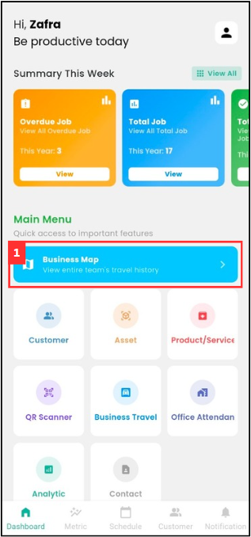
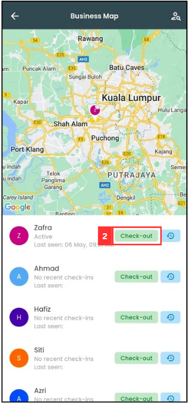

Version 1.0 
Created: 23 May 2024 
Updated: 7 June 2024 
## 🚪 I Forgot to Check Out, How?

### Scenarios below will need assist check out:

  1. If staff **cannot** or **forgot** to check out from the previous task, what to do? 
  
     *Not within range: User currently not near Customer location when trying to Check In/Out. 
     
     

        
     

     
  2. User cannot check in to the next task. 
  
     *Check out required: User did not checked out from the previous job. 
     
     

        
     

      
  
### How to Perform Assist Check Out? - Done by Admin
*Note: If you are **staff**, please find your admin to assist you. 

  **Desktop Version** 
  1. To assist check out, go to desktop site navigation bar > Business Map > Overview. 
     **Open the Business Map Overview Here:** [https://salesconnection.my/BusinessMap](https://salesconnection.my/BusinessMap) 

     

        
     

     
  2. Go to the specific user and click on the "Assisted Check out" button and the user will be checked out. 

     

        
     

     
     *Note: If there is no "Assisted Check out" button, visit this page [How to Enable Assist Check Out?](https://salesconnection.github.io/Sales-Connection-Support/Enable_Assist_Check_Out.html). 

  3. Once the action is done, ask the user to refresh the job detail page to confirm the "Assisted Check out" was successful.
  
     

        
     

  

  **Mobile Version** 
  1. To assist check out, go to Dashboard > Business Map. 

     

        
     

     
  2. Go to the specific user and click on the "Check-out" button and the user will be checked out. 

     

        
     

     *Note: If there is no "Check-out" button, visit this page [How to Enable Assist Check Out?](https://salesconnection.github.io/Sales-Connection-Support/Enable_Assist_Check_Out.html).

  3. Once the action is done, ask the user to refresh the job detail page to confirm the "Assisted Check out" was successful.
  
     

        
     

     

**Related Articles**
- [How to Enable Assist Check Out?](Enable_Assist_Check_Out.md)
- [I am at the location, but the system says I am too far from the location.](Check_In_Address.md)

<!-- [Link Text](https://salesconnection.github.io/Sales-Connection-Support/Assist_Check_Out.html) -->
