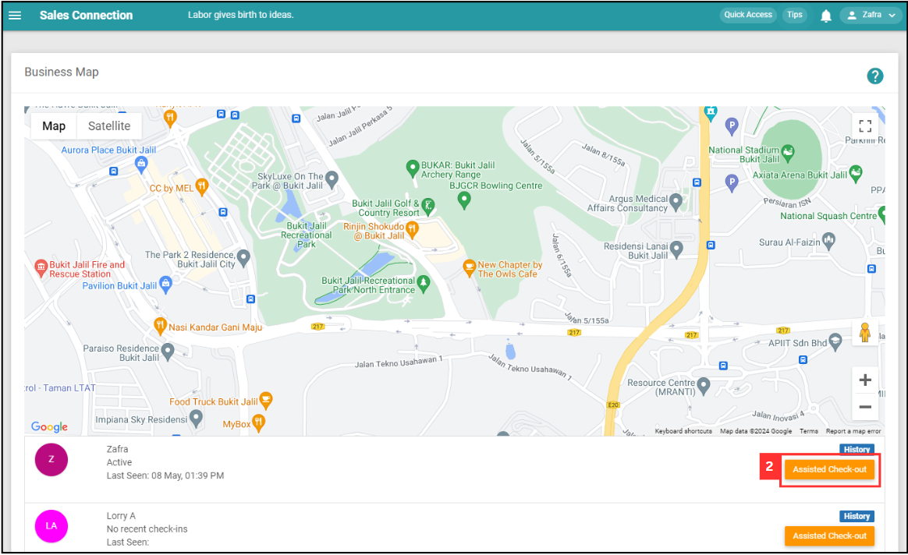

## 🚪 Why My Staff Cannot Check In?

### Scenarios below will need assist check out:

  1. If staff **cannot** or **forgot** to check out from the previous task, what to do? 

     

        
     

     
  2. I can't check in to the next task. 

     

        
     

      
  
### How to Perform Assist Check Out?

  **Desktop Version** 
  1. To assist check out, go to desktop site navigation bar > Business Map > Overview. 
     **Open the Business Map Overview Here:** [https://salesconnection.my/BusinessMap](https://salesconnection.my/BusinessMap) 

     

        
     

     
  2. Go to the specific user and click on the "Assisted Check out" button and the user will be checked out. 

     

        
     

     
  *Note: If there is no "Assisted Check out" button, visit this page [How to Enable Assist Check Out?](https://salesconnection.github.io/Sales-Connection-Support/Enable_Assist_Check_Out.html).  

  **Mobile Version** 
  1. To assist check out, go to Dashboard > Business Map. 

     

        
     

     
  2. Go to the specific user and click on the "Check-out" button and the user will be checked out. 

     

        
     

  *Note: If there is no "Check-out" button, visit this page [How to Enable Assist Check Out?](https://salesconnection.github.io/Sales-Connection-Support/Enable_Assist_Check_Out.html).   

**Related Article** 
[How to Enable Assist Check Out?](Enable_Assist_Check_Out.md)
