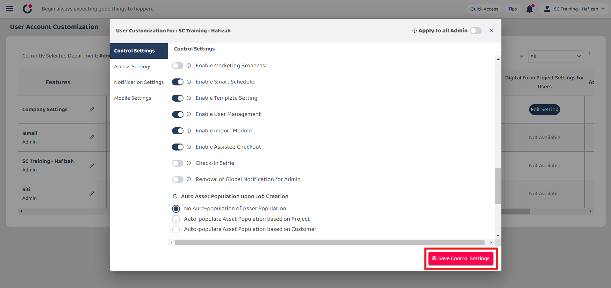

## 🔑 Assist Check Out

- **Scenarios below will need assist check out:** 

  1. If staff **forgot** to check out from the previous task, what to do? 
  2. I can't check in to the next task. 
  3. User cannot check out. 

  If you face any of these problems, please find your **admin** to assist you with the "force" check out.  
  
- **How to assist check out?** 

  **Enable Assist Check Out** 
  1. Please ensure you have permission for the **Assist Check Out** feature. If you do, you may skip to the next section. To enable assist check out, go to desktop site navigation bar > User Management > User Account Customisation (UAC). 
     **Open UAC Page Here:** [https://salesconnection.my/manageuac](https://salesconnection.my/manageuac) 

     

       
     

     *Note: Only the admin is able to perform this action. 
  
  2. Use Ctrl + f to search **Enable Assisted Checkout**. 
  
     

       
     

     
  3. Click on the **Disabled** button on the user who needs this power (normally admin). 

     

       
     

  
     *Note: Whoever with the **Enabled** for the Enable Assisted Checkout, they will have the power to perform the assist check out for every user. 

  4. Click the **Enable Assisted Checkout** to perform the action to other staff. 

     

       
     

  5. Click **Save Control Settings** to save the changes. 

     

        
     

   
  
  **Assist Check Out** 
  **Desktop Version** 
  1. Make sure that **Assisted Checkout** is enabled. 
  2. To assist check out, go to desktop site navigation bar > Business Map > Overview. 
     **Open the Business Map Overview Here:** [https://salesconnection.my/BusinessMap](https://salesconnection.my/BusinessMap) 

     

        
     

     
  3. Go to the specific user and click on the **Assisted Check-out** button and the user will be checked out. 

     

        
     

   

  **Mobile Version** 
  1. Make sure that **Assisted Checkout** is enabled. If not, please refer to the section above to enable it. 
     *Note: This action can only be performed using desktop. 
  2. To assist check out, go to Dashboard > Business Map. 

     

        
     

     
  3. Go to the specific user and click on the **Assisted Check-out** button and the user will be checked out. 

     

        
     

