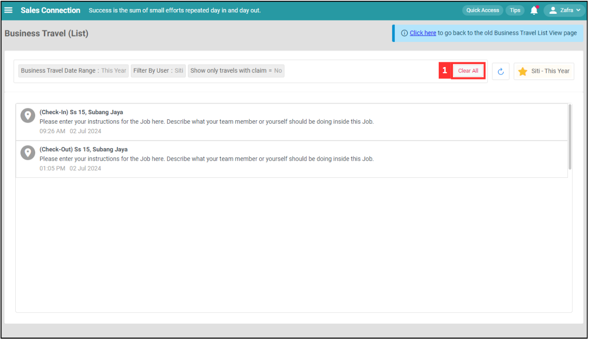

## Business Travel (List)

**Business Travel (List)** displays a list of business travel activities for users, including check-in and check-out events. It helps track and manage business travel logs, ensuring all required actions and comments are fulfilled before status changes.  

**Navigate to the section by clicking it.** 

- [Filter](#section1) 
- [Favourite Filter](#section2) 
- [Default Filter](#section3) 
- [Clear All Filter](#section4) 
- [Refresh](#section5)
   

1. At the desktop site navigation bar, go to Business Map > Business Travel (List). 
   **Open Business Travel (List) Here:** [https://salesconnection.my/business-travel/list](https://salesconnection.my/business-travel/list) 

   

      
   

     
   

### Filter

1. Click "Business Travel Date Range".

   

      
   

  
2. Choose the date range you want to see.

   

      
   

   
3. Click on the "Done" button.

   

      
   

4. Click "Filter By User".

   

      
   

5. Search the user's name.

   

      
   

  
6. Tick the box of the user.

   

      
   

  
7. Click on the "Save" button.

   

      
   

  
8. Click "Show only travel with claim".

   

      
   

  
9. Select the filter value you want.

   

      
   

10. The result of the filter will be shown as below.

    

      
    

      
   

### Favourite Filter

1. Click "Favourite Filter".

   

    
   

  
2. Click "+ Add".

   

    
   

3. Enter the name of the favourite filter.

   

    
   

  
4. Click on the "Save" button.

   

    
   

  
5. The favourite filter has been saved successfully.

   

    
   
  
     
   

### Default Filter

1. Click "Favourite Filter".

   

    
   

  
2. Click "Default Filter".

   

    
   

3. Click on the favourite filter you want to set as default filter.

   

    
   

  
4. The default filter has been saved successfully.

   

    
   

     
   

### Clear All Filter

1. If you want to clear all filters that you have applied manually, click "Clear All" and all filters will be cleared.

   

     
   
  
     
   

### Refresh

1. Click the "Refresh" button to ensure all the information is the latest.

   

     
   
  
      

**Related Articles**
- [Business Travel (Table)](Business_Travel_Table.md)
- [Claim Management](Claim_Management.md)
- [Overtime Management](Overtime_Management.md)
- [Attendance List](Attendance_List.md)
- [Office Check-In Settings](Office_Check_In_Settings.md)

<!-- [Link Text](https://salesconnection.github.io/Sales-Connection-Support/Business_Travel_List.html) -->
