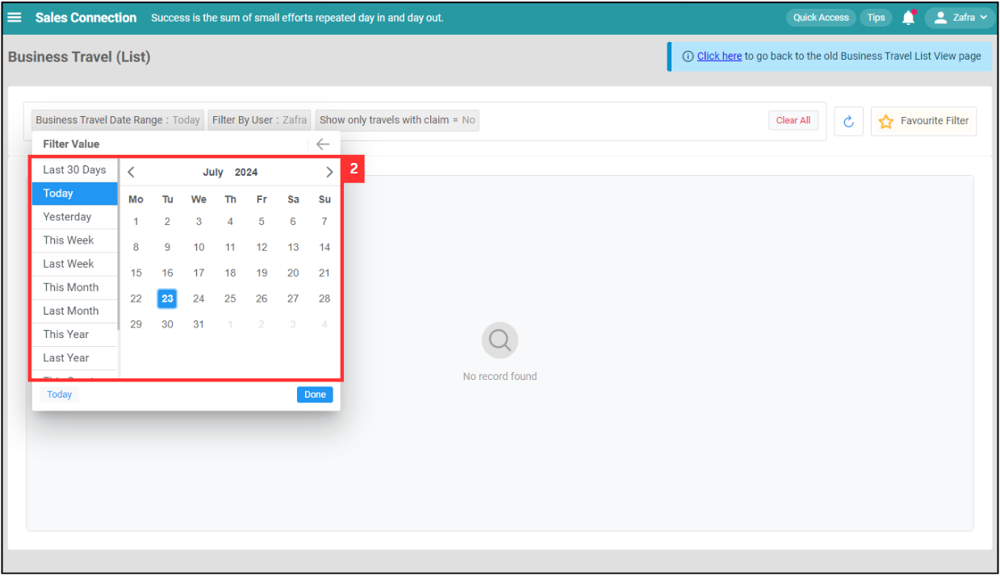
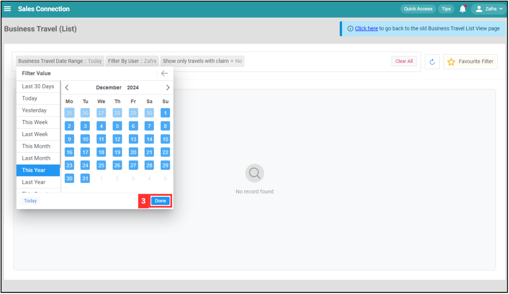
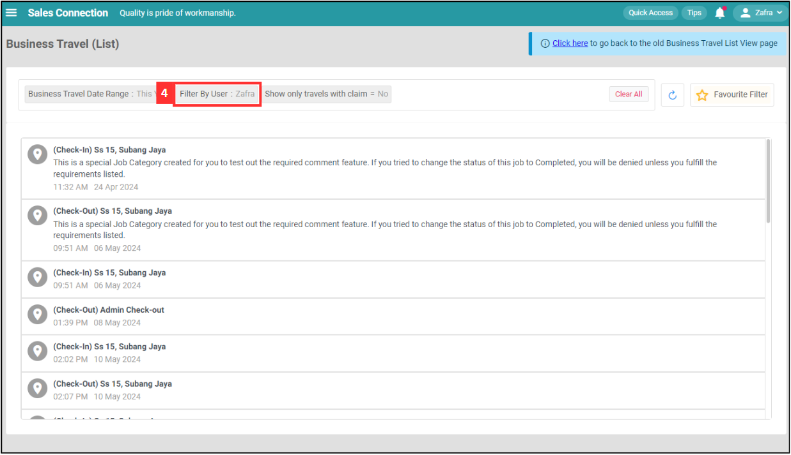
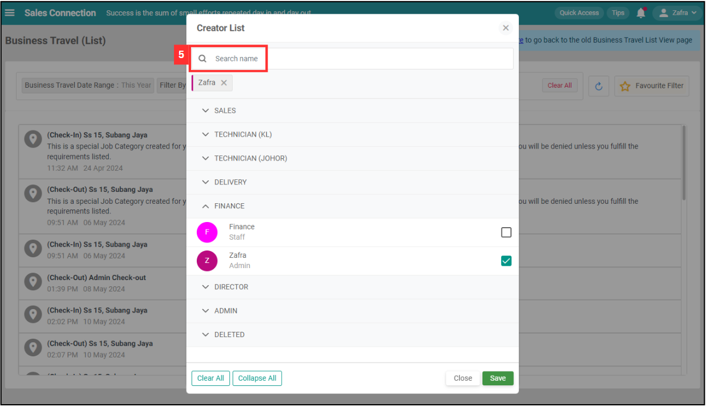
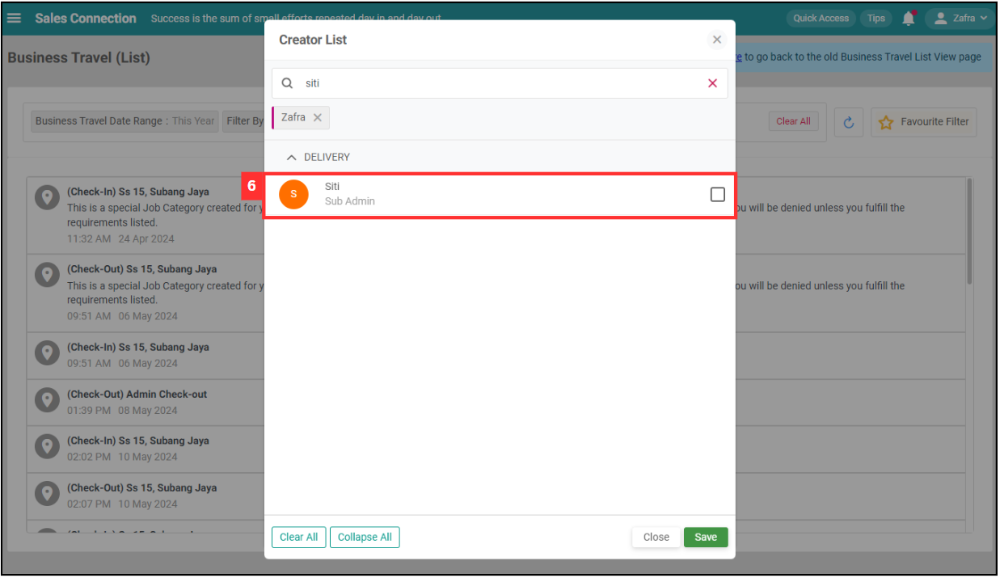
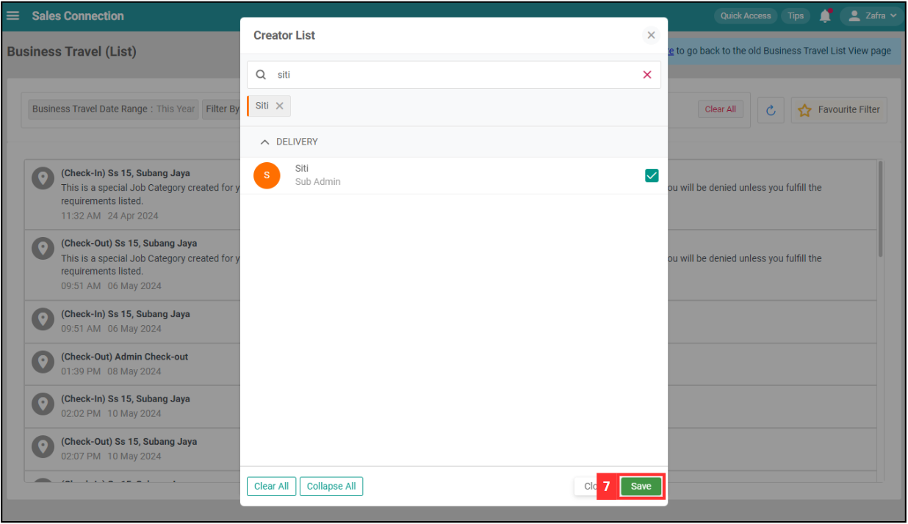
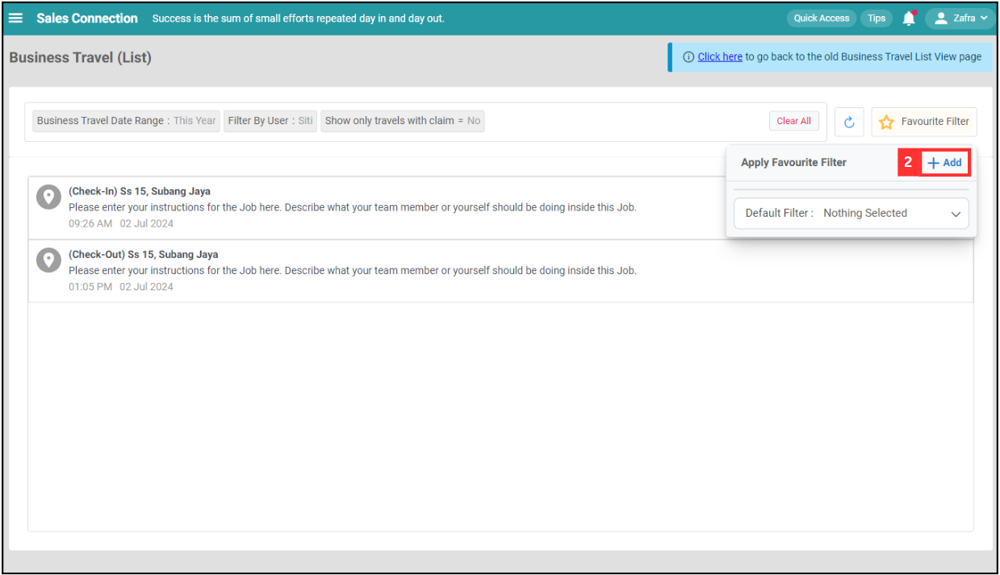

## Business Travel (Mobile)

**Business Travel (Mobile)** displays a list of business travel activities for users, including check-in and check-out events. It helps track and manage business travel logs, ensuring all required actions and comments are fulfilled before status changes.  

1. At the mobile navigation bar, click "Dashboard". 

   

      
   

2. Click "Business Travel". 

   

      
   

3. Click "Business Travel Date Range".

   

      
   

   *Note: Filter options (such as filter by user) depends on your user account access and account type. Please request permission or help from your admin if you do not have access to certain filter options.  
  
4. Choose the date range you want to see.

   

      
   

   
5. Click on the "Done" button.

   

      
   

6. Click "Filter By User".

   

      
   

7. Search the user's name.

   

      
   

  
8. Tick the box of the user.

   

      
   

  
9. Click on the "Save" button.

   

      
   

  
10. Click "Show only travel with claim".

    

       
    

  
11. Select the filter value you want.

    

       
    

12. The result of the filter will be shown as below.

    

      
    

13. Click "Favourite Filter".

    

      
    

  
14. Click "+ Add".

    

      
    

15. Enter the name of the favourite filter.

    

      
    

  
16. Click on the "Save" button.

    

      
    

  
17. The favourite filter has been saved successfully.

    

      
    
  
       

**Related Articles**
- [Business Travel (Table)](Business_Travel_Table.md)
- [Claim Management](Claim_Management.md)
- [Overtime Management](Overtime_Management.md)
- [Attendance List](Attendance_List.md)
- [Office Check-In Settings](Office_Check_In_Settings.md)

<!-- [Link Text](https://salesconnection.github.io/Sales-Connection-Support/Business_Travel_Mobile.html) -->
