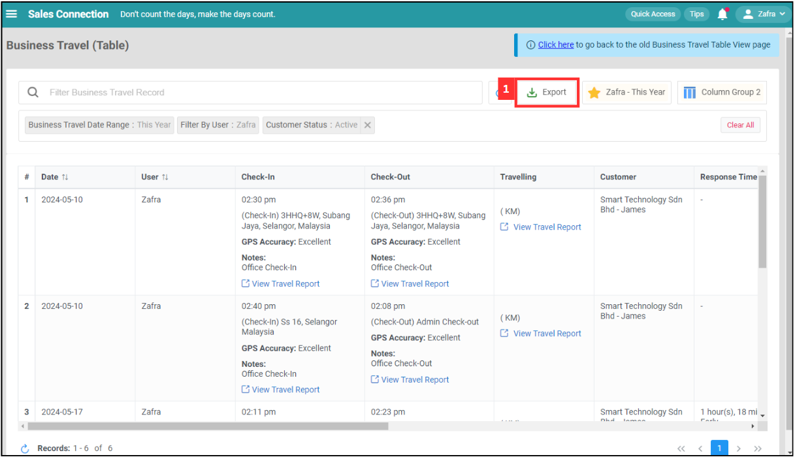

## Business Travel (Table)

**Business Travel (Table)** page displays a detailed table of business travel records, including information such as dates, users, check-in and check-out times, GPS accuracy, notes, and travel reports. It allows users to filter records, export data, and view individual travel reports for efficient tracking and management of business travel activities.  

**Navigate to the section by clicking it.** 

- [Default Columns](#section1) 
- [Filter](#section2) 
- [Favourite Filter](#section3) 
- [Default Filter](#section4) 
- [Clear All Filter](#section5) 
- [Refresh](#section6) 
- [Export](#section7)
   

1. At the desktop site navigation bar, go to Business Map > Business Travel (Table). 
   **Open Business Travel (Table) Here:** [https://salesconnection.my/business-travel/table](https://salesconnection.my/business-travel/table) 

   

      
   

     
   

### Default Columns

1. Click "Default Columns".

   

      
   

  
2. Click "+ Create".

   

      
   

   
3. Select the columns you want to add.

   

      
   

4. Click on the "Save" button.

   

      
   

5. The default column has been saved successfully.

   

      
   

     
   

### Filter
  
1. Click on the filter you want to change. For example, click "Business Travel Date Range".

   

      
   

  
2. Click on the filter value you want.

   

      
   

  
3. Click on the "Done" button.

   

      
   

  
4. To filter other value, click "Filter Business Travel Record".

   

      
   

5. Click on the group you want to filter.

   

     
   

6. Click "Filter Variable" you want to filter.

   

      
   

7. Click on the "Operator".

   

     
   

8. Select the "Filter Value" you want.

   

     
   

9. Click on the "Done" button.

   

     
   

10. The filter result will be shown as below.

    

      
    

     
   

### Favourite Filter

1. Click "Favourite Filter".

   

    
   

  
2. Click "+ Add".

   

    
   

3. Enter the name of the favourite filter.

   

    
   

  
4. Click on the "Save" button.

   

    
   

  
5. The favourite filter has been saved successfully.

   

    
   
  
     
   

### Default Filter

1. Click "Favourite Filter".

   

    
   

  
2. Click "Default Filter".

   

    
   

3. Click on the favourite filter you want to set as default filter.

   

    
   

  
4. The default filter has been saved successfully.

   

    
   

     
   

### Clear All Filter

1. If you want to clear all filters that you have applied manually, click "Clear All" and all filters will be cleared.

   

     
   
  
     
   

### Refresh

1. Click the "Refresh" button to ensure all the information is the latest.

   

     
   
  
     
   

### Export

1. Click the "Export" button to export the Business Travel Record.

   

     
   
  
      

**Related Articles**
- [Business Travel (List)](Business_Travel_List.md)
- [Claim Management](Claim_Management.md)
- [Overtime Management](Overtime_Management.md)
- [Attendance List](Attendance_List.md)
- [Office Check-In Settings](Office_Check_In_Settings.md)

<!-- [Link Text](https://salesconnection.github.io/Sales-Connection-Support/Business_Travel_Table.html) -->
