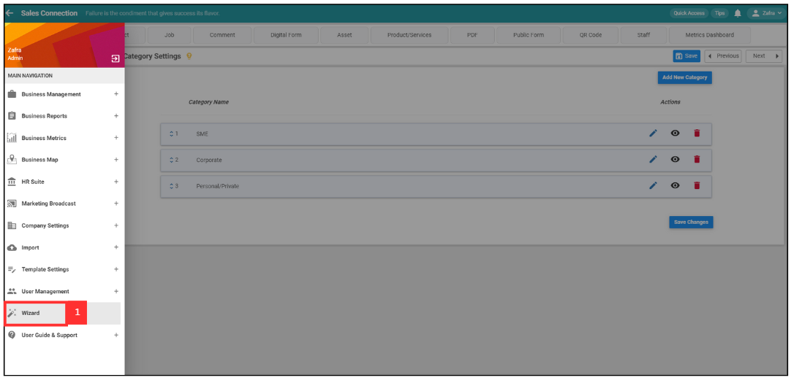
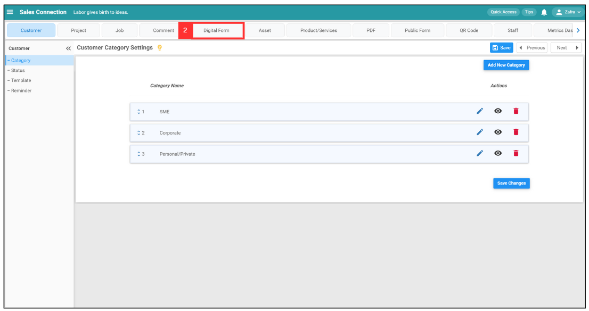
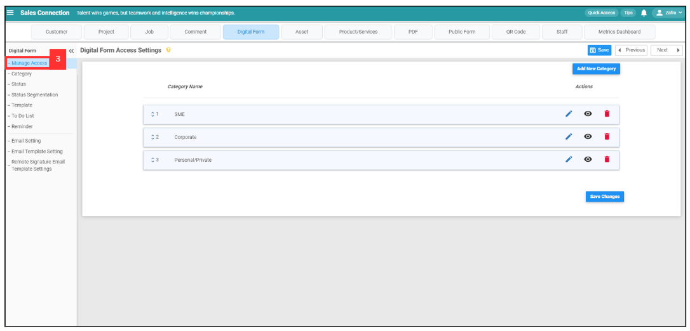
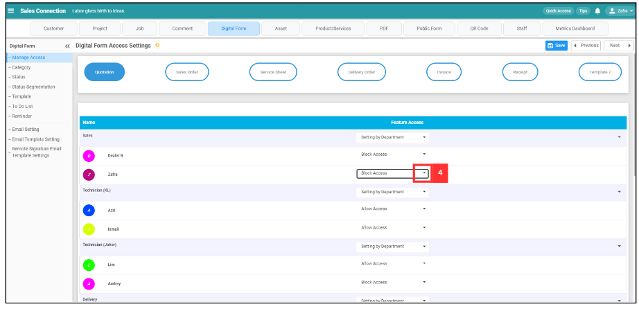
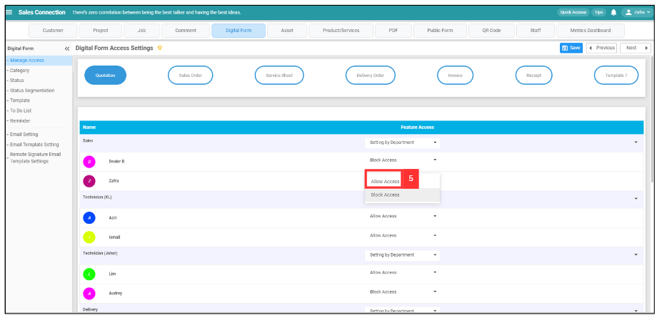
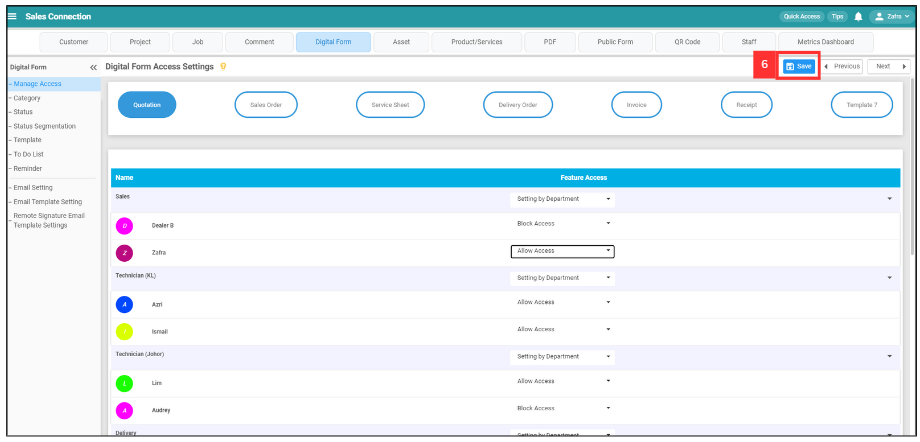
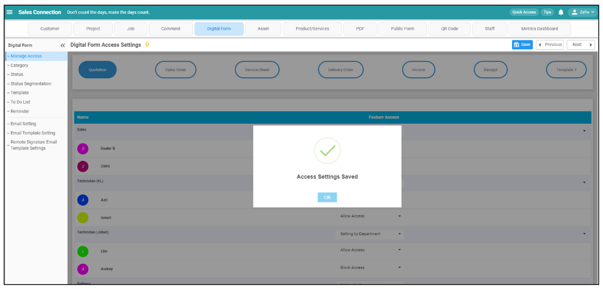

Version 1.0 
Created: 23 May 2024 
Updated: 23 May 2024 
## I can't access Digital Form. Please help.

*Note: If you are unable to access the Digital Form, please reach out to your admin for assistance.

1. Click "Wizard".

   *Note: Only certain admins can perform this access.
   
   

     
   

2. Click "Digital Form".

   

     
   

3. Click "Manage Access".

   

     
   

4. For example, if you want to manage user access for Quotation. Click the expand button to change the access for the user.

   

     
   

5. Click "Allow Access".

   

     
   

6. Click the save icon to save your changes.

   

     
   

7. Now, the user is able to access the Digital Form.

   

     
   

   

**Related Articles**
- [How to Add Dropdown Options in Digital Form?](Add_Dropdown_Options_in_Digital_Form.md)
- [How to Edit Checklist Dropdown Options?](Edit_Checklist_Dropdown_Options.md)
- [How Do I Add New Status in Digital Form?](Add_New_Status_in_Digital_Form.md)

<!-- [Link Text](https://salesconnection.github.io/Sales-Connection-Support/Can't_Access_Digital_Form.html) -->
