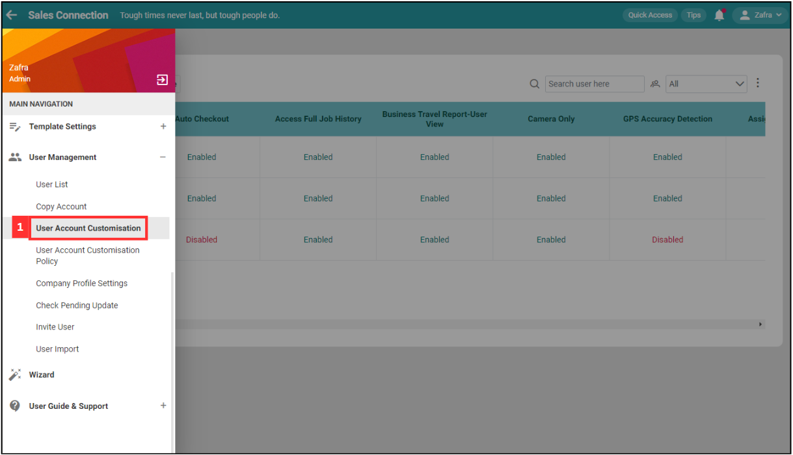
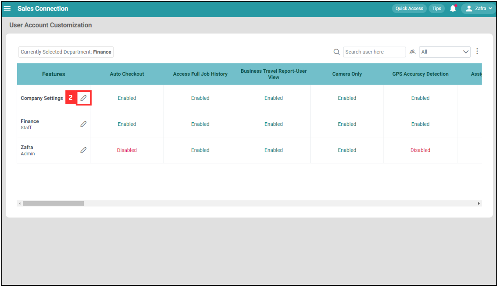
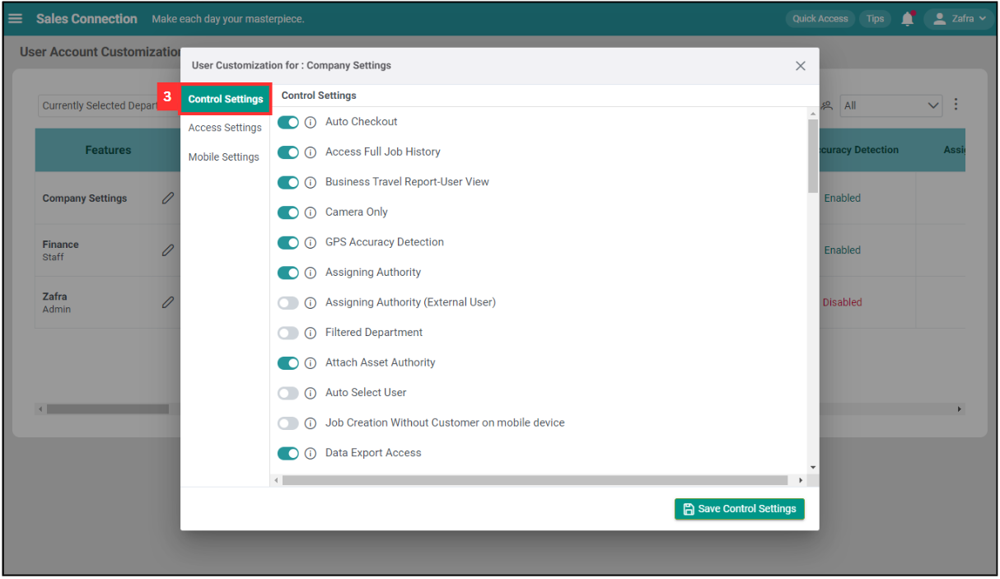
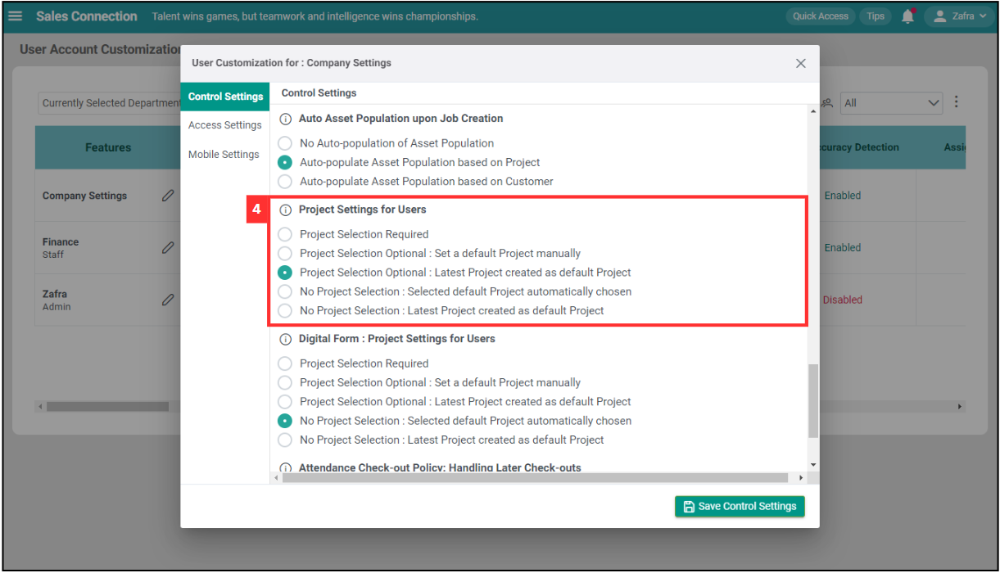
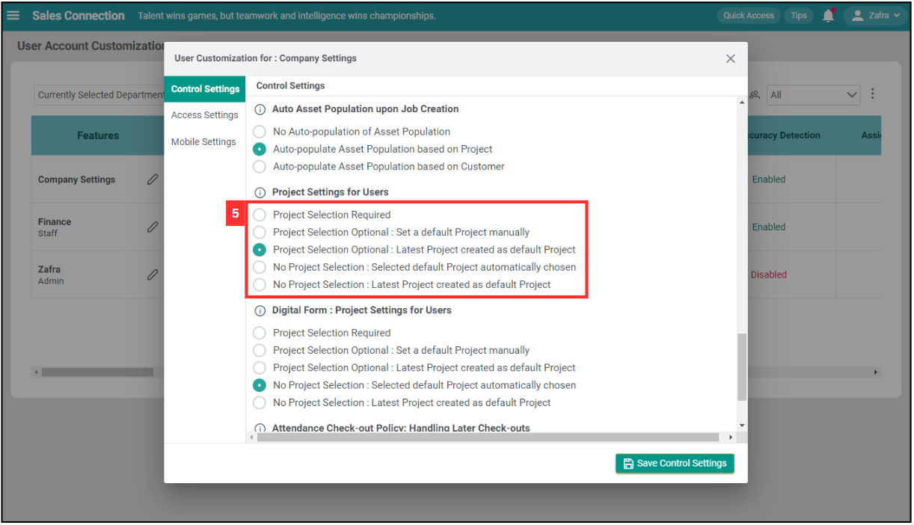
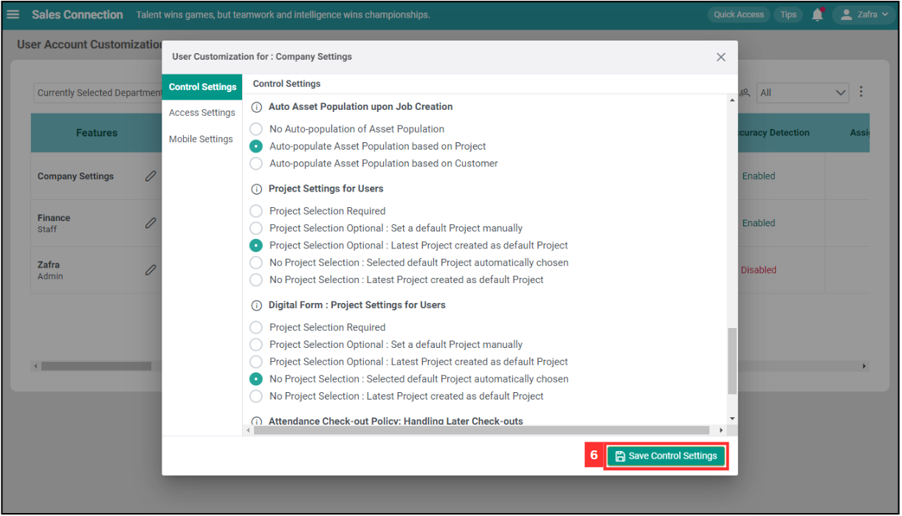
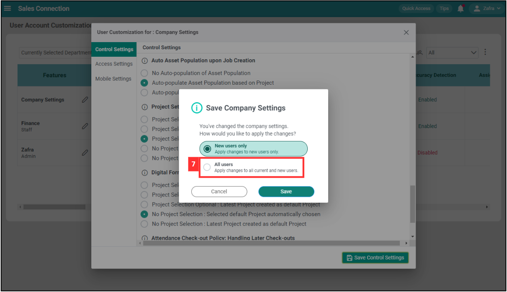
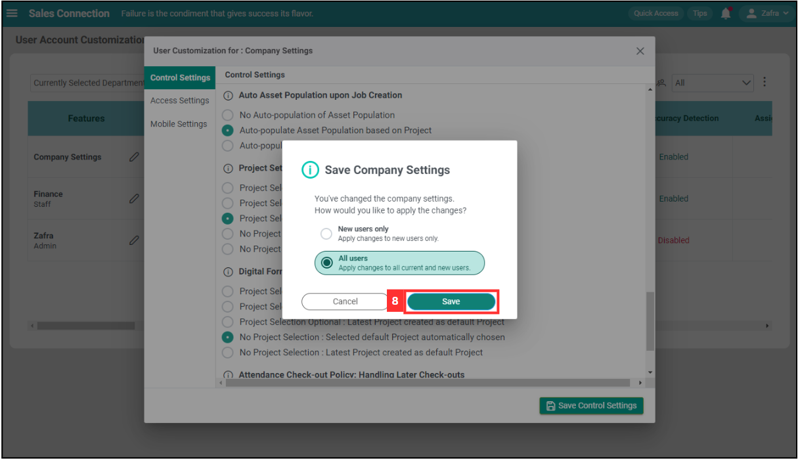
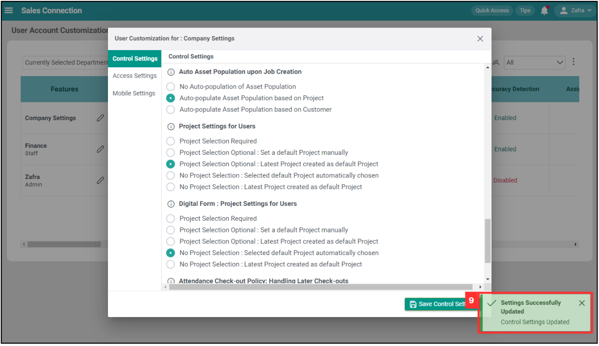

## Why I Cannot Find my Project?

A **Project** in Sales Connection serves as a folder to organize and manage both external and internal services, and as a contract for easy recognition and tracking of tasks and progress.  

1. At the desktop's navigation bar, go to User Management > User Account Customisation. 
   **Open User Account Customisation Page Here:** [https://salesconnection.my/uac](https://salesconnection.my/uac) 
   
   

     
   

   *Note: You must have access to User Management menu to perform this action. Please request permission or help from your admin if you do not have access to the menu. 

2. Click the “pencil” icon beside "Company Settings".

   

     
   

3. Click "Control Settings".

   

     
   

4. Scroll down to "Project Settings for Users".

   

     
   

5. Select the option you want.

   

     
   

6. Click "Save Control Settings".

   

     
   

7. Click "All Users".

   

     
   

8. Click on the "Save" button.

   

     
   

9. The project selection was saved successfully when this prompt appeared.

   

     
   

     

**Project Settings for Users**

| Terms | Description |
|-------|-------------|
| Project Selection Required | Users must select a specific project before proceeding with any actions or tasks. |
| Project Selection Optional: Set a default Project manually | Users can manually set a default project, but selecting a project is optional for tasks and actions. |
| Project Selection Optional: Latest Project created as default Project | If no project is selected, the system will automatically use the latest created project as the default, but users can still select a different project if needed. |
| No Project Selection: Selected default Project automatically chosen | The system will automatically use a pre-selected default project for all tasks and actions, without requiring users to select a project. |
| No Project Selection: Latest Project created as default Project | The system will automatically set the latest created project as the default for all tasks and actions, without requiring users to select a project. |

*Note: "No Project Selection" will cause all the items relevant to Project to be invisible.

   

**Related Articles**
- [Project Schedule Page](Project_Schedule_Page.md)
- [How to Add New Project?](Add_New_Project.md)
