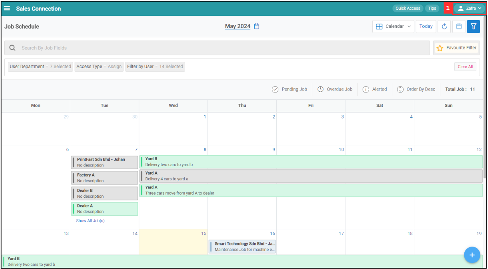

## I can't load the schedule page. Why?

### Scenarios below will cause this problem and how to solve it:

  1. Bad internet connection. 

     a. Is the internet connection & speed strong enough? 
        If the internet connection is weak - request the user to connect to another network (e.g. colleague’s mobile hotspot) and try again. 

     b. Is the internet speed fast enough? 
        Request the user to download the internet speed testing app: 
        Android: https://play.google.com/store/apps/details?id=org.zwanoo.android.speedtest 
        IOS: https://apps.apple.com/us/app/speedtest-by-ookla/id300704847 
  
  2. Server error shown. 
  
     a. Request information from user 
        Account details, consistent error or happen only once, anyone else from the company facing this issue? 

     b. If it happens only once, check if its a connection issue. 

     c. Check with the developer team. 
     
     d. For a response from server error, most likely our side has issues. 

        

          
        

     

   

**Related Articles** 
- [I Get Spammed By a Lot of Notifications. How Do I Disable It?](Disable_Notification.md)
