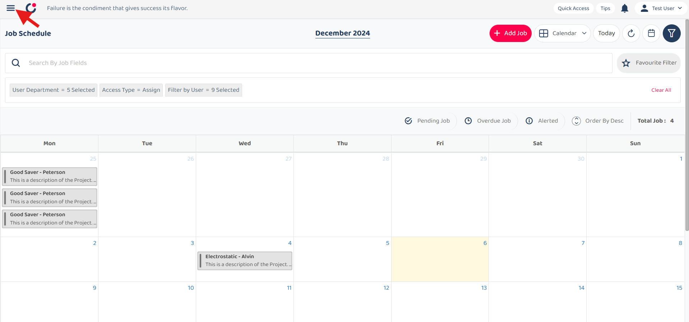
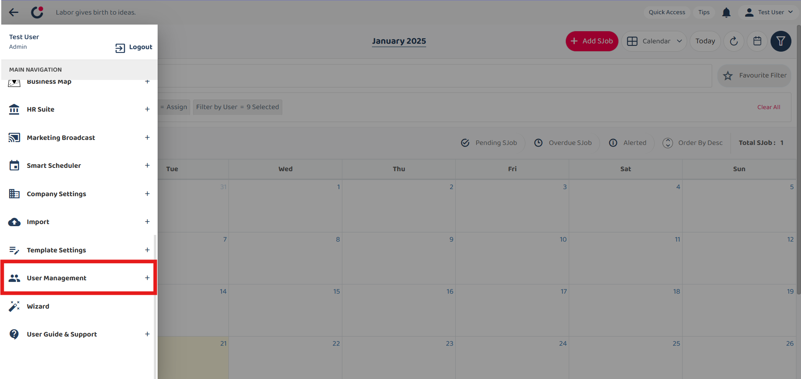
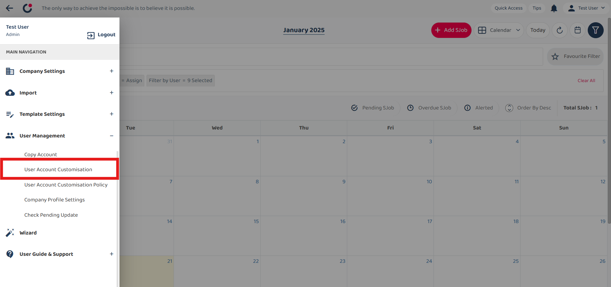
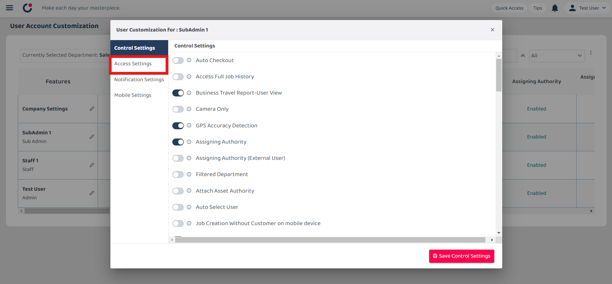
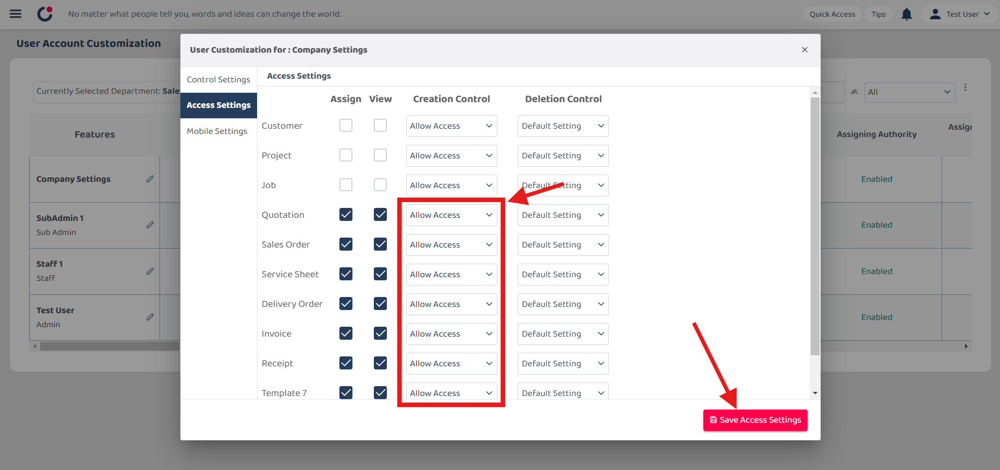
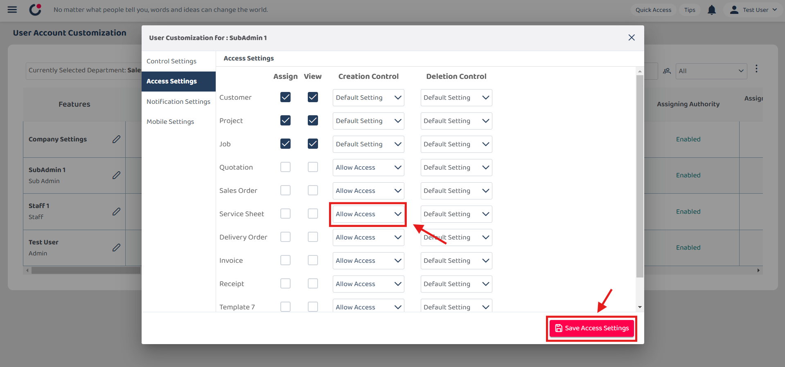

## I can access Digital Form. Why I can’t create Digital Form ?

1) Select left corner menu icon to open sidebar.  

         

 

2) Select User Management.  

         

 

3) Select User Account Customisation.  

         

 

4) Select the pen icon to edit the settings. Choosing ‘Company setting’ will reflect the setting to all users.  
You can choose a user to edit instead of editing the company settings.  

<!--           -->
         

 

5) Select Access Settings.  

<!--           -->
         

 

6) Ensure that the creation control for all digital forms is set to 'Allow Access'. Then, save the access settings.  

<!--           -->
         

 
<!-- 7) Select apply changes to new users only or all users, and then save it.  

         

  -->
