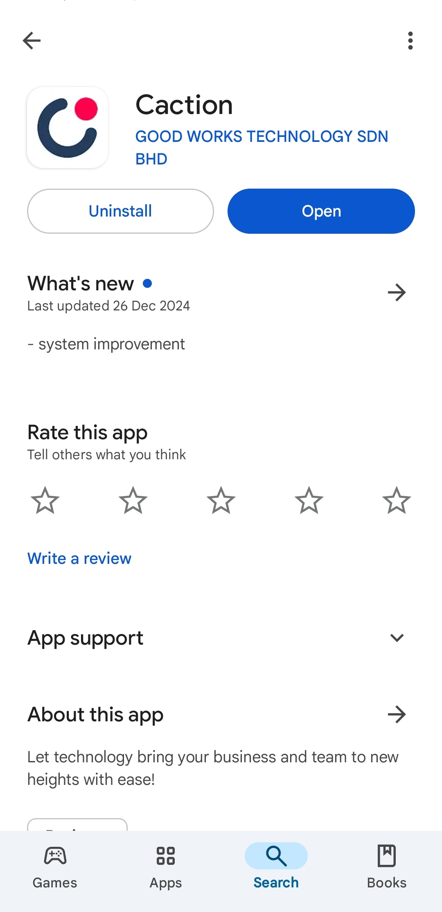
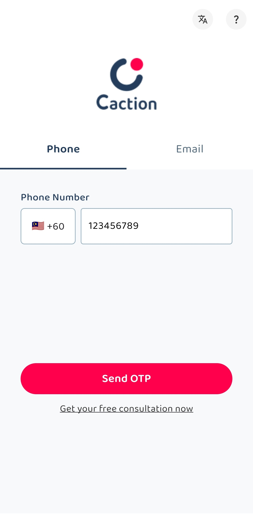

## How to Change Account Password?

**Navigate to the section by clicking it.** 

- [Desktop Version](#section1) 
- [Mobile Version](#section2)
   

    
### Desktop Version
  1. Go to the dashboard and click your name at the top right of the page. 
     **Open Sales Connection's Website Here:** [https://salesconnection.my/](https://salesconnection.my/) 

     

       
     

  
  2. Click "Profile". 
     **Open Profile Page Here:** [https://salesconnection.my/usermanage/changepassword](https://salesconnection.my/usermanage/changepassword) 

     

       
     

  3. Click the "Settings" icon. 

     

       
     

  4. Click "Change Password". 

     

       
     

  5. Enter the old password, new password and confirm your new password. 

     

       
     

  6. Click "Save Changes" and the password has been changed successfully. 

     

       
     

       

### Mobile Version
  1. Navigate to "Dashboard". 

     

       
     

  
  2. Click the "Profile" icon at the top right corner of the page. 

     

       
     

  3. Click "Change Password". 

     

       
     

     *Note: Please wait **at least 5 minutes** before applying a new "OTP Code".

  4. Enter the old password, new password and confirm your new password. 

     

       
     

  5. Click "SUBMIT" and the password has been changed successfully. 

     

       
     

        

**Related Article** 
[Why My Staff Cannot Login with New Device?](IMEI.md)
