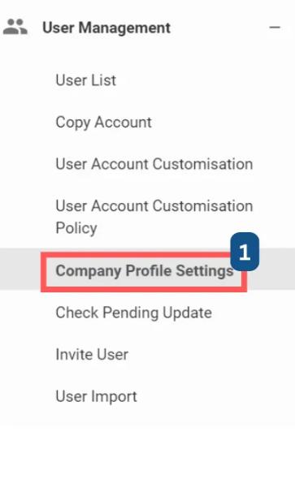
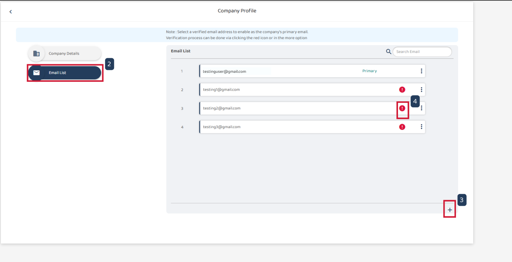
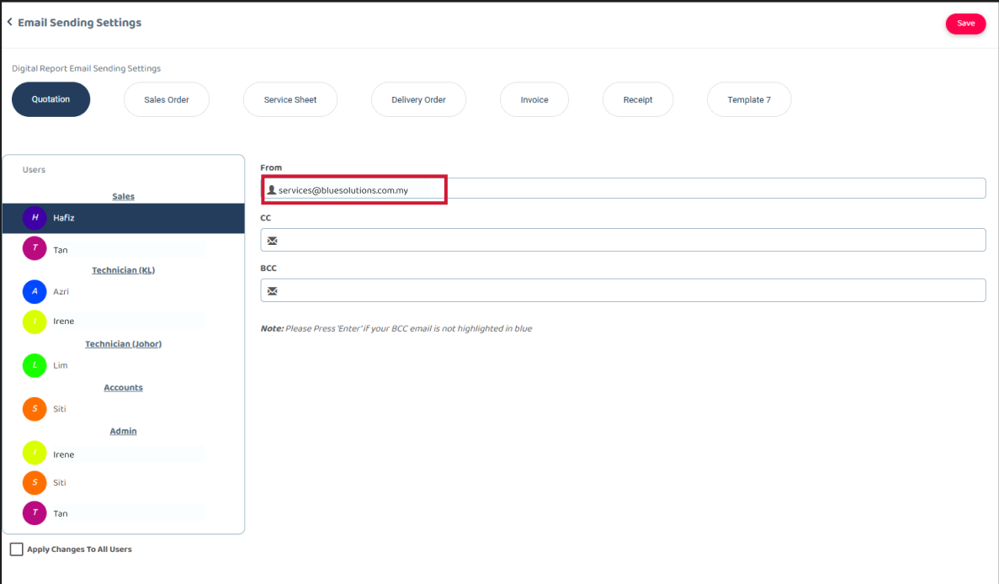
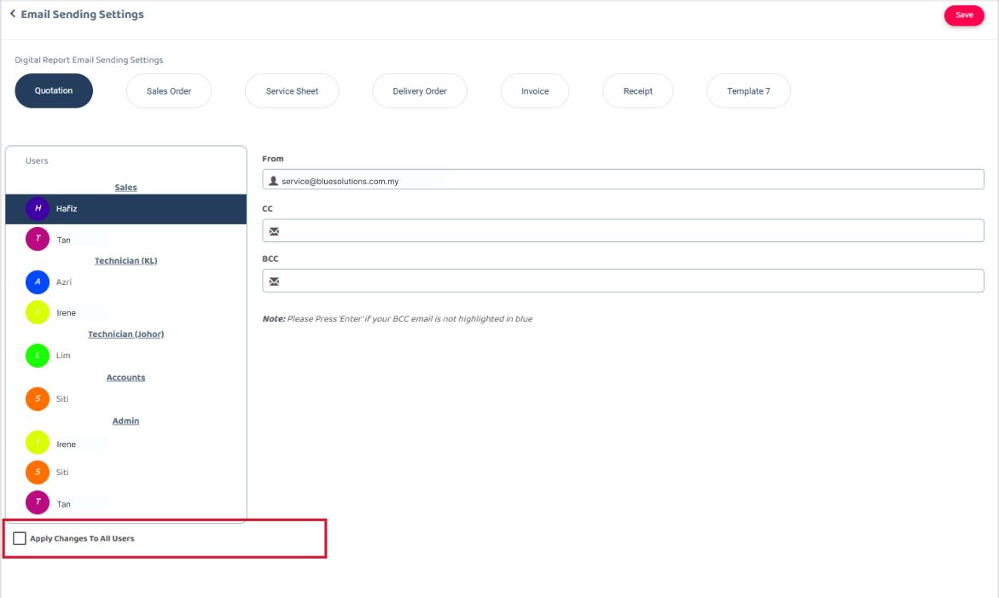

## How to Verify Email Addresses in a Digital Form Email?

The email feature allows the company to send digital form with a verified email address. The email can default sender role, such as primary, CC, BCC, or Tech Email.   

1. From the <b>Main Navigation Bar</b>, go to <b>User Management</b> and select <b>Company Profile Settings</b>. Alternatively, you can directly access this page by clicking the link below: https://system.caction.com/settings/companysettings  

  

2. Navigate to the <b>Email List</b>. A list of associated email addresses will be displayed.  

  

3. If the email address you need is not listed, add a new one by clicking the '+' icon at the bottom of the list.  

4. Unverified email addresses are marked with a red exclamation mark (!). To verify an email, simply click on the red exclamation mark next to the respective address  

5. Once the email is successfully verified, the red exclamation mark will disappear.  

## How to Change the Primary Sending Email for Digital Form Emails?

1. From the <b>Main Navigation Bar</b>, go to <b>User Management</b> and select <b>Company Profile Settings</b>. Alternatively, you can directly access this page by clicking the link below: https://system.caction.com/settings/companysettings  

  

 2. Locate the email list and click on the <b>three-dot</b> icon next to the email address you want to set as the primary sender. 
 
 3. From the dropdown menu, select '<b>Set as Primary</b>'. 
 
 4. The selected email address will now be updated as the primary sender. You can verify this change in both the <b>Company Profile</b> and the <b>Digital Form Email Settings</b> sections. 
 

  

## How to Set CC and BCC in Digital Form Emails?

1. From the <b>Main Navigation Bar</b>, go to <b>Company Settings</b>, go to <b> Digital Form Settings</b>, and select <b>Digital Form Email Settings</b>. 

  

2. Select the <b>Digital Form</b>  

3. Select a user (e.g., SC Support Staff) for whom you want to set the CC or BCC. 

4. Click on the CC field to begin adding email addresses. 

5. From the displayed list, select the desired email address. 

6. If the required email is not listed, refer to [How to Verify Email Addresses in a Digital Form Email?](#how-to-verify-email-addresses-in-a-digital-form-email) to add it to the list. 

7. After selecting the email addresses, click <b> Save </b> to apply the changes. 

8. If you need to configure CC/BCC for another user, repeat the same process. 

9. If the settings need to be applied to all users, select the <b>Apply Changes to All Users</b> option. 

   

  

   

**Related Articles**
- [How to Create Digital Form?](Create_Digital_Form.md)
- [How to Set Up Digital Form PDF Template?](Create_PDF.md)
- [Digital Form Template Settings](Digital_Form_Template_Settings.md)
- [How to Edit Remote Signature Email Template?](Edit_Remote_Signature_Email_Template.md)
