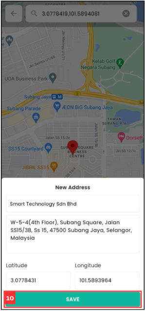

Version 1.0 
Created: 27 May 2024 
Updated: 27 May 2024 
## I am at the location, but the system says I am too far from the location.

### Scenarios below will cause staff cannot check in:

  1. If staff **cannot** or **forgot** to check out from the previous task, what to do? 
  2. User cannot check in to the next task.  

**If you cannot edit the job, please refer to** [Staff Not Able to Edit Job](#section2).
   

### What To Do When Face This Problem?

  **If staff be able to edit the job, follow the steps below.** 
  1. To solve this problem, open Sales Connection's app and go to Schedule. 

     

        
     

     
  2. Click on the specific job. 

     

        
     

  3. Click on the three dots icon at the top right of the page. 

     

        
     

     
  4. Click "Edit" to modify the job details. 

     

        
     

  5. Click the icon to expand the customer details. 

     

        
     

     
  6. Click on the "Add New Address" button. 

     

        
     

  7. Click on the "Get Current Location" icon. 

     

        
     

     
  8. Click "Search" to get the current location. 

     

        
     

  9. Click "CONFIRM" button to confirm the address. 

     

        
     

     
  10. Enter a proper location name and click "SAVE" to save the correct check in address. 

      

        
      

  11. Click the "Save" icon to save the edited job details. 

      

        
      

     
  12. Click "YES" to confirm the action. 

      

        
      

  13. Click "CLOSE". 

      

        
      

     
  14. On the same page, click on the "+" icon. 

      

        
      

  15. Click on the "Map" icon to check in. 

      

        
      

  16. Click on the "Check-In" button. 

      

        
      

     
  17. Click "CHECK-IN" and you has been checked in successfully. 

      

        
      

     
  *Note: You can choose to delete the previous address if the address is not used anymore.
  

  **If staff not be able to edit the job, follow the steps below.** 
  *Note: Only certain admins can perform this action. 
  1. To solve this problem, go to the desktop site navigation bar > Business Management > Schedule > Job Schedule. 
     **Open the Job Schedule Here:** [https://salesconnection.my/activity/scheduler](https://salesconnection.my/activity/scheduler) 

     

        
     

     
  2. Click on the specific job. 

     

        
     

  3. Click on the three dots icon. 

     

        
     

     
  4. Click on the "Pencil" icon to edit the job. 

     

        
     

  5. Click the icon to expand the customer details. 

     

        
     

     
  6. Select "Address not required". 

     

        
     

  7. Click on the "Save Job" button and the staff is able to check in now. 

     

        
     

     
  8. Let your staff know to check in at the precise location of the customer as usual. After they have checked in at the customer's site, you can continue to follow the steps by clicking the link below. 
     [Continue Here After Staff Check In](#section3)

     

        
     

  9. Click on the specific job. 

     

        
     

     
  10. Click the "+" icon at the bottom right of the page. 

      

        
      

  11. Click the "Map" icon to check in. 

      

        
      

     
  12. Click "Check-In" and the staff has been checked in successfully. 

      

        
      

      
  13. After staff performed check in action, admin can go to the desktop site navigation bar > Business Management > Customer List. 

      

        
      

     
  14. Select the specific customer. 

      

        
      

  15. Click on the three dots icon to edit the customer details. 

      

        
      

  16. Click on "Add New Address". 

      

        
      

     
  17. Look for the correct address and click on "Select GPS". 

      

        
      

     
  18. Click on the "Submit" button. 

      

        
      

  19. Enter the new location name. 

      

        
      

     
  20. Click "SAVE" to add the new location for the job. 

      

        
      

  *Note: You can choose to delete the previous address if the address is not used anymore.

   

**Related Articles** 
- [I Forgot to Check Out, How?](Assist_Check_Out.md)
- [How to Enable Assist Check Out?](Enable_Assist_Check_Out.md)

<!-- [Link Text](https://salesconnection.github.io/Sales-Connection-Support/Check_In_Address.html) -->
